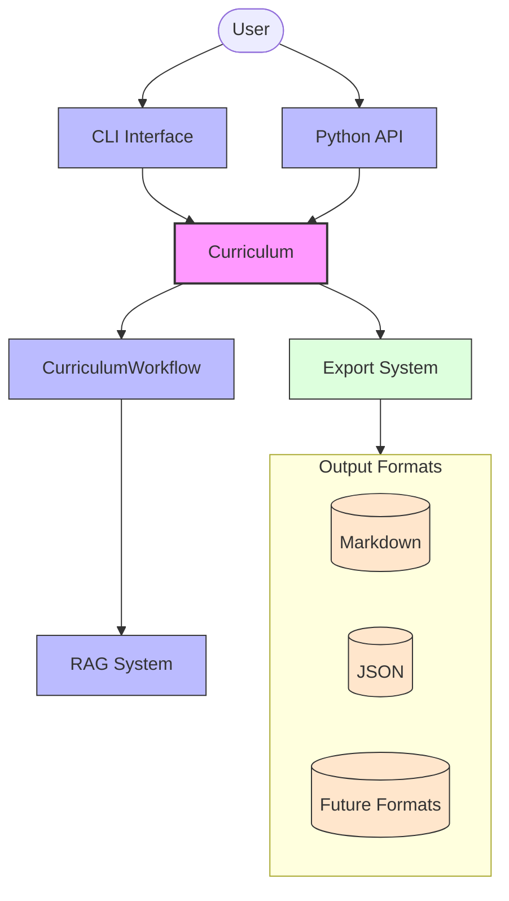
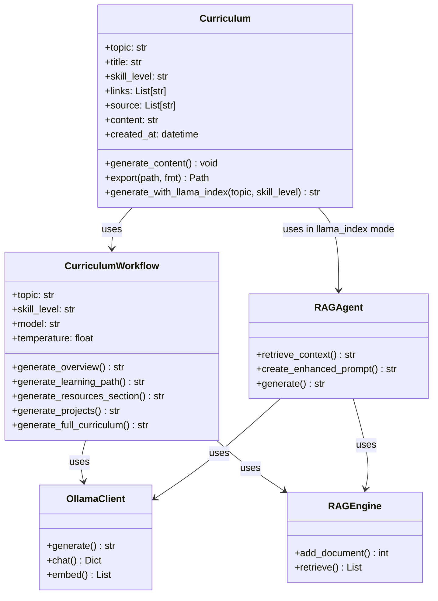
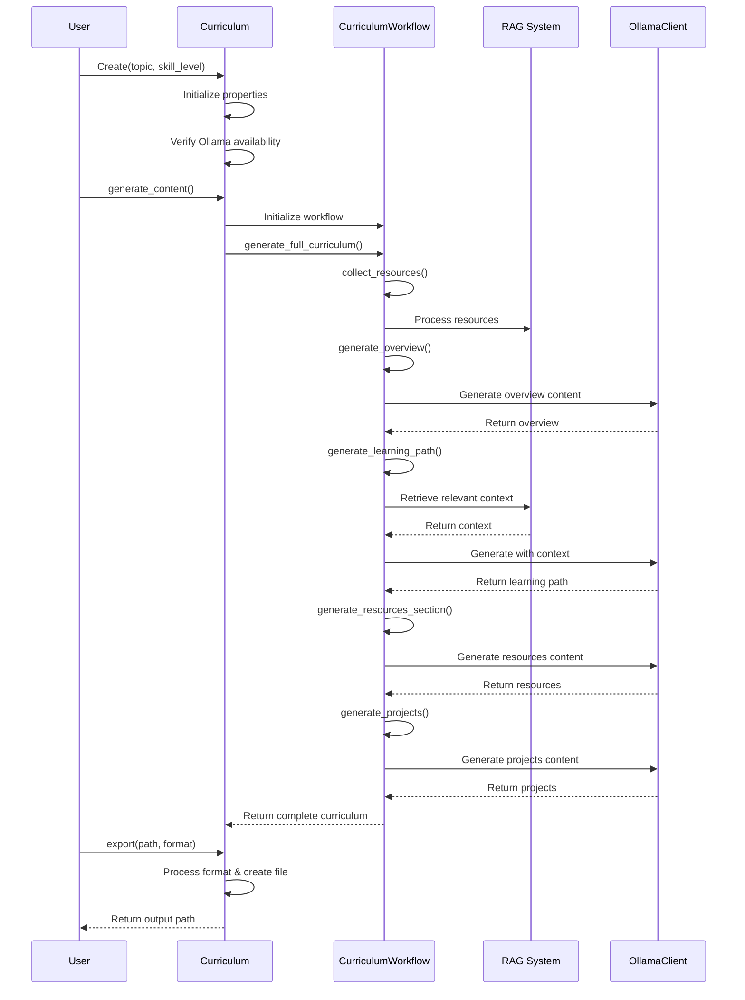

<!-- markdownlint-disable MD033 MD032 MD031 MD040 -->
# Curriculum Generation

This document provides a comprehensive overview of the curriculum generation functionality in oarc_rag.

## Table of Contents

- [Overview](#overview)
- [Architecture](#architecture)
- [Usage](#usage)
  - [Command Line Interface](#command-line-interface)
  - [Python API](#python-api)
- [Generation Process](#generation-process)
- [Export Formats](#export-formats)
- [Advanced Features](#advanced-features)
- [Best Practices](#best-practices)

## Overview

The `Curriculum` class is the central component for generating, managing, and exporting educational curriculum content. It leverages AI integration with Ollama to produce comprehensive curriculum materials on any specified topic, including learning paths, resources, and practical projects.



## Architecture

The curriculum generation system is built with a layered architecture:



## Usage

### Command Line Interface

Generate a curriculum using the CLI:

```bash
# Basic usage
oarc_rag create "Machine Learning" --level "Beginner" --format md

# Advanced usage with additional options
oarc_rag create "Python Programming" \
    --title "Mastering Python" \
    --level "Intermediate" \
    --links "https://docs.python.org" "https://realpython.com" \
    --source "./resources" \
    --export-path "./output/python_course.md"
```

### Python API

Generate a curriculum programmatically:

```python
from oarc_rag import Curriculum

# Create a curriculum instance
curriculum = Curriculum(
    topic="Machine Learning",
    title="Introduction to ML",
    skill_level="Beginner",
    links=["https://scikit-learn.org/"],
    source=["./resources/"]
)

# Generate the content
curriculum.generate_content()

# Export to desired format
output_path = curriculum.export("./output/ml_curriculum.md")
print(f"Curriculum exported to: {output_path}")
```

#### Factory Method

Use the factory method for simplified creation:

```python
from oarc_rag import Curriculum

# Create using factory method
curriculum = Curriculum.create(
    topic="Data Science",
    title="Introduction to Data Science",
    skill_level="Beginner"
)

# Export to different formats
curriculum.export("./output/data_science.md")  # Markdown
curriculum.export("./output/data_science.json", fmt="json")  # JSON
```

## Generation Process

The curriculum generation process follows these steps:



### Content Generation Steps

1. **Topic Analysis**: Analyzes the topic to determine the appropriate approach and scope
2. **Resource Collection**: Gathers relevant resources from URLs and local files
3. **Overview Generation**: Creates an introduction and learning objectives
4. **Learning Path Creation**: Designs a structured progression through the topic
5. **Resources Curation**: Provides recommended learning materials
6. **Project Development**: Creates practical exercises and projects
7. **Content Assembly**: Combines all components into a cohesive curriculum

## Export Formats

The curriculum can be exported in multiple formats:

| Format | Description | Status |
|--------|-------------|--------|
| Markdown (`md`) | Standard format with rich text formatting | Supported |
| JSON (`json`) | Structured data format for programmatic use | Supported |
| PDF (`pdf`) | Portable Document Format | Planned |
| HTML (`html`) | Web-based format | Planned |
| DOCX (`docx`) | Microsoft Word format | Planned |

### Markdown Export

Markdown export includes a YAML frontmatter with metadata:

```markdown
---
title: Machine Learning Curriculum
topic: Machine Learning
created: 2023-07-15T14:30:45.123456
---

# Machine Learning Curriculum

## Overview
...
```

### JSON Export

JSON export includes both metadata and content:

```json
{
  "meta": {
    "title": "Machine Learning Curriculum",
    "topic": "Machine Learning",
    "skill_level": "Beginner",
    "created": "2023-07-15T14:30:45.123456"
  },
  "links": ["https://scikit-learn.org/"],
  "sources": ["./resources/"],
  "content": "# Machine Learning Curriculum\n\n## Overview\n..."
}
```

## Advanced Features

### LlamaIndex Integration

The `generate_with_llama_index` method provides enhanced generation using LlamaIndex:

```python
from oarc_rag import Curriculum

curriculum = Curriculum(
    topic="Machine Learning",
    title="Advanced ML Techniques"
)

# Generate using LlamaIndex capabilities
content = curriculum.generate_with_llama_index(
    topic="Machine Learning",
    skill_level="Advanced"
)

# Export the enhanced curriculum
curriculum.export("./output/advanced_ml.md")
```

This approach utilizes:

1. **RAG Agent**: Enhanced retrieval and context integration
2. **Section-by-Section Generation**: Each curriculum component is generated with specialized context
3. **Subtopic Expansion**: Automatically explores subtopics related to the main topic
4. **Hierarchical Generation**: Creates a structured curriculum with consistent organization

## Best Practices

### Topic Selection

- **Be Specific**: "Python Data Analysis with Pandas" is better than just "Python"
- **Consider Scope**: Ensure the topic can be reasonably covered in a curriculum
- **Target Audience**: Define your skill level appropriately for the content depth

### Resource Integration

- **Include Quality Resources**: Add links to authoritative sources
- **Local Resources**: Include directories with relevant materials
- **Mixed Media**: Consider resources in various formats (articles, videos, code)

### Customization

- **Titles**: Provide descriptive titles for better organization
- **Skill Levels**: Be consistent with skill level designations (Beginner, Intermediate, Advanced, Expert, Master, Pioneer)
- **Export Paths**: Organize exports by topic for better file management

### Error Handling

- **Ollama Availability**: Ensure Ollama is running before curriculum generation
- **Resource Issues**: Check for access issues with web resources
- **Export Errors**: Verify you have write permissions to the export location
