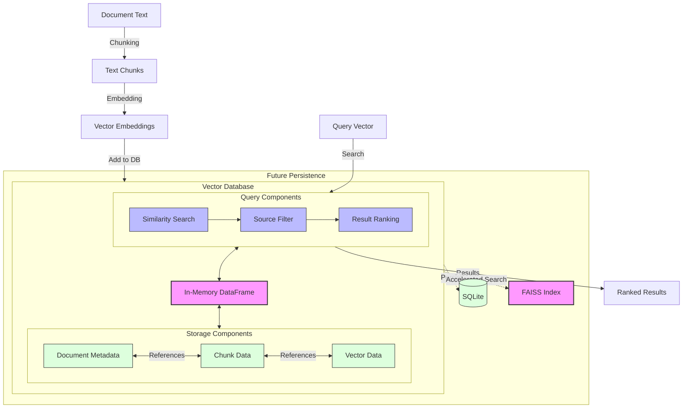

# Vector Database System

The Vector Database system in oarc_rag provides efficient storage and retrieval of embeddings for the RAG (Retrieval-Augmented Generation) functionality.

## Architecture Diagram



## Overview

The vector database implementation uses an in-memory pandas DataFrame approach for development and testing, with potential for SQLite-based persistence in future releases.

## Core Components

### VectorDatabase

The `VectorDatabase` class provides the core functionality for storing and retrieving document embeddings:

```python
from oarc_rag.rag import VectorDatabase

# Initialize database
db = VectorDatabase()

# Add document chunks and embeddings
chunk_ids = db.add_document(
    text_chunks=["Python basics", "Advanced concepts"],
    vectors=[[0.1, 0.2], [0.3, 0.4]],
    metadata={"source": "tutorial"},
    source="python_guide.md"
)

# Search for similar content
results = db.search(
    query_vector=[0.15, 0.25],
    top_k=5,
    threshold=0.7
)
```

### Key Features

1. **Document Management**
   - Add documents with multiple chunks
   - Automatic deduplication
   - Source tracking and metadata support
   - Document removal capabilities

2. **Vector Search**
   - Cosine similarity-based search
   - Configurable similarity threshold
   - Source filtering
   - Top-K results retrieval

3. **Statistics and Monitoring**
   - Document count tracking
   - Chunk statistics
   - Embedding dimension information
   - System-wide performance metrics

## Database Schema

The in-memory database structure includes:

- `doc_id`: Unique document identifier
- `chunk_id`: Unique chunk identifier
- `text`: Original text content
- `source`: Document source identifier
- `metadata`: JSON-encoded metadata
- `embedding`: Vector embedding as numpy array

## Usage Examples

### Adding Documents

```python
# Add document with metadata
db.add_document(
    text_chunks=["Content chunk 1", "Content chunk 2"],
    vectors=[[0.1, 0.2], [0.3, 0.4]],
    metadata={
        "title": "Example Document",
        "tags": ["tutorial", "beginner"]
    },
    source="example.md"
)
```

### Searching Content

```python
# Search with source filtering
results = db.search(
    query_vector=[0.1, 0.2],
    top_k=3,
    threshold=0.5,
    source_filter=["documentation", "tutorials"]
)

# Process search results
for result in results:
    print(f"Chunk ID: {result['id']}")
    print(f"Text: {result['text']}")
    print(f"Similarity: {result['similarity']:.3f}")
    print(f"Source: {result['source']}")
```

### Managing Documents

```python
# Get list of document sources
sources = db.get_document_sources()

# Remove specific document
db.remove_document("outdated_guide.md")

# Get database statistics
stats = db.get_stats()
print(f"Total documents: {stats['document_count']}")
print(f"Total chunks: {stats['chunk_count']}")
print(f"Embedding dimension: {stats['embedding_dimension']}")
```

## Integration with RAG System

The VectorDatabase integrates with other RAG components:

1. **RAGEngine**: Coordinates document processing and retrieval
2. **EmbeddingGenerator**: Creates vectors for storage
3. **TextChunker**: Prepares documents for embedding
4. **ContextAssembler**: Formats retrieved results

Example integration:

```python
from oarc_rag.rag import RAGEngine

# Initialize RAG engine with database
rag = RAGEngine(run_id="curriculum_gen")

# Add document to RAG system
rag.add_document(
    text="Long document content...",
    metadata={"type": "learning_resource"}
)

# Retrieve relevant context
context = rag.retrieve(
    query="Python basics",
    top_k=5
)
```

## Performance Considerations

- Use appropriate chunk sizes (default: 512 tokens)
- Consider source filtering for focused searches
- Monitor memory usage with large document collections
- Implement caching for frequently accessed content

## Future Enhancements

Planned improvements include:

1. SQLite persistence for large datasets
2. FAISS integration for faster similarity search
3. Improved deduplication strategies
4. Distributed database support
5. Advanced caching mechanisms

## Error Handling

The database implements robust error handling:

```python
try:
    db.add_document(chunks, vectors)
except ValueError as e:
    print(f"Invalid input: {e}")
except Exception as e:
    print(f"Database error: {e}")
```

## Best Practices

1. **Data Quality**
   - Validate input text and vectors
   - Use consistent metadata structure
   - Maintain source documentation

2. **Performance**
   - Monitor database statistics
   - Implement appropriate filtering
   - Use batch operations when possible

3. **Maintenance**
   - Regular cleanup of unused documents
   - Monitor system resources
   - Maintain backup strategies
