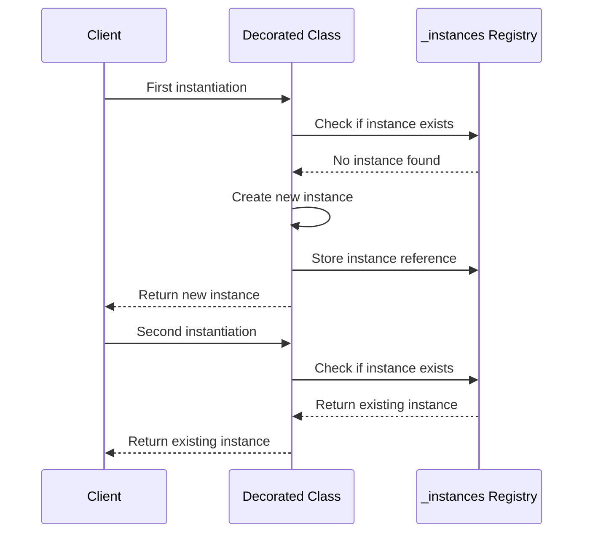
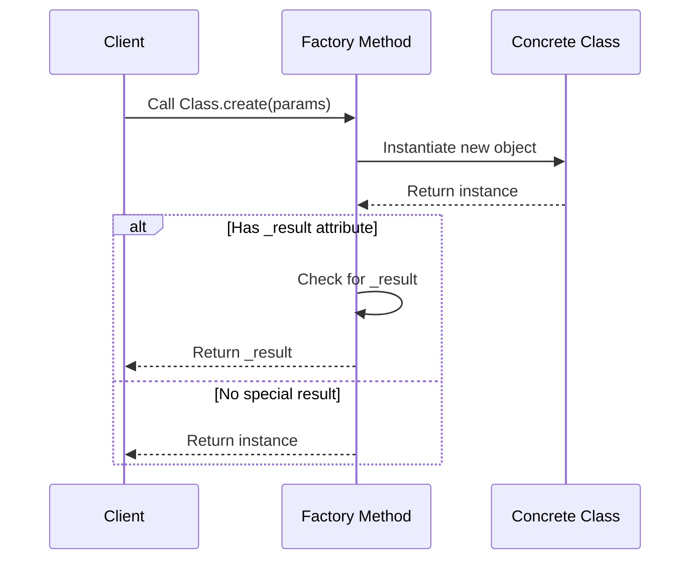
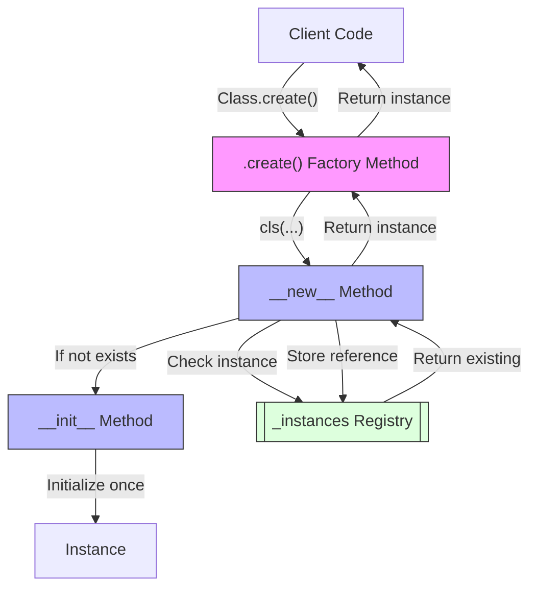

<!-- markdownlint-disable MD033 MD032 MD031 MD040 -->
# oarc_rag Decorators

This document describes the utility decorators used in the oarc_rag project.

## Table of Contents

- [Singleton Decorator](#singleton-decorator)
  - [Usage](#singleton-usage)
  - [Implementation Details](#singleton-implementation)
- [Factory Decorator](#factory-decorator)
  - [Usage](#factory-usage)
  - [Implementation Details](#factory-implementation)
- [Best Practices](#best-practices)
- [Pattern Diagrams](#pattern-diagrams)

## Singleton Decorator

The singleton pattern ensures that a class has only one instance and provides a global point of access to it. This is useful for resources that should be shared across the application, such as configuration managers, database connections, or logging services.

### <a name="singleton-usage"></a>Usage

```python
from oarc_rag.utils.decorators.singleton import singleton

@singleton
class DatabaseConnection:
    def __init__(self, host="localhost", port=5432):
        self.host = host
        self.port = port
        self.connected = False
        
    def connect(self):
        # Connect to database logic here
        self.connected = True
        
# Usage:
db1 = DatabaseConnection(host="db.example.com", port=5432)
db2 = DatabaseConnection()  # Different parameters, but returns the same instance

# Both variables reference the same instance
assert db1 is db2
```

When a singleton-decorated class is instantiated for the first time, a new instance is created and stored. Subsequent instantiations will return the existing instance, regardless of the parameters provided.

### <a name="singleton-implementation"></a>Implementation Details

The singleton decorator works by:

1. Replacing the class's `__new__` method to control instance creation
2. Maintaining a registry of singleton instances
3. Ensuring initialization logic only runs once
4. Optionally logging when an existing instance is reused

The decorator preserves the original class's behavior, only intercepting the instance creation process.

## Factory Decorator

The factory pattern provides an interface for creating objects without specifying their concrete classes. This is implemented as a decorator in oarc_rag to add a convenient `create` class method to any class.

### <a name="factory-usage"></a>Usage

```python
from oarc_rag.utils.decorators.factory import factory

@factory
class ConfigurationBuilder:
    def __init__(self, format_type="json", options=None):
        self.format_type = format_type
        self.options = options or {}
        
    def build(self):
        # Build configuration logic
        return {"type": self.format_type, "settings": self.options}

# Using the factory method:
config = ConfigurationBuilder.create(format_type="yaml", options={"indent": 2})
```

The factory decorator adds a `create` class method that instantiates the class with the provided arguments and returns the instance.

### <a name="factory-implementation"></a>Implementation Details

The factory decorator:

1. Adds a `create` class method to the decorated class
2. Passes all arguments to the class constructor
3. Handles special cases for CLI argument processing
4. Can return either the instance or a special `_result` attribute if present

This pattern simplifies object creation and enables special handling for command-line interface objects.

## Best Practices

### When to Use Singleton

- For resources that should be shared across the application
- When there should be exactly one instance of a class
- For service objects like database connections, configuration managers, etc.

### When to Use Factory

- To encapsulate object creation logic
- When you need a consistent way to create objects
- For classes with complex initialization requirements
- When implementing command patterns for CLI operations

### Combined Usage

The decorators can be combined for classes that should both follow the singleton pattern and provide a factory method:

```python
@singleton
@factory
class GlobalConfiguration:
    def __init__(self, settings=None):
        self.settings = settings or {}
        
# Usage:
config = GlobalConfiguration.create(settings={"debug": True})
```

In this case, the factory will always return the same singleton instance.

### Considerations

- Singletons can make testing more difficult due to shared state
- Ensure thread-safety when necessary (the current implementation is not thread-safe)
- Be careful with mutable state in singletons
- Consider using dependency injection alternatives when appropriate

## Pattern Diagrams

### Singleton Pattern Flow



### Factory Pattern Flow



### Combined Patterns


