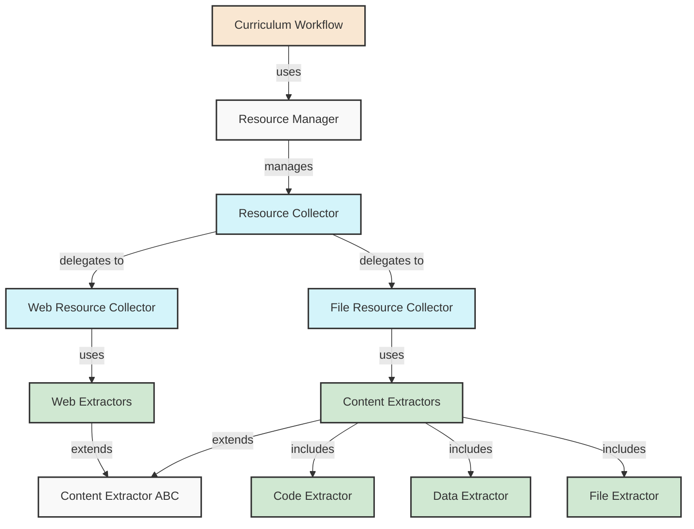

# Generator and Resource Modules Documentation

## Overview

This document explains the architecture and functionality of oarc_rag's generator and resource modules, which form the core of the curriculum generation system. These modules are responsible for collecting, extracting, and processing content from diverse sources to generate comprehensive curricula.

## Architecture

The generator and resource modules follow a modular, extensible architecture that supports multiple source types and content formats. The system is designed with clean separation of concerns to maximize reusability and maintainability.



## Key Components

### Resource Collection

The resource collection subsystem is responsible for gathering content from various sources:

#### ResourceCollector (`collector.py`)

This is the coordinator that delegates to specialized collectors based on the source type:

```python
class ResourceCollector:
    """Coordinates resource collection from multiple sources."""
    
    # Initializes specialized collectors
    def __init__(self, max_concurrent_requests=5, max_file_size_mb=10.0):
        self.web_collector = WebResourceCollector(max_concurrent_requests)
        self.file_collector = FileResourceCollector(max_file_size_mb)
        # ...

    def collect(self, urls, paths):
        # Collect from URLs using web_collector
        # Collect from file paths using file_collector
        # Merge and return results
```

#### WebResourceCollector (`web.py`) 

Handles collection from web URLs with support for concurrent requests:

```python
class WebResourceCollector(CollectorABC):
    """Collects content from web URLs."""
    
    def collect(self, urls):
        # Process URLs concurrently
        # Extract content using appropriate extractors
        # Return collected resources
```

#### FileResourceCollector (`file.py`)

Handles collection from file paths with support for various file types:

```python
class FileResourceCollector:
    """Collects and processes resources from local files."""
    
    def collect(self, paths):
        # Find all files in directories
        # Extract content from each file
        # Return collected resources
```

### Content Extraction

The content extraction subsystem is responsible for parsing and extracting useful content from specific resource types:

#### ContentExtractorABC (`extractor.py`)

Abstract base class for all content extractors:

```python
class ContentExtractorABC(abc.ABC):
    """Abstract base class for content extractors."""
    
    @abc.abstractmethod
    def extract(self, resource):
        """Extract content from a resource."""
        pass
    
    @abc.abstractmethod
    def supports(self, resource):
        """Check if this extractor supports the resource."""
        pass
```

#### Specialized Extractors

Various specialized extractors are implemented for different file types:

- **CodeFileExtractor** (`code.py`): Extracts and analyzes programming code files
- **DataFileExtractor** (`data.py`): Handles data files like CSV, JSON, YAML
- **FileExtractor** (`file.py`): Base extractor for general files
- **PDFExtractor**, **MarkdownExtractor**, etc. (`file.py`): Handle specific file formats

#### Web Content Extractors (`web.py`)

Specialized extractors for web content:

- **HTMLExtractor**: Processes HTML content using BeautifulSoup
- **JSONExtractor**: Processes JSON API responses
- **TextExtractor**: Handles plain text web content

### Resource Management

#### ResourceManager (`manager.py`)

Coordinates the collection and processing workflow:

```python
class ResourceManager:
    """High-level manager for resource collection and processing."""
    
    def process_sources(self, urls, paths, extract_keywords=True, deduplicate=True):
        # Collect resources using ResourceCollector
        # Post-process resources (deduplication, truncation)
        # Return processed resources
        
    def extract_context(self, resources, topic, max_items=5):
        # Extract a unified context from collected resources
        # Format appropriately for prompt use
```

### Workflow Orchestration

#### CurriculumWorkflow (`workflow.py`)

Orchestrates the end-to-end curriculum generation process:

```python
class CurriculumWorkflow:
    """Orchestrates the curriculum generation process."""
    
    def generate_full_curriculum(self, links, source_paths):
        # Collect resources
        # Generate overview
        # Generate learning path
        # Generate resources section
        # Generate projects
        # Assemble complete curriculum
```

## Resource Collection Flow

The resource collection process follows these steps:

1. **Input Processing**:
   - URLs and file paths are received as input
   - URLs are validated and normalized
   - File paths are expanded to include all files in directories

2. **Concurrent Collection**:
   - Web URLs are processed concurrently with throttling
   - File processing is performed with progress tracking

3. **Content Extraction**:
   - Each resource is processed by an appropriate extractor
   - Content is extracted, cleaned, and structured

4. **Metadata Extraction**:
   - Keywords are extracted from content
   - Metadata is collected (file sizes, types, modification dates)
   - Structure information is preserved (headings, sections)

5. **Post-Processing**:
   - Deduplication removes similar content
   - Content is truncated if it exceeds limits
   - Keywords are aggregated and ranked

## Content Extraction Process

Content extraction is specialized based on the resource type:

### Code Files

Code files are analyzed to extract:
- Language identification
- Class and function definitions
- Import statements
- File structure

### Data Files

Data files (CSV, JSON, etc.) are processed to extract:
- Schema information
- Data summaries
- Record counts
- Key statistics

### Document Files

Document files (PDF, DOCX, Markdown) are processed to extract:
- Text content with structure preserved
- Headings hierarchy
- Content sections
- Metadata

### Web Content

Web content is processed to extract:
- Main content with HTML noise removed
- Title and description
- Structured data (where available)
- Domain information

## LangChain and LlamaIndex Integration

The system integrates with LangChain and LlamaIndex for enhanced content processing:

- **Document Loading**: Specialized loaders for different file formats
- **Text Chunking**: Breaking large content into semantic chunks
- **Token Counting**: Accurate token estimation for LLM use
- **Extraction Enhancement**: Better metadata extraction from structured documents

## Extension Points

The system is designed to be extended in several ways:

### Adding New Extractors

To support a new file type or format:

1. Create a new extractor class that extends `ContentExtractorABC`
2. Implement the `extract()` and `supports()` methods
3. Register the extractor in the appropriate collector

### Custom Processing

To add custom processing steps:

1. Extend the `ResourceManager` class
2. Override the `process_sources()` method to add your processing
3. Call the parent method to maintain existing functionality

### Workflow Customization

To customize the generation workflow:

1. Extend the `CurriculumWorkflow` class
2. Override methods like `generate_overview()` or `generate_learning_path()`
3. Create your own template configurations

## Error Handling and Resilience

The system implements several error handling mechanisms:

- **Retry Logic**: Web requests use exponential backoff retry
- **Graceful Degradation**: If advanced processing fails, system falls back to simpler methods
- **Comprehensive Logging**: Detailed logs for troubleshooting

## Usage Example

```python
# Create a curriculum workflow
workflow = CurriculumWorkflow(
    topic="Machine Learning",
    skill_level="Beginner",
    model="llama3.1:latest",
    temperature=0.7
)

# Generate a complete curriculum
curriculum = workflow.generate_full_curriculum(
    links=["https://www.example.com/ml-basics", "https://www.example.com/python-for-ml"],
    source_paths=["docs/ml_resources/", "examples/ml_code/"]
)

# Export the curriculum
with open("ml_curriculum.md", "w") as f:
    f.write(curriculum)
```

## Performance Considerations

- **Concurrent Processing**: Web requests are processed concurrently for better performance
- **Chunking**: Large content is chunked to avoid memory issues
- **Progress Tracking**: Long operations use progress bars
- **Caching**: Results can be cached to improve repeated operations

## Conclusion

The generator and resource modules provide a powerful, flexible foundation for curriculum generation. The modular design allows for easy extension and customization, while the integration with advanced libraries like LangChain and LlamaIndex enhances content processing capabilities.
