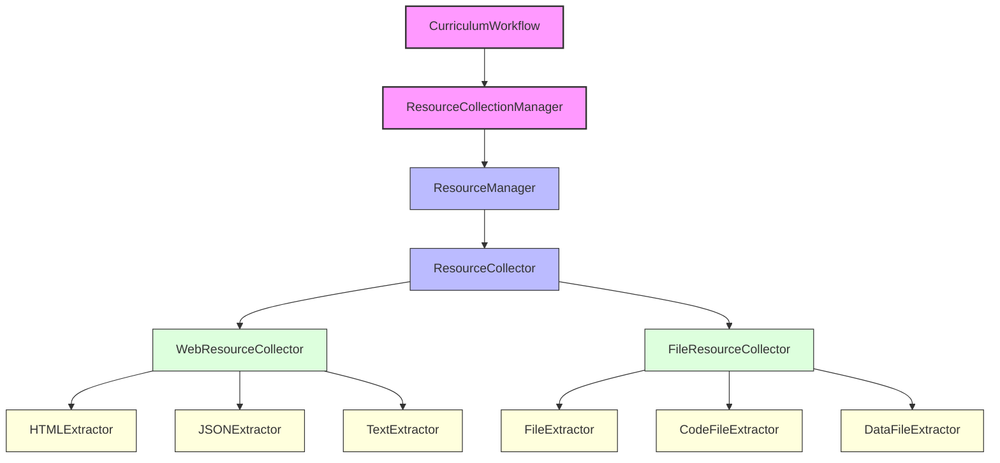

# Generator Package Documentation

The oarc_rag Generator Package provides a comprehensive system for content collection, analysis, and curriculum generation.

## Overview

The Generator Package serves as the content engine for the oarc_rag platform, managing the acquisition and analysis of relevant resources, and orchestrating the curriculum generation workflow.



## Package Structure

The Generator Package consists of several interconnected modules:

- **workflow.py**: Orchestrates the end-to-end curriculum generation process
- **resource.py**: High-level interface for resource collection and management

Resource collection and extraction functionality is organized in the `resource` sub-package:

- **resource/collector.py**: Base classes for resource collection
- **resource/extractor.py**: Base classes for content extraction
- **resource/manager.py**: Coordinates resource collection and processing
- **resource/web.py**: Web URL collection and content extraction
- **resource/file.py**: File system collection and extraction
- **resource/code.py**: Specialized extraction for code files
- **resource/data.py**: Specialized extraction for data files (CSV, JSON, etc.)

## Key Components

### CurriculumWorkflow

The `CurriculumWorkflow` class in `workflow.py` manages the end-to-end process of generating a curriculum:

```python
from oarc_rag.generator.workflow import CurriculumWorkflow

# Create a workflow for a specific topic
workflow = CurriculumWorkflow(
    topic="Machine Learning",
    skill_level="Intermediate",
    model="llama3:latest"
)

# Generate a full curriculum with web and local resources
curriculum = workflow.generate_full_curriculum(
    links=["https://example.com/ml-tutorial"],
    source_paths=["local_resources/ml_notes.md"]
)

# Save the generated curriculum
with open("machine_learning_curriculum.md", "w") as f:
    f.write(curriculum)
```

The workflow handles:

- Resource collection and analysis
- Content generation for each curriculum section
- Assembly of the complete curriculum

### ResourceCollectionManager

The `ResourceCollectionManager` class in `resource.py` provides a unified interface for resource collection:

```python
from oarc_rag.generator.resource import ResourceCollectionManager

# Create a resource manager
resource_manager = ResourceCollectionManager()

# Collect resources from various sources
resources = resource_manager.collect_resources(
    urls=["https://example.com/tutorial"],
    paths=["local_files/notes.md", "code_samples/"]
)

# Extract a formatted context for use in prompts
context = resource_manager.extract_context_for_prompt(
    resources=resources,
    topic="Python Programming"
)
```

### Resource Collectors and Extractors

The package includes specialized collectors and extractors for different types of resources:

- **Web Content**: The `WebResourceCollector` handles fetching and extracting content from URLs, with specialized extractors for HTML, JSON, and plain text.

- **File Content**: The `FileResourceCollector` processes local files and directories, with specialized extractors for code files, data files, and general text files.

## Resource Collection Process

The resource collection process follows these steps:

1. The `ResourceCollectionManager` receives URLs and file paths
2. It delegates collection to the underlying `ResourceManager`
3. The `ResourceManager` uses the `ResourceCollector` to gather content
4. The `ResourceCollector` dispatches to specialized collectors:
   - `WebResourceCollector` for URLs
   - `FileResourceCollector` for file paths
5. Each specialized collector uses appropriate extractors to process content
6. The collected resources are aggregated, deduplicated, and returned

## Content Enhancement and Analysis

Each extractor performs specialized analysis on its content type:

- **Code Analysis**: The `CodeFileExtractor` identifies classes, functions, imports, and structure
- **Data Analysis**: The `DataFileExtractor` analyzes CSV, JSON, and other structured data formats
- **HTML Analysis**: The `HTMLExtractor` extracts meaningful content and metadata from web pages

## Curriculum Generation Workflow

The curriculum generation workflow consists of:

1. **Resource Collection**: Gathering relevant content from URLs and local files
2. **Content Analysis**: Analyzing and extracting key information from resources
3. **Prompt Enhancement**: Using collected resources to enhance AI prompts
4. **Section Generation**: Generating each curriculum section with resource context
5. **Assembly**: Combining all sections into a complete curriculum

## Integration with RAG

The Generator Package is designed to work seamlessly with the RAG (Retrieval-Augmented Generation) system:

- Resources collected can be used directly in the RAG engine
- Content analysis provides metadata useful for RAG retrieval
- Keywords extraction enhances query formulation

## Example Usage

### Basic Resource Collection

```python
from oarc_rag.generator.resource import ResourceCollectionManager

# Create a manager
manager = ResourceCollectionManager()

# Collect resources
resources = manager.collect_resources(
    urls=["https://docs.python.org/3/tutorial/"],
    paths=["python_examples/"]
)

# Print statistics
stats = manager.get_stats()
print(f"Collected {len(resources['urls'])} web resources")
print(f"Collected {len(resources['files'])} file resources")
print(f"Total content size: {stats['total_content_size']} bytes")
print(f"Keywords extracted: {len(resources['metadata']['keywords'])}")
```

### Curriculum Generation

```python
from oarc_rag.generator.workflow import CurriculumWorkflow

# Create a workflow
workflow = CurriculumWorkflow(
    topic="Web Development",
    skill_level="Beginner",
    model="llama3:latest",
    temperature=0.7
)

# Generate individual sections
overview = workflow.generate_overview()
learning_path = workflow.generate_learning_path()
resources_section = workflow.generate_resources_section(
    links=["https://developer.mozilla.org/", "https://www.w3schools.com/"]
)
projects = workflow.generate_projects(number_of_projects=3)

# Or generate a complete curriculum
full_curriculum = workflow.generate_full_curriculum(
    links=["https://developer.mozilla.org/"],
    source_paths=["web_dev_resources/"]
)
```

## Performance Considerations

- **Resource Collection**: Uses concurrent requests for efficient web scraping
- **Content Extraction**: Employs specialized extractors for better performance
- **Content Deduplication**: Removes redundant content to improve quality
- **Content Truncation**: Limits content size to fit within model constraints
- **Optional Integration**: Uses libraries like LangChain when available
