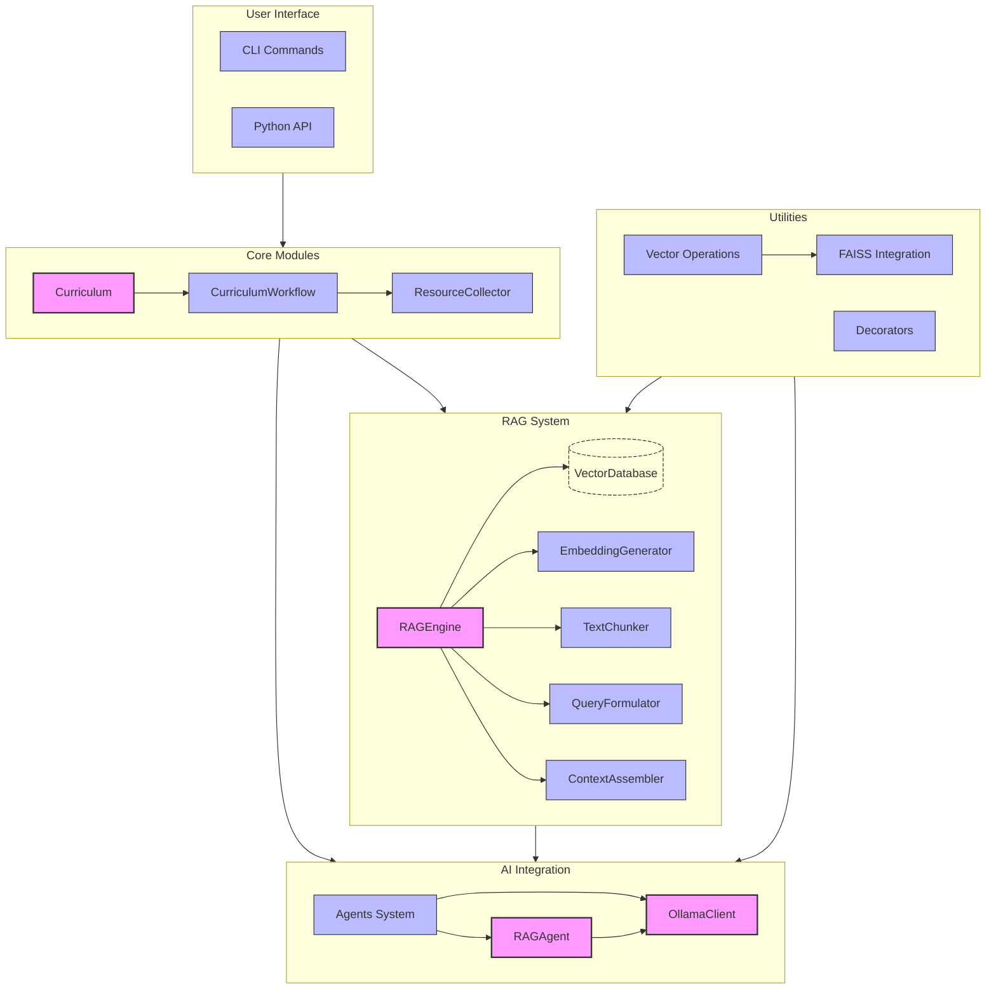
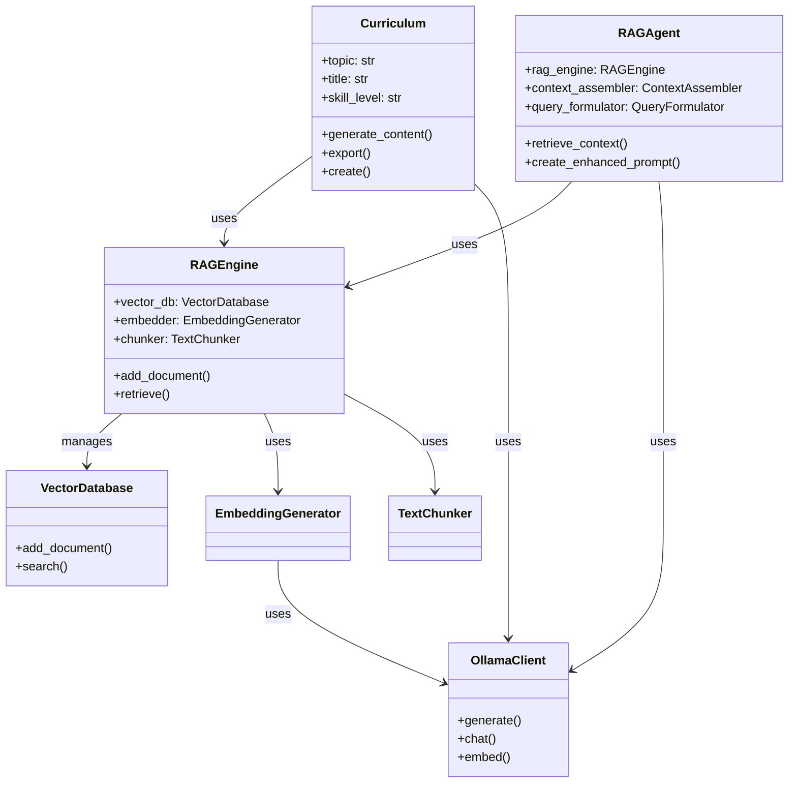
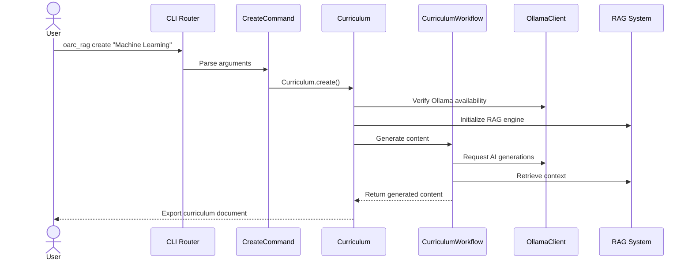
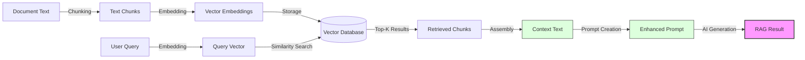

<!-- markdownlint-disable MD033 MD032 MD031 MD040 -->
# oarc_rag API Documentation

This document provides comprehensive documentation for the oarc_rag API, covering core components, usage examples, and reference information.

## Table of Contents

- [Introduction](#introduction)
- [Core Components](#core-components)
- [CLI Usage](#cli-usage)
- [Python API Usage](#python-api-usage)
- [API Reference](#api-reference)
  - [Curriculum](#curriculum)
  - [RAG System](#rag-system)
  - [AI Integration](#ai-integration)
  - [Utility Functions](#utility-functions)

## Introduction

oarc_rag is a Python library for designing personalized curriculums using AI, web crawling, and data integration. The library provides both a command-line interface and a Python API for generating curriculum content.

### Architecture Overview



### Dependencies

oarc_rag has several required dependencies:

- **Ollama**: Required for AI operations
  - Must be installed and running (raises RuntimeError otherwise)
  - Default API endpoint: `http://localhost:11434`
  - Used for text generation and embeddings

- **LangChain**: Required for text processing
  - Used for sophisticated text chunking
  - Required for RAG system operation

- **FAISS** (Optional): For optimized vector search
  - CPU version used by default
  - GPU version automatically used when hardware is available

### Component Relationships



## Core Components

### Curriculum Generation

oarc_rag's core functionality centers around curriculum generation:

```python
from oarc_rag import Curriculum

# Create and generate a curriculum
curriculum = Curriculum(
    topic="Machine Learning",
    title="Introduction to ML",
    skill_level="Beginner",
    links=["https://scikit-learn.org/"]
)

# Export the curriculum
curriculum.export("./output/ml_curriculum.md")
```

### RAG System

The Retrieval-Augmented Generation (RAG) system enhances curriculum generation with relevant context:

```python
from oarc_rag.rag import RAGEngine, EmbeddingGenerator, TextChunker

# Initialize RAG engine
rag_engine = RAGEngine(
    run_id="curriculum_12345",
    embedding_model="llama3"
)

# Add documents to knowledge base
rag_engine.add_document(
    text="Machine learning is a field of study...",
    metadata={"source": "textbook"}
)

# Retrieve context for generation
context = rag_engine.retrieve(
    query="What are the key concepts in machine learning?",
    top_k=5
)
```

### Agent-Based Generation

oarc_rag uses an agent-based approach for specialized content generation:

```python
from oarc_rag.rag import RAGAgent

# Create a RAG-enhanced agent
agent = RAGAgent(
    name="learning_path_agent",
    model="llama3",
    rag_engine=rag_engine
)

# Generate learning path with enhanced context
enhanced_prompt = agent.create_enhanced_prompt(
    base_prompt="Create a learning path for {topic} at {skill_level} level.",
    topic="Machine Learning",
    query_type="learning_path",
    skill_level="Beginner"
)

learning_path = agent.generate(enhanced_prompt)
```

## CLI Usage

oarc_rag provides a command-line interface for easy curriculum generation:

### Command Flow



### Available Commands

```bash
# Basic curriculum creation
oarc_rag create "Machine Learning" --level "Beginner" --format md

# With additional options
oarc_rag create "Python Programming" \
    --title "Mastering Python" \
    --level "Intermediate" \
    --links "https://docs.python.org" "https://realpython.com" \
    --source "./resources" \
    --export-path "./output/python_course.md"

# Cleaning output files
oarc_rag clean --all
oarc_rag clean --output-dir "./output"
oarc_rag clean --cache
```

### Command Options Table

| Command | Description | Primary Options |
|---------|-------------|----------------|
| `create` | Generate a new curriculum | `--title`, `--level`, `--links`, `--source` |
| `clean` | Clean up generated files and caches | `--all`, `--output-dir`, `--cache` |
| `help` | Display help information | `[command]` |

## Python API Usage

### Basic Usage

```python
from oarc_rag import Curriculum

# Create a curriculum
curriculum = Curriculum.create(
    topic="Data Science",
    title="Introduction to Data Science",
    skill_level="Beginner",
    links=["https://pandas.pydata.org/"],
    source=["./resources"]
)

# Export to different formats
curriculum.export("./output/data_science.md")  # Markdown
curriculum.export("./output/data_science.json", fmt="json")  # JSON
```

### Advanced Usage with RAG

```python
from oarc_rag import Curriculum
from oarc_rag.rag import RAGEngine, RAGAgent
from oarc_rag.ai.prompts import PromptTemplate

# Initialize RAG engine and add knowledge
engine = RAGEngine(embedding_model="llama3")
engine.add_document(text="...", source="reference_material")

# Create agent with RAG capabilities
agent = RAGAgent("curriculum_agent", rag_engine=engine)

# Get prompt template
template = PromptTemplate.from_preset("learning_path")
prompt = template.format(topic="Web Development", skill_level="Intermediate")

# Generate enhanced content
enhanced_prompt = agent.create_enhanced_prompt(prompt, "Web Development", "learning_path")
content = agent.generate(enhanced_prompt)

# Create curriculum with the generated content
curriculum = Curriculum(
    topic="Web Development",
    title="Full Stack Web Development",
    skill_level="Intermediate",
    content=content
)

# Export
curriculum.export("./output/web_dev_curriculum.md")
```

### RAG Workflow



## API Reference

### Curriculum

#### `Curriculum`

Main class for curriculum generation and management.

```python
class Curriculum:
    def __init__(
        self, 
        topic: str = None,
        title: Optional[str] = None,
        skill_level: str = "Beginner",
        links: Optional[List[str]] = None,
        source: Optional[List[str]] = None,
        args: Optional[argparse.Namespace] = None
    )
    
    def generate_content(self) -> None:
        """Generate the content for the curriculum."""
        
    def export(self, path: Union[str, Path], fmt: str = 'md') -> Path:
        """Export the curriculum to the specified path and format."""
        
    @classmethod
    def create(cls, **kwargs):
        """Factory method to create and return a curriculum."""
```

#### `CurriculumWorkflow`

Orchestrates the curriculum generation process.

```python
class CurriculumWorkflow:
    def __init__(
        self,
        topic: str,
        skill_level: str = "Beginner",
        client: Optional[OllamaClient] = None,
        model: str = "llama2",
        temperature: float = 0.7
    )
    
    def collect_resources(self, links: List[str], source_paths: List[str]) -> Dict[str, Any]:
        """Collect resources for curriculum generation."""
        
    def generate_overview(self) -> str:
        """Generate curriculum overview."""
        
    def generate_learning_path(self) -> str:
        """Generate learning path."""
        
    def generate_resources_section(self, links: List[str]) -> str:
        """Generate resources section."""
        
    def generate_projects(self, number_of_projects: int = 3) -> str:
        """Generate projects or exercises."""
        
    def generate_full_curriculum(self, links: List[str], source_paths: List[str]) -> str:
        """Generate a complete curriculum."""
```

#### `RAGEngine`

Core engine for retrieval-augmented generation.

```python
class RAGEngine:
    def __init__(
        self,
        run_id: Optional[str] = None,
        base_dir: Optional[Union[str, Path]] = None,
        embedding_model: str = "llama3.1:latest",
        chunk_size: int = 512,
        chunk_overlap: int = 50
    )
    
    def add_document(
        self, 
        text: str, 
        metadata: Optional[Dict[str, Any]] = None,
        source: Optional[str] = None
    ) -> int:
        """Process and add a document to the vector store."""
        
    def retrieve(
        self, 
        query: str, 
        top_k: int = 5,
        threshold: float = 0.0,
        source_filter: Optional[Union[str, List[str]]] = None
    ) -> List[Dict[str, Any]]:
        """Retrieve relevant context for a query."""
        
    def get_stats(self) -> Dict[str, Any]:
        """Get statistics about the RAG engine and database."""
        
    def purge(self) -> None:
        """Remove all data from the vector database."""
        
    @classmethod
    def load(cls, run_id: str, base_dir: Optional[Union[str, Path]] = None) -> 'RAGEngine':
        """Load an existing RAG engine by run ID."""
```

#### `EmbeddingGenerator`

Generates vector embeddings for text using Ollama.

```python
class EmbeddingGenerator:
    def __init__(
        self,
        model_name: str = "llama3",
        cache_embeddings: bool = True,
        max_cache_size: int = 1000
    )
    
    def embed_texts(self, texts: List[str]) -> List[List[float]]:
        """Generate embeddings for multiple texts."""
        
    def embed_text(self, text: str) -> List[float]:
        """Generate embedding for a single text."""
        
    def get_embedding_dimension(self) -> int:
        """Get the dimension of the embeddings."""
        
    def get_cache_stats(self) -> Dict[str, Any]:
        """Get statistics about the embedding cache."""
```

#### `TextChunker`

Splits text into chunks for embedding and retrieval.

```python
class TextChunker:
    def __init__(
        self,
        chunk_size: int = 512,
        overlap: int = 50,
        respect_paragraphs: bool = True
    )
    
    def chunk_text(self, text: str) -> List[str]:
        """Split text into overlapping chunks.""" 
        
    def chunk_text_with_metadata(self, text: str) -> List[Dict[str, Any]]:
        """Split text into overlapping chunks with metadata.""" 
        
    def count_tokens(self, text: str) -> int:
        """Estimate the number of tokens in the text.""" 
```

#### `VectorDatabase`

SQLite-based vector database for storing and retrieving embeddings.

```python
class VectorDatabase:
    def __init__(
        self,
        db_path: Union[str, Path],
        chunks_table: str = "chunks",
        vectors_table: str = "vectors"
    )
    
    def add_document(
        self,
        text_chunks: List[str],
        vectors: List[List[float]],
        metadata: Optional[Dict[str, Any]] = None,
        source: Optional[str] = None,
        dedup: bool = True
    ) -> List[int]:
        """Add document chunks and their vectors to the database.""" 
        
    def search(
        self,
        query_vector: List[float],
        top_k: int = 5,
        threshold: float = 0.0,
        source_filter: Optional[Union[str, List[str]]] = None
    ) -> List[Dict[str, Any]]:
        """Find most similar vectors using cosine similarity.""" 
        
    def get_stats(self) -> Dict[str, Any]:
        """Get database statistics.""" 
        
    def close(self) -> None:
        """Close the database connection.""" 
```

### AI Integration

#### `Agent` (Abstract Base Class)

Base class for all AI agents.

```python
class Agent(abc.ABC):
    def __init__(
        self,
        name: str,
        model: str = "llama3",
        temperature: float = 0.7,
        max_tokens: int = 1000
    )
    
    def set_model(self, model: str) -> None:
        """Set the model for this agent.""" 
        
    def set_temperature(self, temperature: float) -> None:
        """Set the temperature for generation.""" 
        
    def set_max_tokens(self, max_tokens: int) -> None:
        """Set maximum tokens for generation.""" 
        
    def store_result(self, key: str, value: Any) -> None:
        """Store a result from the agent's operations.""" 
        
    def get_result(self, key: str, default: Any = None) -> Any:
        """Get a stored result.""" 
        
    @abc.abstractmethod
    def generate(self, prompt: str) -> str:
        """Generate content based on a prompt.""" 
        
    @abc.abstractmethod
    def process(self, input_data: Any) -> Any:
        """Process input data and produce output.""" 
```

#### `RAGAgent`

Agent with RAG enhancement capabilities.

```python
class RAGAgent(Agent):
    def __init__(
        self,
        name: str,
        model: str = "llama3.1:latest",
        rag_engine: Optional[RAGEngine] = None,
        context_assembler: Optional[ContextAssembler] = None,
        query_formulator: Optional[QueryFormulator] = None,
        temperature: float = 0.7,
        max_tokens: int = 1000
    )
    
    def set_rag_engine(self, rag_engine: RAGEngine) -> None:
        """Set the RAG engine for this agent.""" 
        
    def retrieve_context(
        self,
        topic: str,
        query_type: str,
        skill_level: str = "Beginner",
        additional_context: Optional[Dict[str, Any]] = None,
        top_k: int = 5,
        threshold: float = 0.0,
        deduplicate: bool = True
    ) -> str:
        """Retrieve and format context for generation.""" 
        
    def create_enhanced_prompt(
        self,
        base_prompt: str,
        topic: str,
        query_type: str,
        skill_level: str = "Beginner",
        top_k: int = 5
    ) -> str:
        """Create a RAG-enhanced prompt by adding retrieved context.""" 
        
    def generate(self, prompt: str) -> str:
        """Generate content based on a prompt.""" 
        
    def process(self, input_data: Dict[str, Any]) -> str:
        """Process input data and produce output using RAG enhancement.""" 
```

#### `OllamaClient`

Client for making requests to Ollama API.

```python
class OllamaClient:
    def __init__(self, base_url: str = "http://localhost:11434", default_model: str = "llama2")
    
    def generate(
        self, 
        prompt: str, 
        model: Optional[str] = None,
        system: Optional[str] = None,
        temperature: float = 0.7, 
        max_tokens: int = 1000,
        stream: bool = False
    ) -> Union[str, Generator[str, None, None]]:
        """Generate a completion from a prompt.""" 
        
    def chat(
        self, 
        messages: List[Dict[str, str]], 
        model: Optional[str] = None,
        temperature: float = 0.7, 
        max_tokens: int = 1000,
        stream: bool = False
    ) -> Union[Dict[str, Any], Generator[Dict[str, Any], None, None]]:
        """Generate a chat completion from a list of messages.""" 
        
    def list_models(self) -> List[Dict[str, Any]]:
        """List available models in Ollama.""" 
        
    def embed(
        self,
        text: str,
        model: Optional[str] = None
    ) -> List[float]:
        """Generate embedding for text using Ollama's embedding API.""" 
        
    def embed_batch(
        self,
        texts: List[str],
        model: Optional[str] = None
    ) -> List[List[float]]:
        """Generate embeddings for multiple texts using Ollama's API.""" 
```

#### `PromptTemplate`

Handles template-based prompts for AI requests.

```python
class PromptTemplate:
    def __init__(self, template_text: Optional[str] = None, template_name: Optional[str] = None)
    
    @classmethod
    def from_preset(cls, template_name: str) -> 'PromptTemplate':
        """Create a template from a predefined preset.""" 
        
    @classmethod
    def from_file(cls, file_path: Union[str, Path]) -> 'PromptTemplate':
        """Load a template from a file.""" 
        
    def save_to_file(self, file_path: Union[str, Path], format: str = 'json') -> None:
        """Save the template to a file.""" 
        
    def format(self, **kwargs) -> str:
        """Format the template with the provided values.""" 
        
    def add_examples(self, examples: List[Dict[str, str]]) -> 'PromptTemplate':
        """Add few-shot learning examples to a template.""" 
        
    def create_chat_messages(
        self, 
        system_template: Optional['PromptTemplate'] = None,
        **kwargs
    ) -> List[Dict[str, str]]:
        """Create a list of chat messages from the template.""" 
        
    def validate(self) -> Tuple[bool, Optional[str]]:
        """Validate the template structure and variables.""" 
```

### Utility Functions

#### Core Utilities

```python
def check_for_ollama() -> bool:
    """Check if Ollama server is available and responding.""" 
    
def is_debug_mode() -> bool:
    """Check if debug mode is enabled via environment variable.""" 
    
def detect_gpu() -> Tuple[bool, Optional[str]]:
    """Detect if a CUDA-capable GPU is available on the system.""" 
    
def upgrade_faiss_to_gpu() -> Tuple[bool, str]:
    """Attempt to upgrade faiss-cpu to faiss-gpu if a GPU is available.""" 
    
def check_faiss_gpu_capability() -> bool:
    """Check if FAISS has GPU support enabled.""" 
```

#### Path Utilities

```python
def ensure_directory(path: Union[str, Path]) -> Path:
    """Ensure a directory exists, creating it if necessary.""" 
    
def get_project_root() -> Path:
    """Get the project root directory.""" 
    
def get_temp_directory() -> Path:
    """Get a temporary directory for oarc_rag.""" 
    
def get_output_directory() -> Path:
    """Get the output directory, creating it if necessary.""" 
    
def create_unique_file_path(base_dir: Union[str, Path], name: str, extension: str = "md") -> Path:
    """Create a unique file path that doesn't overwrite existing files.""" 
    
def find_source_files(
    source_paths: List[Union[str, Path]], 
    recursive: bool = True
) -> List[Path]:
    """Find all source files from a list of directories and files.""" 
```

#### Vector Operations

```python
def cosine_similarity(vec1: Union[List[float], np.ndarray], 
                     vec2: Union[List[float], np.ndarray]) -> float:
    """Calculate cosine similarity between two vectors.""" 
    
def normalize_vector(vector: Union[List[float], np.ndarray]) -> List[float]:
    """Normalize a vector to unit length.""" 
    
def create_faiss_index(vectors: List[List[float]], use_gpu: bool = True) -> Any:
    """Create a FAISS index for efficient similarity search.""" 
    
def faiss_search(index: Any, query_vector: List[float], k: int = 5) -> Tuple[List[float], List[int]]:
    """Search a FAISS index for similar vectors.""" 
    
def batch_cosine_similarity(query_vector: Union[List[float], np.ndarray],
                           vectors: List[List[float]]) -> List[float]:
    """Compute cosine similarity between a query vector and multiple vectors.""" 
```
