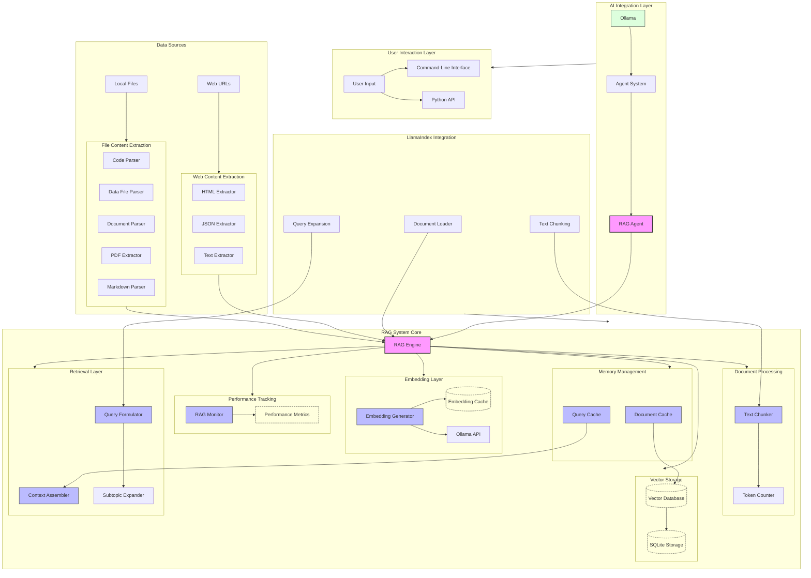

<!-- markdownlint-disable MD033 MD032 MD031 MD040 -->
# Retrieval-Augmented Generation (RAG) System

oarc_rag implements a sophisticated Retrieval-Augmented Generation (RAG) system to enhance curriculum generation by incorporating relevant information from various sources.

## System Architecture



## Core Components

### RAGEngine

The `RAGEngine` class serves as the central coordinator for the entire RAG system, providing a high-level interface for adding documents to the knowledge base, retrieving relevant context for queries, and managing persistent storage of embeddings and chunks.

```python
from oarc_rag.rag.engine import RAGEngine

# Initialize RAG engine
rag_engine = RAGEngine(
    run_id="curriculum_12345",
    embedding_model="llama3"
)

# Add documents to knowledge base
rag_engine.add_document(
    text="Python is a programming language...",
    metadata={"source": "documentation"},
    source="python_docs.md"
)

# Retrieve relevant context
results = rag_engine.retrieve(
    query="How to start learning Python?",
    top_k=5
)
```

The `RAGEngine` operates as a singleton to ensure consistent state across the application. It coordinates:

- Document ingestion and chunking
- Embedding generation through the Ollama API
- Vector storage and retrieval
- Context assembly for generation tasks

### Embedding Generation

The `EmbeddingGenerator` creates vector representations of text chunks using the Ollama API. It supports:

- Batched embedding generation for efficiency
- In-memory caching to reduce duplicate processing
- Automatic fallback and retry logic

```python
from oarc_rag.rag.embedding import EmbeddingGenerator

# Initialize embedding generator
embedder = EmbeddingGenerator(model_name="llama3")

# Generate embeddings for text
embeddings = embedder.embed_texts(["Text chunk 1", "Text chunk 2"])

# Check cache statistics
stats = embedder.get_cache_stats()
print(f"Cache hit rate: {stats['hit_rate']:.2f}")
```

### Text Chunking

The `TextChunker` divides documents into smaller, semantically meaningful pieces suitable for embedding:

- Uses LangChain's `RecursiveCharacterTextSplitter` for intelligent splitting
- Preserves paragraph boundaries when possible
- Supports token counting and metadata tracking

```python
from oarc_rag.rag.chunking import TextChunker

# Initialize chunker
chunker = TextChunker(chunk_size=512, overlap=50)

# Split document into chunks
chunks = chunker.chunk_text(long_document)

# Get chunks with metadata
chunked_doc = chunker.chunk_text_with_metadata(long_document)
```

### Vector Database

The `VectorDatabase` stores document chunks and their vector embeddings:

- In-memory implementation using pandas DataFrames
- Support for metadata and source tracking
- Similarity search with filters and thresholds

```python
from oarc_rag.rag.database import VectorDatabase

# Initialize database
vector_db = VectorDatabase()

# Add document chunks and embeddings
chunk_ids = vector_db.add_document(
    text_chunks=["Chunk 1", "Chunk 2"],
    vectors=[[0.1, 0.2], [0.3, 0.4]],
    metadata={"topic": "Python"},
    source="tutorial.md"
)

# Search for similar content
results = vector_db.search(
    query_vector=[0.1, 0.2],
    top_k=5,
    threshold=0.7,
    source_filter="tutorial.md"
)
```

### Context Assembly

The `ContextAssembler` creates formatted context from retrieved chunks:

- Multiple format styles (plain, markdown)
- Deduplication of similar content
- Token-aware truncation
- Source attribution and similarity scores

```python
from oarc_rag.rag.context import ContextAssembler

# Initialize context assembler
assembler = ContextAssembler(max_tokens=4000, format_style="markdown")

# Assemble context from retrieved chunks
context = assembler.assemble_context(
    chunks=retrieved_chunks,
    deduplicate=True
)
```

### Query Formulation

The `QueryFormulator` generates optimized queries for effective retrieval:

- Domain-specific query templates
- Topic detection and keyword enhancement
- Hierarchical and subtopic expansion
- Integration with LlamaIndex prompt templates

```python
from oarc_rag.rag.query import QueryFormulator

# Initialize query formulator
formulator = QueryFormulator()

# Generate query for curriculum resources
query = formulator.formulate_query(
    topic="Python",
    query_type="resources",
    skill_level="Beginner"
)

# Generate multiple queries for different curriculum aspects
queries = formulator.formulate_multi_queries(
    topic="Machine Learning",
    skill_level="Intermediate"
)

# Generate hierarchical queries from general to specific
hierarchical = formulator.create_hierarchical_queries(
    topic="Web Development"
)
```

### Caching System

The RAG system incorporates multiple caching strategies:

- `QueryCache`: Stores results of previous queries with TTL
- `DocumentCache`: Caches document chunks and embeddings
- `EmbeddingGenerator` cache: Reduces redundant embedding generation

```python
from oarc_rag.rag.cache import QueryCache, DocumentCache

# Initialize query cache with 1-hour TTL
query_cache = QueryCache(max_size=1000, ttl=3600)

# Store and retrieve from cache
query_cache.add("learn python basics", results)
cached_results = query_cache.get("learn python basics")

# Document cache for storing chunks and embeddings
doc_cache = DocumentCache(max_size=500)
doc_cache.add("tutorial.md", chunks, embeddings)
```

### Performance Monitoring

The `RAGMonitor` tracks system performance:

- Retrieval success rates and latency
- Embedding generation efficiency
- Query history and context statistics
- Persistent logging of metrics

```python
from oarc_rag.rag.monitor import RAGMonitor

# Initialize monitor
monitor = RAGMonitor(log_path="rag_metrics.json")

# Record retrieval operation
retrieval_id = monitor.start_retrieval()
monitor.record_retrieval(
    retrieval_id=retrieval_id,
    query="Python basics",
    results=retrieved_results,
    duration=0.25
)

# Get performance metrics
metrics = monitor.get_metrics()
print(f"Average retrieval time: {metrics['retrieval']['avg_time']:.3f}s")
```

### LlamaIndex Integration

The RAG system integrates with LlamaIndex for enhanced document processing:

- `LlamaDocumentLoader`: Loads and parses files (PDF, DOCX)
- Text processing with LlamaIndex components
- Compatibility with LlamaIndex prompt templates

```python
from oarc_rag.rag.llama import LlamaDocumentLoader, setup_llama_index

# Setup LlamaIndex integration
setup_llama_index()

# Initialize document loader
loader = LlamaDocumentLoader()

# Load document using LlamaIndex
documents = loader.load("curriculum_resources.pdf")

# Add document to RAG engine
rag_engine.add_document_with_llama("lecture_notes.pdf")
```

### RAG-Enhanced Agents

The `RAGAgent` extends the base agent class with RAG capabilities:

- Context-enhanced prompt creation
- Multiple retrieval strategies
- Performance tracking and reporting
- Context caching and management

```python
from oarc_rag.rag.rag_agent import RAGAgent

# Initialize RAG agent
agent = RAGAgent(
    name="CurriculumAgent",
    model="llama3",
    rag_engine=rag_engine,
    temperature=0.7
)

# Create enhanced prompt with context
enhanced_prompt = agent.create_enhanced_prompt(
    base_prompt="Create a learning path for Python programming",
    topic="Python",
    query_type="learning_path",
    skill_level="Beginner",
    context_strategy="chain_of_thought"
)

# Process input data with RAG enhancement
result = agent.process({
    "topic": "Machine Learning",
    "query_type": "overview",
    "base_prompt": "Explain machine learning concepts",
    "skill_level": "Intermediate"
})
```

## Usage Patterns

### Basic RAG Workflow

The typical workflow for using the RAG system in curriculum generation:

1. **Initialize the RAG engine**:
   ```python
   rag_engine = RAGEngine(
       run_id="python_curriculum",
       embedding_model="llama3"
   )
   ```

2. **Add documents to the knowledge base**:
   ```python
   for document_path in document_paths:
       rag_engine.add_document_with_llama(document_path)
   ```

3. **Create a RAG-enhanced agent**:
   ```python
   agent = RAGAgent(name="CurriculumBuilder", rag_engine=rag_engine)
   ```

4. **Generate curriculum components**:
   ```python
   overview = agent.process({
       "topic": "Python",
       "query_type": "overview",
       "base_prompt": "Create a comprehensive overview of Python programming"
   })
   
   learning_path = agent.process({
       "topic": "Python",
       "query_type": "learning_path",
       "base_prompt": "Create a structured learning path for Python programming"
   })
   ```

### Advanced Query Strategies

The system supports sophisticated query strategies:

1. **Hierarchical queries** - Start broad, then get specific:
   ```python
   hierarchical_queries = formulator.create_hierarchical_queries("Machine Learning")
   
   # Process each hierarchy level
   for level, queries in hierarchical_queries.items():
       for query in queries:
           results = rag_engine.retrieve(query)
           # Process results for this hierarchy level
   ```

2. **Topic expansion** - Explore related aspects:
   ```python
   expanded_queries = formulator.expand_query(
       "Python programming basics",
       ["data types", "control flow", "functions"]
   )
   
   all_results = []
   for query in expanded_queries:
       results = rag_engine.retrieve(query, top_k=3)
       all_results.extend(results)
   ```

### Performance Optimization

The RAG system includes several optimization strategies:

1. **Caching for frequently used content**:
   ```python
   # Enable document caching
   doc_cache = DocumentCache(max_size=1000)
   
   # Check cache before processing
   cached_chunks = doc_cache.get_chunks("document.pdf")
   if cached_chunks:
       # Use cached chunks
   else:
       # Process document and add to cache
       chunks = process_document("document.pdf")
       doc_cache.add("document.pdf", chunks, embeddings)
   ```

2. **Batch operations for efficiency**:
   ```python
   # Batch embedding generation
   chunks = chunker.chunk_text(long_document)
   embeddings = embedder.embed_texts(chunks)  # Processes all chunks in one API call
   ```

3. **Monitoring and tuning**:
   ```python
   # Check performance metrics
   metrics = monitor.get_metrics()
   
   # Adjust parameters based on performance
   if metrics["retrieval"]["avg_time"] > 0.5:
       # Reduce retrieval depth or increase caching
   ```

## Best Practices

### Document Preparation

- **Chunk size selection**: Consider model context window limitations
  - For most models, chunks of 512-1024 tokens work well
  - Smaller chunks (256-512) improve precision but may lose context
  - Larger chunks (1024+) preserve context but reduce diversity

- **Content organization**: Structure documents with clear headings and sections
  - Well-structured content produces better chunks
  - Include metadata like titles and source information
  - Use consistent terminology for better retrieval

### Query Optimization

- **Be specific**: More specific queries yield better results
  - Example: "Python data structures for beginners" vs. "Python"
  
- **Use domain-specific terminology**: Include relevant technical terms
  - Example: "Python list comprehensions and generators" vs. "Python shortcuts"
  
- **Consider query expansion**: Sometimes multiple queries work better than one
  - Example: Query both "Python basics" and "Python fundamentals"

### Context Assembly

- **Balance precision and diversity**: Include varied but relevant content
  - Aim for 3-7 high-quality chunks rather than many lower-quality ones
  
- **Remove redundant information**: Deduplication improves prompt quality
  - Use `deduplicate=True` when assembling context
  
- **Format for readability**: Well-formatted context improves model comprehension
  - Use the `format_style="markdown"` option for structured content

### Maintenance and Monitoring

- **Track performance metrics**: Use `RAGMonitor` to identify bottlenecks
  - Monitor retrieval success rates and response times
  - Identify frequently failing queries
  
- **Refresh content regularly**: Update the knowledge base with new information
  - Periodically add updated documents
  - Remove outdated content with `rag_engine.purge()`
  
- **Cache management**: Balance memory usage and performance
  - Adjust cache sizes based on available system resources
  - Clear caches when content changes significantly
