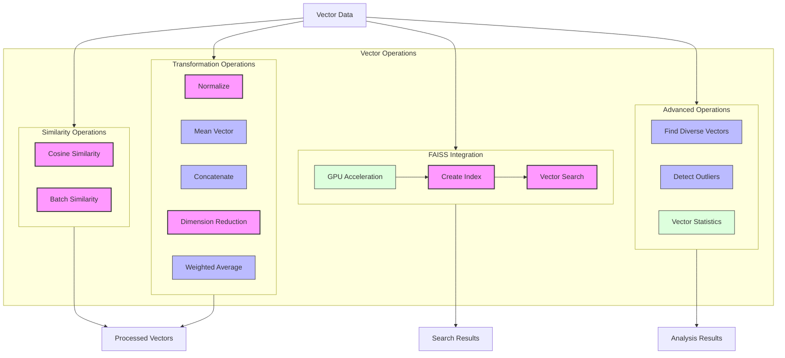

<!-- markdownlint-disable MD033 MD032 MD031 MD040 -->
# Vector Operations in oarc_rag

This document describes the vector operations functionality available in the oarc_rag project for supporting Retrieval-Augmented Generation (RAG) capabilities.

## Table of Contents

- [Overview](#overview)
- [Vector Similarity Operations](#vector-similarity-operations)
- [Vector Transformations](#vector-transformations)
- [FAISS Integration](#faiss-integration)
- [Advanced Vector Operations](#advanced-vector-operations)
- [Statistical Functions](#statistical-functions)
- [Best Practices](#best-practices)

## Overview

The vector operations module provides a set of functions for working with high-dimensional vector embeddings. These operations are essential for implementing effective RAG systems, where document embeddings need to be compared, manipulated, and efficiently searched.



## Vector Similarity Operations

### Cosine Similarity

```python
from oarc_rag.utils.vector.operations import cosine_similarity

# Calculate similarity between two vectors
score = cosine_similarity([0.1, 0.2, 0.3], [0.2, 0.3, 0.4])
print(f"Similarity score: {score}")  # Output will be between -1 and 1
```

Cosine similarity measures the cosine of the angle between two vectors, providing a similarity score between -1 and 1, where 1 indicates identical vectors and -1 indicates opposite vectors.

### Batch Cosine Similarity

```python
from oarc_rag.utils.vector.operations import batch_cosine_similarity

query = [0.1, 0.2, 0.3]
vectors = [
    [0.2, 0.3, 0.4],
    [0.1, 0.1, 0.1],
    [0.5, 0.5, 0.5]
]

# Calculate similarity between query and all vectors
scores = batch_cosine_similarity(query, vectors)
print(f"Similarity scores: {scores}")  # List of similarity scores
```

Efficiently computes similarity between one query vector and multiple candidate vectors using optimized matrix operations.

## Vector Transformations

### Normalize Vector

```python
from oarc_rag.utils.vector.operations import normalize_vector

# Normalize a vector to unit length
original = [3.0, 4.0]
normalized = normalize_vector(original)
print(f"Normalized vector: {normalized}")  # Length will be 1.0
```

Converts a vector to have unit length (L2 norm = 1) while preserving its direction.

### Mean Vector

```python
from oarc_rag.utils.vector.operations import mean_vector

# Calculate the centroid of multiple vectors
vectors = [
    [1.0, 2.0, 3.0],
    [4.0, 5.0, 6.0],
    [7.0, 8.0, 9.0]
]
centroid = mean_vector(vectors)
print(f"Centroid vector: {centroid}")  # Average of all vectors
```

Calculates the average of multiple vectors, creating a centroid that represents the "center" of the vector space.

### Concatenate Vectors

```python
from oarc_rag.utils.vector.operations import concatenate_vectors

# Combine multiple vectors into one larger vector
vectors = [
    [1.0, 2.0],
    [3.0, 4.0],
    [5.0, 6.0]
]
weights = [0.5, 0.3, 0.2]  # Optional weights

# Concatenate vectors with weights
combined = concatenate_vectors(vectors, weights)
print(f"Concatenated vector: {combined}")  # [0.5, 1.0, 0.9, 1.2, 1.0, 1.2]
```

Combines multiple vectors into a single, longer vector with optional weighting for each input vector.

### Reduce Dimensions

```python
from oarc_rag.utils.vector.operations import reduce_dimensions

# Reduce dimensionality of vectors using PCA
high_dim_vectors = [
    [1.0, 2.0, 3.0, 4.0, 5.0],
    [6.0, 7.0, 8.0, 9.0, 10.0],
    [11.0, 12.0, 13.0, 14.0, 15.0]
]
target_dims = 2

# Reduce from 5D to 2D
reduced_vectors = reduce_dimensions(high_dim_vectors, target_dims)
print(f"Reduced vectors: {reduced_vectors}")  # Now each vector has only 2 dimensions
```

Uses Principal Component Analysis (PCA) to reduce the dimensionality of vectors while preserving as much variance as possible.

### Weighted Average Vectors

```python
from oarc_rag.utils.vector.operations import weighted_average_vectors

vectors = [
    [1.0, 2.0, 3.0],
    [4.0, 5.0, 6.0],
    [7.0, 8.0, 9.0]
]
weights = [0.5, 0.3, 0.2]  # Must sum to approximately 1.0

# Calculate weighted average
w_avg = weighted_average_vectors(vectors, weights)
print(f"Weighted average: {w_avg}")
```

Calculates a weighted average of multiple vectors, where the influence of each vector is determined by its corresponding weight.

## FAISS Integration

### Creating a FAISS Index

```python
from oarc_rag.utils.vector.operations import create_faiss_index

# Create a FAISS index for fast similarity search
vectors = [
    [1.0, 2.0, 3.0],
    [4.0, 5.0, 6.0],
    # ... thousands more vectors ...
]

# Create index (uses GPU if available)
index = create_faiss_index(vectors, use_gpu=True)
```

Creates a FAISS index for efficient similarity search, with optional GPU acceleration for large datasets.

### Searching the FAISS Index

```python
from oarc_rag.utils.vector.operations import faiss_search

# Search for similar vectors in the index
query = [2.0, 3.0, 4.0]
k = 5  # Return top 5 results

# Get distances and indices of similar vectors
distances, indices = faiss_search(index, query, k)
print(f"Most similar indices: {indices}")
print(f"Distances: {distances}")
```

Performs a fast k-nearest neighbors search using the FAISS index, returning the indices and distances of the most similar vectors.

## Advanced Vector Operations

### Find Diverse Vectors

```python
from oarc_rag.utils.vector.operations import find_diverse_vectors

vectors = [
    # ... many vectors ...
]

# Find 3 diverse vectors from the collection
diverse_indices = find_diverse_vectors(vectors, count=3, min_similarity_threshold=0.7)
diverse_vectors = [vectors[i] for i in diverse_indices]

print(f"Diverse vector indices: {diverse_indices}")
```

Identifies a subset of vectors that are maximally different from each other, useful for ensuring variety in search results.

### Detect Outliers

```python
from oarc_rag.utils.vector.operations import detect_outliers

vectors = [
    # ... many vectors ...
]

# Find vectors that are statistical outliers
outlier_indices = detect_outliers(vectors, threshold=1.5)
print(f"Outlier indices: {outlier_indices}")
```

Identifies vectors that are statistical outliers based on their distance from the centroid, useful for data cleaning and anomaly detection.

## Statistical Functions

### Compute Vector Statistics

```python
from oarc_rag.utils.vector.operations import compute_vector_stats

vectors = [
    [1.0, 2.0, 3.0],
    [4.0, 5.0, 6.0],
    [7.0, 8.0, 9.0]
]

# Get statistical properties of the vector collection
stats = compute_vector_stats(vectors)
print(f"Dimensionality: {stats['dim']}")
print(f"Mean vector: {stats['mean']}")
print(f"Min magnitude: {stats['min_magnitude']}")
print(f"Max magnitude: {stats['max_magnitude']}")
```

Calculates various statistical properties of a collection of vectors, including dimensionality, mean, variance, and magnitude information.

## Best Practices

### Efficient Vector Operations

- Pre-normalize vectors when performing many similarity calculations
- Use batch operations when possible instead of loops
- Consider dimensionality reduction for very high-dimensional vectors
- Use FAISS for large-scale vector search operations

### GPU Acceleration

The vector operations module can leverage GPU acceleration through FAISS when available:

```python
# Check if GPU acceleration is available
from oarc_rag.utils.vector.operations import FAISS_GPU_ENABLED

if FAISS_GPU_ENABLED:
    print("GPU acceleration available for vector operations")
else:
    print("Using CPU-only mode for vector operations")
```

For large datasets, GPU acceleration can provide orders of magnitude faster performance, especially for k-nearest neighbor searches.

### Choosing the Right Operation

- **Cosine Similarity**: Best for comparing semantic similarity regardless of magnitude
- **Reduce Dimensions**: Useful for visualizing high-dimensional data or reducing computational complexity
- **Find Diverse Vectors**: Valuable for generating varied results for users
- **Detect Outliers**: Important for data cleaning and quality control
- **FAISS Search**: Essential for real-time search in large vector collections

### Memory Considerations

When working with large collections of vectors:

- Consider using numpy's memory-mapped arrays for very large datasets
- Reduce dimensionality when full precision isn't needed
- Use 32-bit floats instead of 64-bit doubles when possible
- Monitor memory usage when creating large FAISS indices
