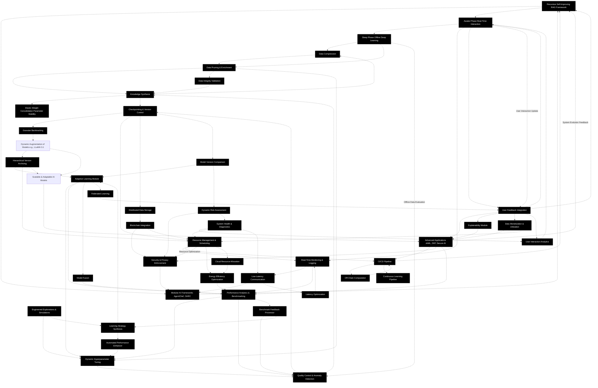

# Recursive Self-Improving RAG in Modular AI Frameworks: A Comprehensive Investigation

## Abstract

This thesis explores the transformative potential of Recursive Augmented Generation (RAG) within modular artificial intelligence frameworks, notably AgentChef and OARC. At its core, the research examines how lightweight AI models can be empowered through iterative refinement cycles—cycles that mirror the nature of human cognitive consolidation and circadian rhythms. The proposed framework continuously reprocesses data, compresses and prunes inefficient representations, and autonomously augments its own learning processes without external intervention. By anchoring each update in rigorous fact-checking and precision engineering, the system not only overcomes longstanding challenges related to scalability and adaptability but also democratizes access to high-performance AI solutions. This work embodies a synthesis of biological inspiration and computational innovation, forging a pathway toward intelligent systems that are both resilient and accessible in complex, real-world applications.

> **Implementation Note:** The theories presented in this document are implemented in the OARC-RAG system as described in Specification.md, with lightweight variants available through the Smol_Brain.md approach for resource-constrained environments.

## Introduction

In recent years, the rapid evolution of artificial intelligence has illuminated inherent limitations in static, monolithic architectures, especially when it comes to scaling and adapting to dynamic environments. Traditional systems are often burdened with rigid structures that impede their ability to evolve as new data emerges. Inspired by the self-organizing nature of biological systems, the Recursive Augmented Generation framework is conceived as a novel paradigm for continuous, autonomous improvement. This conceptual model draws parallels between the iterative learning processes of the human brain and the operational cycles of AI, suggesting that systems, much like living organisms, can benefit from a structured interplay between active engagement and reflective consolidation. By integrating these recursive cycles into modular platforms like AgentChef and OARC, the framework bridges the gap between real-time interactivity and profound offline learning, ensuring that while users experience a seamless, responsive system, extensive data refinement occurs concurrently behind the scenes.

The methodology leverages advanced techniques in data compression, selective enrichment, and automated pruning to optimize training datasets at every iteration. This rigorous approach is not taken lightly; every update is meticulously verified to contribute to the overall learning efficiency while safeguarding previous knowledge. In addressing issues such as catastrophic forgetting—a phenomenon where the system loses important insights as it evolves—the framework employs robust checkpointing mechanisms. Each checkpoint serves as an immutable record of the system’s evolution, allowing developers to trace the lineage of information and ensuring that the knowledge base remains both evolving and reliable. This dual focus on innovation and continuity is vital, as it harmonizes the need for immediate operational responsiveness with the imperative of long-term learning.

### Systems Diagram

---

### Technical Summary

The Recursive Self-Improving RAG Framework (**A**) serves as the central hub of an expansive, multi-layered AI ecosystem that continuously optimizes itself through recursive, bidirectional feedback loops. In this architecture, **A** collaborates synergistically with Modular AI Systems (**B**) to drive real-time operations during the Awake Phase (**AP**)—supported by Real-Time Monitoring (**RTM**), Low-Latency Communication (**LL**), and enhanced by Latency Optimization (**LO**)—while the Sleep Phase (**SP**) handles offline processing such as Data Compression (**DC**) and Data Pruning & Enrichment (**DP**). Processed data flows into Knowledge Synthesis (**KS**), which is rigorously validated by Data Integrity Validation (**DI**) and further refined through Dynamic Hyperparameter Tuning (**DHT**) overseen by Quality Control (**QC**). User feedback is captured via User Feedback Integration (**UFI**) and enriched with transparency provided by the Explainability Module (**EX**), feeding into Advanced Applications (**AA**). Robust knowledge preservation is maintained through Elastic Weight Consolidation (**EWC**), Checkpointing (**CP**), and Granular Backtracking (**GB**), with Distributed Data Storage (**DDS**) interfacing with Blockchain Integration (**BI**) to reinforce Security & Privacy Enforcement (**SecMod**). The system’s evolution is further driven by Dynamic Augmentation (**DA**) and Hierarchical Version Archiving (**HVA**), which together feed Adaptive Learning (**ALM**) enhanced by Model Fusion (**MF**) and supported by Federated Learning (**FL**). Continuous performance monitoring is ensured by Performance Analytics (**PA**) and Benchmark Feedback Processing (**BFP**), while Model Version Comparison (**MVP**) and Dynamic Risk Assessment (**DRA**) uphold system integrity by coordinating with System Health & Diagnostics (**SH**) and User Interaction Analytics (**UIA**). Underpinning these processes, Resource Management (**RM**), CI/CD Pipelines (**CD**), Cloud Resource Allocation (**CR**), and Off-Chain Computation (**OCC**) coalesce with a Continuous Learning Pipeline (**CLP**) to guarantee operational efficiency. Supplementary modules such as Engineered Explorations & Simulations (**ENG**), Learning Strategy Synthesis (**LS**), Automated Performance Enhancer (**APE**), Energy Efficiency Optimization (**EE**), and Data Monetization & Utilization (**DM**) further bolster the framework, resulting in a highly integrated, self-improving ecosystem designed for persistent adaptation and scalable, secure deployment.

## Computational Learning Inspired by Circadian Rhythms

At the heart of the RAG framework lies an operational model inspired by human circadian rhythms. Much like how the human brain alternates between periods of active engagement and deep sleep to consolidate memories, the system is divided into distinct but interrelated phases. The "awake" phase is dedicated to processing incoming requests and executing high-priority tasks, ensuring that interactive demands are met with minimal latency. In stark contrast, the "sleep" phase—analogous to the restorative and consolidative functions of human sleep—focuses on intense offline learning. Here, the model reorganizes vast amounts of accumulated data, compressing and distilling complex information into more manageable, high-value insights. 

### Practical Implementation

This theoretical model is implemented in OARC-RAG through:

1. **Mode Transition Management:** Automatic switching between awake and sleep modes based on:
   - System load and idle detection
   - Time-based scheduling
   - Manual triggers for immediate optimization

2. **Resource Allocation:**
   - Awake mode: Prioritizes memory for caching and response generation
   - Sleep mode: Allocates resources to batch processing and vector optimization

3. **Configurable Parameters:**
   - `awake_timeout`: Duration before considering sleep mode (default: 3600s)
   - `sleep_cycle_duration`: Minimum time to spend in sleep mode (default: 1800s)
   - `knowledge_consolidation_interval`: Period between deep optimization (default: 86400s)

For resource-constrained environments, the Smol_Brain implementation provides a simplified version with fixed operational modes and reduced processing requirements.

## Dynamic Augmentation of Foundational Models

The effectiveness of the recursive RAG framework is vividly demonstrated in its application to foundational models such as LLaMA 3.1. Even rudimentary architectures can undergo significant enhancements when subjected to iterative refinement. In what is called the "dream" phase, the system engages in a meticulous process of data pruning and enrichment. Raw data is first scrutinized to eliminate redundancy and then enriched with salient features that improve overall quality and relevance for subsequent training cycles. This dynamic augmentation process transforms the initial, unrefined datasets into sophisticated, hierarchically structured inputs that bolster the model’s performance. 

### Scale-Appropriate Implementation

The dynamic augmentation process can be implemented at various scales:

- **Full Implementation (Big_Brain):** Complete recursive processing with extensive data pruning, enrichment, and hierarchical version control
- **Moderate Implementation (Standard):** Scheduled optimization with basic version control and selective enrichment
- **Lightweight Implementation (Smol_Brain):** Essential optimization focusing on most frequently accessed content with minimal version tracking

Each implementation level maintains compatibility with the others, allowing systems to be upgraded as resources permit.

Integration into modular ecosystems like AgentChef is achieved through the implementation of unsloth server architectures, which meticulously archive each iteration as a distinct checkpoint. These checkpoints serve not only as milestones in the model’s evolution but also as verifiable records that enable systematic backtracking and continuous improvement. Such hierarchical version control assures that every incremental change meaningfully contributes to the cumulative knowledge base. The efficacy of this approach lies in its ability to continuously assimilate new patterns while preserving the integrity of previously acquired information, thereby fostering an environment of cumulative and sustainable learning.

## Safeguarding Knowledge Through Elastic Weight Consolidation

One of the most formidable challenges in designing iterative learning systems is the risk of catastrophic forgetting, where new learning inadvertently erases vital information developed in earlier iterations. To address this, the RAG framework incorporates Elastic Weight Consolidation (EWC), a sophisticated technique that assigns importance scores to model parameters and anchors these scores using matrix-based checkpoints. This strategy effectively ensures that crucial aspects of the system’s prior learning are preserved even as new information is assimilated. The integration of EWC not only stabilizes the learning process but also facilitates a form of granular backtracking whereby each evolutionary step of the model is documented with precision.

The system further optimizes its resource usage by employing advanced metadata compression techniques, which allow extensive amounts of data to be encoded into compact representations. This capability is critical, especially when dealing with architectures such as 8b Q4 models, where computational efficiency is paramount. By compressing metadata without losing essential details, the framework maintains robust accountability for every piece of information, thus safeguarding the continuity and reliability of the entire system. The result is an integrative approach that marries high-fidelity preservation of learned parameters with the dynamic influx of new data, ensuring that the model's evolution is both reversible and transparent.

## Applications and Long-Term Implications

The versatility of the recursive self-improving RAG framework opens up a multitude of applications across various domains. Its inherent capacity for automagic modular reconfiguration makes it ideally suited for decentralized environments where scalability, privacy, and adaptability are critical. In practical terms, this framework supports the development of secure, self-hosted AI solutions and paves the way for the integration of advanced paradigms such as zero-knowledge machine learning (zkML) and zero-knowledge proofs (ZKP). These features enhance the security and verification of AI operations, aligning the system with contemporary trends in distributed computing and data privacy.

Looking ahead, future research will undoubtedly focus on refining recursive techniques to meet the specific demands of various application domains. Further optimization of data compression algorithms remains a priority as information volumes continue to increase. The long-term implications of this work are profound, suggesting that by democratizing scalable, lightweight AI technologies, we can fundamentally reshape the architecture of intelligent systems. This transformative potential is not limited merely to technical environments but extends to a broader socio-economic context where accessible, high-performance AI could play a crucial role in bridging technological divides and fostering innovation on a global scale.

## Conclusion

In conclusion, the recursive self-improving RAG system represents a landmark advancement in the field of artificial intelligence. By fusing rigorous computational methodologies with insights drawn from human cognitive processes and natural temporal cycles, the framework establishes a new paradigm for continuous, autonomous learning. The intricate balance between real-time interactivity and intensive offline refinement creates a resilient loop of innovation that can adapt to the ever-changing demands of complex environments. Through the integration of Elastic Weight Consolidation, dynamic data augmentation, and modular checkpointing, the system not only mitigates potential pitfalls such as catastrophic forgetting but also secures a dependable evolutionary pathway for ongoing model improvement.

This comprehensive framework offers a compelling blueprint for the democratization of high-performance, adaptable AI systems. It enables a future where the boundaries of conventional AI are transcended by self-sufficient, continuously evolving models. In doing so, the research lays a robust foundation for both theoretical exploration and practical application, promising a new era in which intelligent systems are accessible, scalable, and profoundly transformative. The recursive self-improving RAG framework, therefore, stands as both a technical achievement and a visionary roadmap for the future of artificial intelligence.

## Implementation References

- For detailed technical specifications, see [Specification.md](Specification.md)
- For lightweight implementation guidance, see [Smol_Brain.md](Smol_Brain.md)
