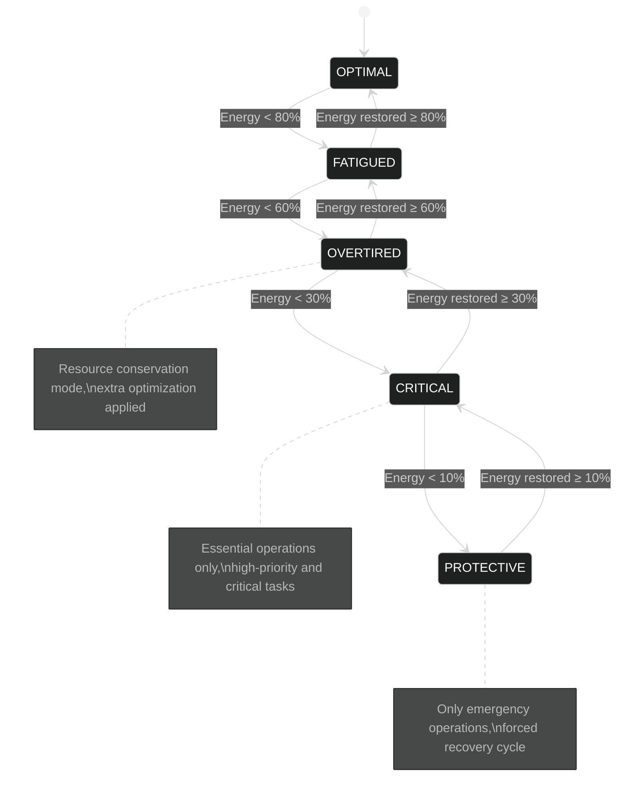

# Cognitive RAG (CRAG) System Technical Specification

## Table of Contents

- [1. Introduction](#1-introduction)
- [2. Core Concepts](#2-core-concepts)
  - [2.1 Cognitive Energy Model](#21-cognitive-energy-model)
  - [2.2 System States](#22-system-states)
  - [2.3 Sleep Stages](#23-sleep-stages)
- [3. Awake State Phases](#3-awake-state-phases)
  - [3.1 Alert Phase](#31-alert-phase)
  - [3.2 Focused Phase](#32-focused-phase)
  - [3.3 Conservation Phase](#33-conservation-phase)
  - [3.4 Emergency Phase](#34-emergency-phase)
- [4. Sleep Phases](#4-sleep-phases)
  - [4.1 NAPPING Phase](#41-napping-phase)
  - [4.2 SLOW_WAVE Phase](#42-slow_wave-phase)
  - [4.3 REM Phase](#43-rem-phase)
  - [4.4 RECOVERY Phase](#44-recovery-phase)
- [5. Dual-Graph Memory Architecture](#5-dual-graph-memory-architecture)
  - [5.1 Experience Graph](#51-experience-graph)
    - [5.1.1 Experience Graph Architecture](#511-experience-graph-architecture)
    - [5.1.2 Experience Graph Operations](#512-experience-graph-operations)
  - [5.2 Memory Graph](#52-memory-graph)
    - [5.2.1 Memory Graph Architecture](#521-memory-graph-architecture)
    - [5.2.2 Memory Graph Operations](#522-memory-graph-operations)
    - [5.2.3 Memory Graph Population and Maintenance](#523-memory-graph-population-and-maintenance)
  - [5.3 Dual-Graph Integration](#53-dual-graph-integration)
    - [5.3.1 Cross-Graph Retrieval](#531-cross-graph-retrieval)
    - [5.3.2 Knowledge Bridge Mechanism](#532-knowledge-bridge-mechanism)
  - [5.4 Memory Graph vs Experience Graph Comparison](#54-memory-graph-vs-experience-graph-comparison)
- [6. Server-Specific Adaptations](#6-server-specific-adaptations)
- [7. Integration with OARC-RAG Architecture](#7-integration-with-oarc-rag-architecture)
  - [7.1 Vector Database Enhancement](#71-vector-database-enhancement)
  - [7.2 RAG Engine Integration](#72-rag-engine-integration)
  - [7.3 API Layer Adaptation](#73-api-layer-adaptation)
  - [7.4 System Interconnection Architecture](#74-system-interconnection-architecture)
  - [7.5 Implementation Strategy](#75-implementation-strategy)
- [8. CRAG System Benefits for OARC-RAG](#8-crag-system-benefits-for-oarc-rag)
- [9. Error Handling in CRAG](#9-error-handling-in-crag)
  - [9.1 Energy-Aware Error Recovery](#91-energy-aware-error-recovery)
  - [9.2 Sleep Cycle Integration](#92-sleep-cycle-integration)
  - [9.3 Experience Graph Error Learning](#93-experience-graph-error-learning)
- [10. Security in CRAG](#10-security-in-crag)
  - [10.1 Energy-Based Protection Mechanisms](#101-energy-based-protection-mechanisms)
  - [10.2 Memory Graph Security](#102-memory-graph-security)
- [11. System Limitations and Future Work](#11-system-limitations-and-future-work)
  - [11.1 Current Limitations](#111-current-limitations)
  - [11.2 Future Research Directions](#112-future-research-directions)
- [12. Conclusion](#12-conclusion)

## 1. Introduction

This document outlines the technical design and implementation of the Cognitive RAG (CRAG) system for the OARC-RAG framework. The system implements computational analogs of biological cognitive processes, particularly the sleep-wake cycle and memory consolidation mechanisms, to create an efficient, self-regulating RAG system capable of continuous operation in server environments.

The CRAG system extends the core architecture defined in `Specification.md` by implementing:
- Energy and entropy tracking for operational state management
- Multi-stage sleep cycles for system optimization
- Dual-graph memory architecture for knowledge representation
- Protection mechanisms for continuous operation

## 2. Core Concepts

### 2.1 Cognitive Energy Model

The Cognitive Energy Model tracks the system's operational capacity through two primary metrics:

1. **Energy**: Represents the system's available computational resources, which are depleted through operations and recovered during sleep cycles.
2. **Entropy**: Represents system disorder that increases through operations and is reduced during sleep cycles.

The following algorithm demonstrates how the Cognitive Energy Model manages system resources and state transitions. This model serves as the foundation for the system's self-regulation capabilities, allowing it to adapt its behavior based on available computational resources. By tracking energy depletion from various operations and the accumulation of entropy (system disorder), the model enables graceful degradation under load and proactive resource management, similar to how biological systems manage their energy budgets.

```
CognitiveEnergyModel

Initialize:
  current_energy ← max_energy
  current_entropy ← 0
  system_state ← OPTIMAL
  current_sleep_stage ← AWAKE
  
RecordOperation(operation_type, count):
  energy_cost ← depletion_rates[operation_type] × count
  current_energy ← max(0, current_energy - energy_cost)
  current_entropy ← min(max_entropy, current_entropy + energy_cost × entropy_rate)
  UpdateSystemState()
  return {energy_remaining, entropy_level, system_state}

UpdateSystemState():
  energy_percent ← current_energy / max_energy × 100
  
  if energy_percent ≥ 80: new_state ← OPTIMAL
  else if energy_percent ≥ 60: new_state ← FATIGUED
  else if energy_percent ≥ 30: new_state ← OVERTIRED
  else if energy_percent ≥ 10: new_state ← CRITICAL
  else: new_state ← PROTECTIVE
  
  if entropy_percent > 90 and new_state ≠ PROTECTIVE:
    Degrade new_state by one level
  
  system_state ← new_state
  return new_state

ShouldInitiateSleep():
  if system_state ∈ {PROTECTIVE, CRITICAL}: return true
  if system_state = OVERTIRED and entropy_percent > 70: return true
  if time_since_activity > threshold and energy_low: return true
  return false
```

### 2.2 System States

The system transitions between operational states based on energy and entropy levels:

1. **OPTIMAL**: Full performance, well-rested (80-100% energy)
2. **FATIGUED**: Starting to show energy depletion (60-80% energy)
3. **OVERTIRED**: Significant energy depletion (30-60% energy)
4. **CRITICAL**: Emergency mode, only essential operations (10-30% energy)
5. **PROTECTIVE**: Forced recovery, minimal operations only (<10% energy)

The system employs a state-based optimization mechanism that adjusts resource usage based on current energy levels. This function maps system states to optimization levels, allowing components to adapt their behavior accordingly. Higher optimization levels correspond to more aggressive resource conservation strategies, ensuring the system can maintain essential functionality even when energy is low, as specified in the main architecture document's energy management guidelines.

```
GetOptimizationLevel():
  Match system_state:
    OPTIMAL:    return 0
    FATIGUED:   return 1
    OVERTIRED:  return 2
    CRITICAL:   return 3
    PROTECTIVE: return 4
```



### 2.3 Sleep Stages

The system implements multiple sleep stages inspired by human sleep cycles:

1. **NAPPING**: Light sleep for quick recovery, can be interrupted
2. **SLOW_WAVE**: Deep sleep for significant energy recovery and memory organization
3. **REM**: Creative connections and knowledge synthesis
4. **RECOVERY**: Emergency recovery mode for overtired systems

The sleep scheduling algorithm determines the appropriate sleep stage and duration based on the current system state. This biomimetic approach to system maintenance mirrors how human sleep cycles serve different cognitive functions. The sleep scheduler selects increasingly deeper and longer recovery periods as system energy decreases, with RECOVERY being the most intensive stage reserved for critical conditions. This mechanism connects directly to the maintenance strategies outlined in the main specification, providing scheduled periods for optimization tasks that would otherwise impact performance during normal operation.

```
ScheduleSleep():
  if system_state = PROTECTIVE:
    stage ← RECOVERY
    duration ← 30.0
  else if system_state = CRITICAL:
    stage ← SLOW_WAVE
    duration ← 20.0
  else if system_state = OVERTIRED:
    if entropy > high_threshold:
      stage ← REM
      duration ← 15.0
    else:
      stage ← SLOW_WAVE
      duration ← 10.0
  else:
    stage ← NAPPING
    duration ← 5.0
  
  ExecuteSleepCycle(stage, duration)

ExecuteSleepCycle(stage, duration):
  current_sleep_stage ← stage
  start_time ← current_time()
  
  if stage = NAPPING: PerformNapping(duration)
  else if stage = SLOW_WAVE: PerformSlowWaveSleep(duration)
  else if stage = REM: PerformREMSleep(duration)
  else if stage = RECOVERY: PerformRecoverySleep(duration)
  
  current_sleep_stage ← AWAKE
  UpdateSystemState()
```

## 3. Awake State Phases

The system operates in several distinct phases during the awake state, each with specific characteristics and responsibilities.

### 3.1 Alert Phase

During the Alert phase, the system operates at peak performance and responsiveness:

The Alert Phase represents the optimal operational mode when energy levels are high. This algorithm configures the system for maximum accuracy and proactive processing. In this phase, the system prioritizes result quality over computational efficiency, enabling features like speculative processing and advanced retrieval techniques. This phase aligns with the performance optimization strategies in the main specification, representing the baseline state where all systems operate at full capacity without constraints.

```
OperateInAlertPhase():
  if system_state ≠ OPTIMAL: return false
  
  SetOptimizationLevel(0)
  EnableProactiveOperations(true)
  SetRetrievalPriority("accuracy")
  StartAlertPhaseMonitoring()
  
  return true
```

### 3.2 Focused Phase

The Focused phase represents directed attention on specific tasks with moderate energy:

This algorithm configures the system for balanced operation when energy levels are good but not optimal. The Focused Phase represents a slight degradation from peak performance, implementing light optimizations to conserve resources while maintaining strong functionality. This state corresponds to the multi-level optimization approach described in the main specification, where the system can dynamically adjust its resource consumption based on operational conditions, prioritizing current tasks while beginning to limit background activities.

```
OperateInFocusedPhase():
  if system_state ∉ {OPTIMAL, FATIGUED}: return false
  
  SetOptimizationLevel(1)
  PrioritizeCurrentTasks()
  SetRetrievalPriority("balanced")
  
  return true
```

### 3.3 Conservation Phase

When energy is limited, the system enters Conservation phase to maintain essential functions:

The Conservation Phase algorithm implements significant energy-saving measures during periods of limited resources. This mode increases caching effectiveness, disables non-essential background tasks, and shifts retrieval strategies toward efficiency over comprehensiveness. It proactively schedules sleep cycles when possible to recover energy. This phase directly implements the graceful degradation principles described in the main specification, allowing the system to continue functioning effectively even with significantly reduced resources by focusing only on high-priority operations.

```
OperateInConservationPhase():
  if system_state ∉ {OVERTIRED, CRITICAL}: return false
  
  SetOptimizationLevel(3)
  DisableNonEssentialTasks()
  IncreaseEffectiveCacheTTL(3.0)
  SetRetrievalPriority("efficiency")
  
  if CanScheduleProactiveSleep():
    ScheduleProactiveSleep()
  
  return true
```

### 3.4 Emergency Phase

The Emergency phase represents operations under critical energy conditions:

The Emergency Phase activates when energy levels reach critically low thresholds. This emergency protocol maximizes resource conservation by enforcing the most aggressive optimization settings, rejecting all non-critical requests, and providing minimal responses to essential operations. It triggers immediate recovery cycles if not already in a sleep state. This phase implements the system protection mechanisms described in the main specification, preventing complete system failure by radically reducing functionality to preserve core operations until energy can be restored.

```
OperateInEmergencyPhase():
  if system_state ≠ PROTECTIVE: return false
  
  SetOptimizationLevel(4)
  RejectNonCriticalRequests()
  SetMinimalResponseMode()
  
  if current_sleep_stage = AWAKE:
    ForceRecoveryCycle()
  
  return true
```

## 4. Sleep Phases

Each sleep phase serves a specific purpose in maintaining system health and optimizing performance.

### 4.1 NAPPING Phase

The NAPPING phase provides light recovery with minimal system maintenance:

The NAPPING algorithm implements a light recovery mode designed for quick energy restoration with minimal interruption to system availability. It begins energy recovery immediately while gradually performing light maintenance tasks after the first minute. This phase regularly checks if it should be interrupted by urgent system needs. As described in the main specification's maintenance strategies, NAPPING represents the lowest-intensity maintenance cycle suitable for regular use during normal operation. The light maintenance tasks align with the "routine maintenance" operations outlined in the specification, focusing on cache refreshing and data validation.

```
PerformNapping(duration):
  minutes_elapsed ← 0
  interval ← 0.5
  
  while minutes_elapsed < duration:
    if CheckInterruptSleep(): break
    
    energy_recovery ← recovery_rates[NAPPING] × interval
    current_energy ← min(max_energy, current_energy + energy_recovery)
    
    entropy_reduction ← entropy_reduction_rates[NAPPING] × interval
    current_entropy ← max(0, current_entropy - entropy_reduction)
    
    if minutes_elapsed ≥ 1.0:
      PerformLightMaintenance(0.1)
    
    Sleep(interval × 60)
    minutes_elapsed ← minutes_elapsed + interval

PerformLightMaintenance(intensity):
  RefreshCriticalCaches()
  RemoveExpiredCacheEntries()
  ValidateRecentAdditions(10)
  UpdateSystemStatistics()
```

### 4.2 SLOW_WAVE Phase

SLOW_WAVE sleep focuses on deep memory consolidation and system optimization:

The SLOW_WAVE sleep algorithm implements deeper optimization and maintenance operations that parallel the slow-wave sleep phase in human cognition. It sequentially executes resource-intensive optimization tasks like PCA dimensionality reduction, vector cleanup, index optimization, and chunk clustering. Each operation helps consolidate and optimize the knowledge base, improving future retrieval efficiency. This phase directly implements the database optimization and index maintenance operations outlined in the main specification, and represents a critical component of the system's self-optimization capabilities, allowing it to maintain performance as the knowledge base grows.

```
PerformSlowWaveSleep(duration):
  start_time ← current_time()
  target_end_time ← start_time + duration × 60
  
  operations ← [
    (pca_optimization, OptimizePCA),
    (vector_cleanup, CleanupVectors),
    (index_optimization, OptimizeIndices),
    (chunk_clustering, ClusterChunks)
  ]
  
  for each operation in operations:
    if current_time() ≥ target_end_time: 
      exit loop
    
    execute operation
    
    time_spent ← (current_time() - last_update_time) / 60
    RecoverEnergy(SLOW_WAVE, time_spent)
    ReduceEntropy(SLOW_WAVE, time_spent)
```

### 4.3 REM Phase

The REM sleep phase focuses on creative connections and knowledge synthesis:

The REM sleep algorithm implements sophisticated knowledge synthesis operations inspired by how human REM sleep facilitates creative connections and memory consolidation. During this phase, the system identifies concept clusters, discovers semantically similar but disconnected chunks, creates new connections between related content, and generates higher-level abstractions. This phase implements the knowledge graph enhancement strategies described in the main specification, playing a critical role in developing the system's conceptual understanding over time by forming connections that aren't immediately apparent through direct similarity. These operations enhance the system's ability to retrieve contextually relevant information beyond simple vector similarity.

```
PerformREMSleep(duration):
  start_time ← current_time()
  target_end_time ← start_time + duration × 60
  
  concept_clusters ← IdentifyConceptClusters()
  
  for each cluster in concept_clusters:
    if current_time() ≥ target_end_time:
      exit loop
    
    distant_connections ← FindDistantConnections(cluster)
    CreateConceptConnections(cluster, distant_connections)
    GenerateAbstractions(cluster)
    
    RecoverEnergy(REM, time_since_last_update)
    ReduceEntropy(REM, time_since_last_update)
```

### 4.4 RECOVERY Phase

The Recovery phase is an emergency restorative sleep mode:

The RECOVERY sleep algorithm implements an emergency restoration protocol when the system reaches critically low energy levels. It executes in three distinct phases: rapid energy recovery (focusing on restoring computational resources), critical system repairs (fixing any identified issues or inconsistencies), and entropy reduction (restoring system order). This emergency protocol directly implements the system resilience strategies outlined in the main specification, providing a mechanism for the system to recover from periods of extreme load or resource depletion without manual intervention. This capability is essential for continuous operation in production environments.

```
PerformRecoverySleep(duration):
  initial_energy ← current_energy
  initial_entropy ← current_entropy
  
  PerformRapidEnergyRecovery(duration × 0.4)
  PerformCriticalRepairs(duration × 0.3)
  PerformEntropyReduction(duration × 0.3)
```

## 5. Dual-Graph Memory Architecture

The CRAG system implements a comprehensive dual-graph memory architecture that provides complementary knowledge representation and retrieval capabilities. This architecture consists of the Experience Graph for episodic memory and associative learning, and the Memory Graph for structured semantic knowledge.

### 5.1 Experience Graph

The Experience Graph forms associative memories by creating a network of experiences where edges represent meaningful relationships. This process is analogous to how episodic experiences are consolidated into pattern recognition.

#### 5.1.1 Experience Graph Architecture

The Experience Graph creates a multi-level representation of knowledge:

1. **Raw Experiences**: Individual text chunks with their vector embeddings
2. **K-Cluster Relationships**: Groupings of semantically similar chunks 
3. **Edge Formations**: Explicit relationships between clusters or chunks
4. **Memory Abstractions**: Higher-order nodes representing consolidated knowledge
5. **Meme Structures**: Self-reinforcing patterns that persist across multiple contexts

The GraphNode and GraphEdge classes define the core data structures for the Experience Graph component. These structures implement the associative memory model described in the main specification, creating a multi-layered representation that ranges from raw text chunks to higher-level conceptual abstractions. This hierarchical approach emulates how human memory consolidates specific experiences into generalized patterns and concepts. The Experience Graph complements the vector database described in the main specification by adding explicit relationship modeling and hierarchical abstraction capabilities.

```
GraphNode:
  id
  type
  text
  embedding
  metadata
  created_at
  source_ids
  activation

GraphEdge:
  id
  source_id
  target_id
  type
  weight
  metadata
```

#### 5.1.2 Experience Graph Operations

The Experience Graph supports several operations for memory formation and retrieval:

1. **Node Activation**: Tracks usage and strengthens connections
2. **Edge Formation**: Creates meaningful relationships between nodes
3. **Cluster Formation**: Groups similar nodes into clusters
4. **Abstraction Generation**: Synthesizes higher-level concepts
5. **Meme Identification**: Detects recurring patterns

The Experience Graph operations work together to create an associative memory system that models how human brains form connections between related information. The node activation mechanism reinforces frequently accessed information, making it more likely to be retrieved in future queries. Edge formation creates explicit connections between related concepts, while clustering groups similar content to support abstraction. The abstraction generation process is particularly important as it creates higher-level concepts from patterns in lower-level nodes, enabling the system to develop increasingly sophisticated understanding of its knowledge domain.

```
ActivateNode(node_id, activation_strength):
  node ← GetNode(node_id)
  if node is null: return false
  
  node.activation ← node.activation + activation_strength
  node.last_activated ← current_time()
  
  SpreadActivation(node_id, activation_strength × 0.5, 1)
  
  return true

SpreadActivation(source_id, strength, depth):
  if depth > max_activation_depth or strength < min_activation_threshold:
    return
  
  connected_nodes ← GetConnectedNodes(source_id)
  for each target_id, edge_weight in connected_nodes:
    spread_strength ← strength × edge_weight
    node ← GetNode(target_id) 
    node.activation ← node.activation + spread_strength
    
    SpreadActivation(target_id, spread_strength × 0.5, depth + 1)
```

### 5.2 Memory Graph

The Memory Graph provides structured knowledge representation through explicit semantic relationships. Unlike the associative nature of the Experience Graph, the Memory Graph focuses on precise, typed relationships between entities.

#### 5.2.1 Memory Graph Architecture

The Memory Graph is implemented as a directed property graph with:

1. **Entities**: Nodes representing concepts, objects, or abstract ideas
2. **Relationships**: Typed, directed edges connecting entities
3. **Properties**: Key-value attributes attached to entities and relationships
4. **Types**: Ontological classifications for entities and relationships

The EntityNode and RelationshipEdge classes define the core data structures for the Memory Graph, implementing the structured knowledge representation described in the main specification. Unlike the associative Experience Graph, the Memory Graph provides explicit semantic modeling through typed entities and relationships, capturing factual knowledge rather than pattern-based associations. This approach is aligned with the knowledge representation strategies in the main specification, enabling precise logical querying and inference capabilities that complement vector similarity search.

```
EntityNode:
  id
  type
  name
  properties
  created_at

RelationshipEdge:
  id
  source_id
  target_id
  type
  weight
  properties
```

#### 5.2.2 Memory Graph Operations

The Memory Graph supports several core operations:

1. **Entity Management**:
   - Addition, retrieval, update, and removal of entities
   - Property management for entity attributes

2. **Relationship Management**:
   - Creation of typed connections between entities 
   - Relationship property updates
   - Inverse relationship management

3. **Knowledge Queries**:
   - Path-based graph traversal
   - Entity neighborhood exploration
   - Pattern matching across subgraphs

4. **Inference Operations**:
   - Transitive relationship inference
   - Property inheritance through hierarchies
   - Consistency validation

These Memory Graph operations implement the structured knowledge management capabilities described in the main specification. The AddEntity algorithm creates new concept nodes in the knowledge graph, while AddRelationship establishes typed semantic connections between entities. The Query algorithm enables traversal-based knowledge retrieval that follows explicit relationship paths rather than vector similarity. These functions provide a complementary knowledge access mechanism to the vector similarity approaches described in the main specification, enabling more precise factual retrieval and logical inference capabilities.

```
AddEntity(type, name, properties):
  entity_id ← GenerateEntityID(type, name)
  
  if entity_id exists in entities:
    return failure with message "Entity already exists"
  
  entity ← create new entity with {id, type, name, properties}
  store entity in entities collection
  add entity_id to type index
  
  return success with entity_id
```

```
AddRelationship(source_id, relation_type, target_id, weight):
  if source_id or target_id not in entities:
    return failure with message "Entity not found"
  
  relationship_id ← GenerateRelationshipID(source_id, relation_type, target_id)
  relationship ← create relationship with {source_id, target_id, type, weight}
  
  store relationship in relationships collection
  update relationship indices
  
  if relation_type has inverse relation:
    inverse_type ← get inverse relation type
    AddRelationship(target_id, inverse_type, source_id, weight)
  
  return success with relationship_id
```

```
Query(start_entity, relation_path, max_depth):
  if start_entity not in entities:
    return empty results
  
  results ← empty list
  visited ← set containing start_entity
  queue ← list containing {entity: start_entity, depth: 0, path: empty list}
  
  while queue not empty and first item depth < max_depth:
    current ← remove first item from queue
    entity_id ← current.entity
    
    for each outgoing relation_type and targets from entity_id:
      if relation_path is null or relation_type in relation_path:
        for each target_id in targets:
          if target_id not in visited:
            add target_id to visited
            add {entity_id: target_id, depth: current.depth + 1} to results
            add {entity: target_id, depth: current.depth + 1} to queue
  
  return results
```

#### 5.2.3 Memory Graph Population and Maintenance

The Memory Graph is populated through several mechanisms:

1. **Direct Extraction**: Facts and relationships directly extracted from ingested documents
2. **Inference**: New relationships derived from existing knowledge
3. **External Knowledge**: Optional integration with external knowledge bases
4. **LLM Extraction**: Structured knowledge extraction using LLM capabilities

During sleep cycles, the Memory Graph undergoes maintenance:

The MemoryGraphMaintenance algorithm implements critical knowledge graph optimization and consistency management operations that occur during sleep cycles. This maintenance process aligns with the database optimization strategies in the main specification, focusing specifically on the structured knowledge represented in the Memory Graph. It performs ontological consistency checking, computes transitive relationships to enhance querying efficiency, prunes low-confidence data to maintain quality, and merges duplicate entities to reduce redundancy. These operations ensure the Memory Graph remains accurate and efficient as it grows, supporting the system's overall knowledge representation capabilities.

```
MemoryGraphMaintenance():
  inconsistencies ← CheckOntologicalConsistency()
  for each inconsistency: ResolveInconsistency(inconsistency)
  
  for each transitive_relation: ComputeTransitiveClosure(transitive_relation)
  
  low_confidence ← GetLowConfidenceRelationships(threshold)
  for each relationship in low_confidence: RemoveRelationship(relationship)
  
  potential_duplicates ← FindPotentialDuplicates()
  for each duplicate_group: MergeEntities(duplicate_group)
```

### 5.3 Dual-Graph Integration

The dual memory architecture integrates both graphs to provide complementary functionality:

```mermaid
%%{init: {
    'theme': 'dark',
    'themeVariables': {
        'background': 'transparent',
        'primaryColor': '#ffffff',
        'primaryTextColor': '#ffffff',
        'primaryBorderColor': '#ffffff',
        'lineColor': '#ffffff',
        'fontSize': '16px',
        'fontFamily': 'arial'
    }
}}%%

graph TB
    subgraph "Cognitive RAG System (CRAG)"
        direction TB
        
        subgraph "Memory Architecture"
            direction LR
            
            subgraph "Experience Graph"
                E1[Raw Experiences]
                E2[Clusters]
                E3[Abstractions]
                E4[Memes]
                
                E1 --> E2
                E2 --> E3
                E3 --> E4
            end
            
            subgraph "Memory Graph"
                M1[Entities]
                M2[Relationships]
                M3[Ontology]
                
                M1 --- M2
                M2 --- M3
                M3 --- M1
            end
            
            Bridge1[Knowledge Bridge]
            Bridge2[Entity Linking]
            
            E3 --- Bridge1
            Bridge1 --- M1
            E1 --- Bridge2
            Bridge2 --- M1
        end
        
        EM[Energy Management]
        SC[Sleep Cycles]
        PS[Protection System]
        
        EM --> SC
        SC --> "Memory Architecture"
        PS --> EM
    end
    
    VDB[(Vector Database)]
    RAG[RAG Processing]
    API[API Interface]
    
    VDB <--> "Experience Graph"
    "Memory Graph" <--> RAG
    "Experience Graph" <--> RAG
    EM <--> API
    RAG <--> API
```

#### 5.3.1 Cross-Graph Retrieval

The CRAG system provides integrated retrieval across both memory structures:

The DualGraphRetrieval algorithm implements the integrated querying system that combines vector-based similarity search with structured knowledge retrieval. This multi-phase approach enhances the core retrieval capabilities described in the main specification by adding structured knowledge context to similarity-based results. The algorithm first retrieves vector-similar content, then extracts entities to query the Memory Graph for related structured knowledge, and finally combines and ranks all results. This integrated approach provides more comprehensive, contextually-relevant responses compared to pure vector similarity methods, implementing the knowledge enhancement strategy outlined in the main specification.

```
DualGraphRetrieval(query, max_results):
  query_embedding ← EmbedQuery(query)
  
  experience_results ← experience_graph.RetrieveRelevantMemories(query_embedding, max_results)
  
  entities ← ExtractEntities(query)
  memory_results ← empty list
  
  for each entity in entities:
    entity_nodes ← memory_graph.LookupEntity(entity)
    for each entity_node in entity_nodes:
      relationships ← memory_graph.Query(entity_node, null, 2)
      for each relationship in relationships:
        add {text: format relationship as text, confidence: relationship.weight} to memory_results
  
  combined_results ← empty list
  
  for each result in experience_results:
    add {text: result.text, score: result.similarity, source: "experience_graph"} to combined_results
  
  for each result in memory_results:
    add {text: result.text, score: CalculateScore(result, query_embedding), source: "memory_graph"} to combined_results
  
  sort combined_results by score in descending order
  return first max_results items from combined_results
```

#### 5.3.2 Knowledge Bridge Mechanism

The system implements a Knowledge Bridge to transfer information between the two graph structures:

The Knowledge Bridge algorithms facilitate bidirectional information flow between the Experience Graph and Memory Graph components. The UpdateMemoryFromExperience function extracts structured knowledge from the abstract patterns identified in the Experience Graph, converting associative patterns into explicit semantic relationships in the Memory Graph. Conversely, the EnrichExperienceFromMemory function enhances vector-based content with structured knowledge context. These mechanisms implement the knowledge integration strategies outlined in the main specification, creating a synergistic relationship between the two complementary knowledge representation approaches. This integration enhances both retrieval precision and context awareness beyond what either system could achieve independently.

```
UpdateMemoryFromExperience():
  unprocessed_abstractions ← GetUnprocessedAbstractions()
  
  for each abstraction in unprocessed_abstractions:
    extraction_result ← ExtractStructuredKnowledge(abstraction.text)
    
    if extraction_result is successful:
      for each entity in extraction_result.entities:
        memory_graph.AddEntity(entity.type, entity.name, entity.properties)
      
      for each relationship in extraction_result.relationships:
        memory_graph.AddRelationship(relationship.source, relationship.type, relationship.target, relationship.confidence)
      
      mark abstraction as processed
```

```
EnrichExperienceFromMemory():
  recent_nodes ← GetRecentlyActivatedNodes()
  
  for each node in recent_nodes:
    if node is of type "chunk":
      entities ← ExtractEntities(node.text)
      
      for each entity in entities:
        memory_entities ← memory_graph.LookupEntity(entity)
        
        if memory_entities is not empty:
          for each memory_entity in memory_entities:
            relationships ← memory_graph.Query(memory_entity, null, 1)
            
            if relationships is not empty:
              enrichment_text ← FormatRelationshipsAsText(relationships)
              
              enrichment_id ← experience_graph.AddExperience(enrichment_text, EmbedText(enrichment_text), {type: "enrichment", entity: entity})
              
              experience_graph.CreateEdge(node.id, enrichment_id, "enrichment", 0.9)
```

### 5.4 Memory Graph vs Experience Graph Comparison

The dual-graph memory system provides complementary capabilities:

| Feature | Memory Graph | Experience Graph |
|---------|--------------|------------------|
| **Structure** | Structured triples (subject-predicate-object) | Associative clusters with embedding similarity |
| **Node Types** | Entities with types and properties | Chunks, clusters, abstractions, memes |
| **Edge Types** | Typed semantic relationships | Similarity, temporal, hierarchical |
| **Query Method** | Path traversal and pattern matching | Vector similarity and activation spread |
| **Knowledge Type** | Declarative, factual knowledge | Episodic, pattern-based knowledge |
| **Formation Process** | Explicit extraction and verification | Automatic clustering and abstraction |
| **Strength** | Precision and logical inference | Associative learning and pattern recognition |

This dual-graph approach enables the CRAG system to leverage both structured knowledge and associative learning for enhanced RAG capabilities.

## 6. Server-Specific Adaptations

The system is designed for continuous server operation:
- Background monitoring threads track energy, entropy, and usage patterns
- Sleep cycles are scheduled during predicted low-activity periods
- Request handling continues during light sleep stages

The CognitiveServer and HandleRequest algorithms implement the server adaptation layer that enables the CRAG system to operate continuously in production environments. These components integrate the cognitive framework with traditional server request handling, implementing the resilience and continuous operation strategies described in the main specification. The server manages incoming requests based on the current cognitive state, prioritizing critical operations and potentially rejecting non-essential requests during protective states. This approach ensures that the system can maintain core functionality even under extreme load conditions, implementing the graceful degradation principle outlined in the main specification.

```
CognitiveServer(rag_engine, cognitive_model):
  if rag_engine is null: 
    rag_engine ← create new RAGEngine
  
  if cognitive_model is null: 
    cognitive_model ← create new CognitiveEnergyModel
  
  start cognitive_model monitoring
  
  request_queue ← empty list
  stats ← {total_requests: 0, rejected_requests: 0}
```

```
HandleRequest(request_data, priority):
  request_id ← GenerateUUID()
  request ← {id: request_id, data: request_data, priority, timestamp: current_time}
  
  system_state ← cognitive_model.system_state
  
  if system_state is PROTECTIVE and priority is not "critical":
    increment stats.rejected_requests
    return {status: "rejected", reason: "system_in_protective_mode"}
  
  increment stats.total_requests
  
  add request to queue with priority
  
  if priority is "critical" and cognitive_model is in sleep mode:
    interrupt cognitive_model sleep
  
  result ← ProcessRequest(request)
  cognitive_model.RecordOperation("query", 1)
  
  return {status: "success", result, system_state, energy_level}
```

The server-specific adaptations enable the CRAG system to operate reliably in production environments by integrating energy awareness into request handling. The server implementation includes priority-based request processing, where higher-priority requests can interrupt sleep cycles when necessary. Additionally, the system can reject non-critical requests during protective states to conserve resources, allowing the server to recover from extreme load conditions without manual intervention. These mechanisms collectively ensure 24/7 operational capability with graceful performance degradation under stress.

## 7. Integration with OARC-RAG Architecture

The CRAG system integrates with core components of the OARC-RAG system as defined in `Specification.md`.

### 7.1 Vector Database Enhancement

The CRAG system enhances the Vector Database through:
- PCA optimization during sleep cycles
- Vector indices rebuilding during slow-wave sleep
- Operation prioritization based on system state
- Memory graph knowledge enhancement for semantic context

### 7.2 RAG Engine Integration

The RAG Engine interfaces with the CRAG system:
- Energy expenditure tracking for all operations
- Parameter adjustment based on energy state
- Non-urgent operation scheduling during appropriate cycles
- Knowledge-enhanced retrieval using both graph systems

The EnhancedRetrievalWithCRAG algorithm implements the integration between the core RAG engine and the cognitive system. This function enhances the basic vector retrieval capabilities described in the main specification by adding energy-aware parameter adjustment and dual-graph knowledge augmentation. The algorithm tracks energy usage, adjusts search parameters based on the current system state, and adaptively decides whether to enhance results with graph-based knowledge based on available energy. This implementation directly addresses the resource optimization and knowledge enhancement strategies outlined in the main specification, creating a system that can adapt its retrieval strategy based on current operational conditions.

```
EnhancedRetrievalWithCRAG(query, parameters):
  system_state ← cognitive_system.GetSystemState()
  adjusted_parameters ← AdjustParametersForState(parameters, system_state)
  
  cognitive_system.RecordOperationStart("retrieval")
  
  vector_results ← vector_db.Search(query_embedding: EmbedQuery(query), parameters: adjusted_parameters)
  
  energy_level ← cognitive_system.GetEnergyLevel()
  
  if energy_level > low_energy_threshold:
    graph_results ← DualGraphRetrieval(query, adjusted_parameters.top_k)
    merged_results ← MergeResults(vector_results, graph_results)
    results ← merged_results
  else:
    results ← vector_results
  
  cognitive_system.RecordOperationComplete("retrieval")
  
  return {results, system_info: {state: system_state, energy_level, optimization_level: cognitive_system.GetOptimizationLevel()}}
```

### 7.3 API Layer Adaptation

The CRAG system adapts the API layer to provide:
- System state information
- Enhanced retrieval capabilities
- Priority-based request handling

The API layer adaptations enable clients to interact with the cognitive aspects of the system, providing additional context about retrieval operations. Clients can receive information about the current system state, energy levels, and optimization settings along with query results. This transparency allows applications to adapt their interaction patterns based on the cognitive system's current state, potentially delaying non-critical operations when the system is in resource-constrained states, or enabling more comprehensive queries when energy levels are high.

### 7.4 System Interconnection Architecture

The CRAG system integrates seamlessly with the OARC-RAG architecture, connecting core components such as the Vector Database, RAG Engine, and API Interface.

The system interconnection architecture enables the cognitive components to influence and enhance the core RAG operations without requiring fundamental changes to the base architecture. The cognitive system's energy model serves as a central coordination mechanism, providing system state information that influences parameter settings, operation scheduling, and retrieval strategies across all components. This architecture follows the principles of progressive enhancement, where cognitive capabilities are layered on top of the base functionality, allowing the system to continue operating even if cognitive components are temporarily unavailable.

### 7.5 Implementation Strategy

The integration with existing systems follows these principles:

1. **Non-invasive coupling**: Cognitive components communicate with core systems through well-defined interfaces
2. **Graceful degradation**: If cognitive systems are unavailable, core functionality continues with default parameters
3. **Progressive enhancement**: Cognitive capabilities are layered on top of base functionality
4. **Event-driven communication**: Core systems emit events that cognitive components can monitor and respond to
5. **Resource-aware scheduling**: Cognitive operations adapt based on system load and available resources

## 8. CRAG System Benefits for OARC-RAG

The Cognitive RAG (CRAG) system enhances the OARC-RAG framework with self-regulation capabilities inspired by biological cognitive processes. By implementing energy tracking, entropy management, sleep cycles, and a dual-graph memory architecture, the system achieves:

1. **Efficient resource management** through energy-aware operation scheduling
2. **System health maintenance** through regular optimization cycles
3. **Dual knowledge representation** using complementary memory structures
4. **Graceful degradation** under resource constraints
5. **Continuous operation capability** for server environments
6. **Self-optimization** through adaptive parameter tuning
7. **Enhanced retrieval** through integrated graph-based and vector-based search
8. **Associative learning** via the Experience Graph's abstraction mechanisms
9. **Structured knowledge** via the Memory Graph's semantic relationships

The CRAG system transforms a basic RAG implementation into a self-regulating cognitive architecture capable of continuous learning and adaptation in production environments.

## 9. Error Handling in CRAG

### 9.1 Energy-Aware Error Recovery

Error handling in the CRAG system is modulated by the current energy state:

The HandleCRAGError algorithm implements energy-aware error handling that adapts recovery strategies based on the system's current energy state. This approach extends the error handling framework described in the main specification by making recovery behavior dynamic rather than static. The system becomes more conservative in its retry policies as energy decreases, reducing maximum retries and increasing backoff periods to prevent error recovery from consuming critical resources. This implementation directly supports the system resilience principles described in the main specification, ensuring that error recovery itself doesn't exacerbate resource constraints during periods of system stress.

```
HandleCRAGError(error, context):
  state ← cognitive_system.GetSystemState()
  energy_level ← cognitive_system.GetEnergyLevel()
  
  error_type ← ClassifyError(error)
  error_config ← GetErrorConfiguration(error_type)
  
  cognitive_system.RecordErrorEvent(error_type, context)
  
  if error_config.retryable:
    if state is CRITICAL or PROTECTIVE:
      max_retries ← minimum(1, error_config.max_retries)
      backoff_factor ← error_config.backoff_factor × 2.0
    else if state is OVERTIRED:
      max_retries ← maximum(1, error_config.max_retries - 1)
      backoff_factor ← error_config.backoff_factor × 1.5
    else:
      max_retries ← error_config.max_retries
      backoff_factor ← error_config.backoff_factor
    
    return RetryWithParameters(error, context, max_retries, backoff_factor)
  
  recovery_strategy ← DetermineRecoveryStrategy(error, context, state)
  
  return {handled: true, strategy: recovery_strategy, state, error_type}
```

### 9.2 Sleep Cycle Integration

The CRAG system can defer error recovery to sleep cycles for non-critical errors:

The DetermineRecoveryStrategy algorithm implements intelligent scheduling of error recovery operations, integrating with the sleep cycle framework. This mechanism enhances the system's resilience by deferring non-critical error recovery to appropriate sleep phases rather than handling all errors immediately. By evaluating whether recovery can be safely delayed, the system preserves resources for immediate operational needs while ensuring errors are still addressed during maintenance periods. This approach aligns with the maintenance scheduling strategies outlined in the main specification, treating error recovery as another form of system maintenance that can be prioritized and scheduled appropriately.

```
DetermineRecoveryStrategy(error, context, state):
  if CanDeferRecovery(error) and state is not PROTECTIVE:
    sleep_task ← {type: "error_recovery", error, context, priority: DetermineRecoveryPriority(error)}
    
    cognitive_system.ScheduleSleepTask(sleep_task)
    
    return {action: "deferred_to_sleep", scheduled_cycle: DetermineSleepCycleForRecovery(error)}
  
  return {action: "immediate_recovery", steps: GenerateRecoverySteps(error, context, state)}
```

### 9.3 Experience Graph Error Learning

The CRAG system learns from errors by recording patterns in the Experience Graph:

The RecordErrorInExperienceGraph algorithm implements an error pattern learning system that leverages the Experience Graph to improve future error handling. By recording error experiences as nodes in the graph and finding similarities between errors, the system can identify recurring patterns and generate higher-level abstractions about error categories. This approach extends the self-improvement capabilities described in the main specification to error handling, allowing the system to develop more sophisticated error management strategies over time. By scheduling error pattern abstraction during REM sleep cycles, the system continuously refines its understanding of error conditions and their appropriate responses.

```
RecordErrorInExperienceGraph(error, context):
  error_text ← FormatErrorExperience(error, context)
  error_embedding ← EmbedText(error_text)
  
  error_node_id ← experience_graph.AddExperience(error_text, error_embedding, {type: "error_experience", error_type: error.type})
  
  similar_errors ← experience_graph.FindSimilarNodes(error_node_id, "error_experience", 5, 0.8)
  
  for each (similar_id, similarity) in similar_errors:
    experience_graph.CreateEdge(error_node_id, similar_id, "similar_error", similarity)
  
  if number of similar_errors ≥ 3:
    cognitive_system.ScheduleREMTask({type: "error_pattern_abstraction", node_ids: [error_node_id] + similar_ids, priority: "medium"})
```

## 10. Security in CRAG

### 10.1 Energy-Based Protection Mechanisms

The CRAG system leverages its energy model to enhance security:

The ApplyEnergyBasedProtection algorithm implements adaptive security controls that become increasingly strict as system energy decreases. This energy-aware security approach extends the protection mechanisms described in the main specification by dynamically adjusting validation stringency and rate limits based on the current system state. During high-energy states, the system can afford more permissive validation, while low-energy states trigger stricter validation to prevent resource exhaustion attacks. This implementation directly addresses the security considerations outlined in the main specification, providing an additional layer of defense that becomes more aggressive as the system enters more vulnerable states.

```
ApplyEnergyBasedProtection(request, client_info):
  state ← cognitive_system.GetSystemState()
  
  validation_level ← state.GetValidationLevel()
  
  validation_result ← ValidateRequestWithLevel(request, validation_level)
  if not validation_result.valid:
    return {allowed: false, reason: "validation_failed", details: validation_result.failures}
  
  rate_limit_result ← CheckEnergyAwareRateLimit(client_info, state)
  if not rate_limit_result.allowed:
    return {allowed: false, reason: "rate_limited", retry_after: rate_limit_result.retry_after}
  
  if state is PROTECTIVE:
    if not IsRequestCritical(request):
      return {allowed: false, reason: "protective_mode", retry_after: EstimateRecoveryTime()}
  
  return {allowed: true}
```

### 10.2 Memory Graph Security

The Memory Graph provides security benefits through access control and relationship validation:

The ValidateRelationshipSecurity algorithm implements multi-layered validation for knowledge graph modifications. This security mechanism extends the data integrity protections described in the main specification by ensuring that relationship changes conform to ontological constraints, access control rules, and provenance requirements. By validating relationships before they are added to the Memory Graph, the system prevents knowledge corruption and unauthorized modifications. This approach is particularly important for maintaining the integrity of the structured knowledge representation that forms a critical component of the system's retrieval capabilities.

```
ValidateRelationshipSecurity(source_id, relation_type, target_id):
  ontology_valid ← ValidateRelationshipOntology(source_id, relation_type, target_id)
  if not ontology_valid:
    return {valid: false, reason: "ontology_violation"}
  
  access_valid ← CheckRelationshipAccessControl(source_id, relation_type, target_id)
  if not access_valid:
    return {valid: false, reason: "access_control_violation"}
  
  provenance_valid ← ValidateRelationshipProvenance(source_id, relation_type, target_id)
  if not provenance_valid:
    return {valid: false, reason: "invalid_provenance"}
  
  return {valid: true}
```

The Memory Graph security mechanisms work together to protect the integrity of the knowledge graph. The ontological validation ensures that relationships comply with the defined domain model, preventing semantic inconsistencies. Access control validation enforces permissions on entities and relationships, limiting modifications to authorized users or processes. Provenance validation verifies that new relationships have appropriate sourcing and confidence levels. These layered protections preserve the structured knowledge representation's reliability, ensuring that inferences and query results maintain high quality and trustworthiness.

## 11. System Limitations and Future Work

### 11.1 Current Limitations

The CRAG system has several inherent limitations:

1. **Energy Model Calibration**: The energy depletion and recovery rates require careful tuning for each specific deployment environment.
2. **Sleep Cycle Scheduling**: Optimal scheduling of sleep cycles depends on application usage patterns which may not be predictable.
3. **Memory Graph Consistency**: Maintaining logical consistency in the Memory Graph becomes challenging as the graph grows in size and complexity.
4. **Computational Overhead**: The cognitive framework introduces additional computational overhead that must be balanced against performance benefits.
5. **Cold Start Problem**: Both graph structures require significant data to provide value, creating a cold start challenge.

### 11.2 Future Research Directions

Several promising areas for future enhancement include:

1. **Adaptive Energy Model**: Self-adjusting energy parameters based on observed system behavior and performance metrics.
2. **Hierarchical Sleep Cycles**: Multi-level sleep scheduling that operates at different granularities (component-level vs. system-level).
3. **Probabilistic Memory Graph**: Introducing uncertainty handling and belief revision into the Memory Graph for more robust knowledge representation.
4. **Cross-Modal Bridging**: Extending the Knowledge Bridge to handle multimodal information beyond text.
5. **Distributed Cognitive Architecture**: Implementing distributed CRAG instances that share knowledge and coordinate sleep cycles.

The ImplementAdaptiveEnergyModel algorithm outlines a future enhancement that would allow the system to self-tune its energy parameters based on operational history. This approach addresses one of the key limitations identified in the current system by analyzing past operation impacts and recovery effectiveness to propose optimized energy parameters. The implementation uses a gradual blending approach to avoid disruptive parameter changes. This enhancement aligns with the adaptive optimization strategies mentioned in the main specification, advancing the system's capability to self-regulate without manual parameter tuning across different deployment environments.

```
ImplementAdaptiveEnergyModel():
  operation_history ← GetOperationHistory(30 days)
  
  depletion_analysis ← AnalyzeEnergyImpact(operation_history)
  recovery_analysis ← AnalyzeRecoveryEffectiveness(GetSleepHistory(30 days))
  
  proposed_parameters ← {
    depletion_rates: CalculateOptimalDepletionRates(depletion_analysis),
    recovery_rates: CalculateOptimalRecoveryRates(recovery_analysis),
    thresholds: DetermineOptimalThresholds(operation_history)
  }
  
  current_parameters ← GetCurrentParameters()
  blended_parameters ← BlendParameters(current_parameters, proposed_parameters, 0.2)
  
  UpdateEnergyParameters(blended_parameters)
  ScheduleParameterEvaluation(7 days)
```

The adaptive energy model represents a significant advancement toward fully autonomous operation. By analyzing operational patterns, the system can identify which types of operations consume more energy than expected, which sleep cycles provide the most effective recovery, and what threshold adjustments would optimize performance. This self-tuning capability would eliminate the need for manual calibration across different deployment environments, allowing the system to automatically adapt to the specific workload patterns and hardware constraints of each installation.

## 12. Conclusion

The Cognitive RAG (CRAG) system represents a significant advancement in retrieval-augmented generation architectures by incorporating biologically-inspired self-regulation mechanisms. Through the energy model, sleep cycles, and dual-graph memory architecture, CRAG addresses critical challenges in maintaining system health, optimizing resource usage, and enhancing knowledge representation.

The integration of structured knowledge in the Memory Graph with associative learning in the Experience Graph provides a comprehensive foundation for advanced reasoning and contextual understanding. This dual approach enables both precise factual recall and intuitive pattern recognition that complements traditional vector similarity methods.

By modeling the system's operational capacity as energy and entropy, CRAG introduces an adaptive framework that naturally adjusts to varying workloads and prioritizes tasks based on available resources. The sleep cycle mechanism further enhances this adaptability by providing scheduled maintenance periods that optimize performance and consolidate knowledge.

For production deployments, CRAG offers significant advantages in terms of sustainability, reliability, and continuous improvement. As the system operates, it naturally evolves its knowledge structures and optimizes its parameters, resulting in increasingly effective retrieval and generation capabilities.

Implementation of the CRAG architecture should follow the guidelines in this document, with careful consideration of the specific requirements and constraints of the target environment. Through appropriate tuning of energy parameters and sleep cycle scheduling, the system can be adapted to a wide range of operational contexts.

Future research directions include enhancing the adaptive capabilities of the energy model, expanding the knowledge representation capabilities of the dual-graph architecture, and exploring distributed cognitive architectures for large-scale deployments.
