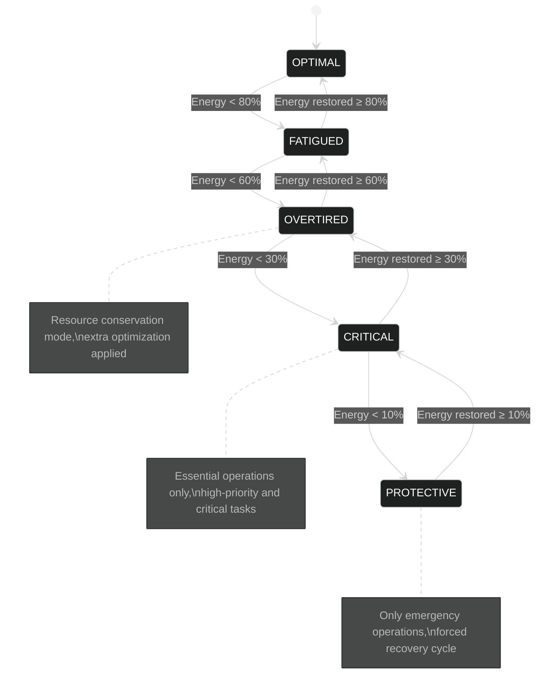

# Cognitive RAG (CRAG) System Technical Specification

## 1. Introduction

This document outlines the technical design and implementation of the Cognitive RAG (CRAG) system for the OARC-RAG framework. The system implements computational analogs of biological cognitive processes, particularly the sleep-wake cycle and memory consolidation mechanisms, to create an efficient, self-regulating RAG system capable of continuous operation in server environments.

The CRAG system extends the core architecture defined in `Specification.md` by implementing:
- Energy and entropy tracking for operational state management
- Multi-stage sleep cycles for system optimization
- Dual-graph memory architecture for knowledge representation
- Protection mechanisms for continuous operation

## 2. Core Concepts

### 2.1 Cognitive Energy Model

The Cognitive Energy Model tracks the system's operational capacity through two primary metrics:

1. **Energy**: Represents the system's available computational resources, which are depleted through operations and recovered during sleep cycles.
2. **Entropy**: Represents system disorder that increases through operations and is reduced during sleep cycles.

```
Algorithm: CognitiveEnergyModel

Initialize:
  current_energy ← max_energy
  current_entropy ← 0
  system_state ← OPTIMAL
  current_sleep_stage ← AWAKE
  
RecordOperation(operation_type, count):
  energy_cost ← depletion_rates[operation_type] × count
  current_energy ← max(0, current_energy - energy_cost)
  current_entropy ← min(max_entropy, current_entropy + energy_cost × entropy_rate)
  UpdateSystemState()
  return {energy_remaining, entropy_level, system_state}

UpdateSystemState():
  energy_percent ← current_energy / max_energy × 100
  
  // Determine state from energy level
  if energy_percent ≥ 80: new_state ← OPTIMAL
  else if energy_percent ≥ 60: new_state ← FATIGUED
  else if energy_percent ≥ 30: new_state ← OVERTIRED
  else if energy_percent ≥ 10: new_state ← CRITICAL
  else: new_state ← PROTECTIVE
  
  // Adjust for high entropy
  if entropy_percent > 90 and new_state ≠ PROTECTIVE:
    Degrade new_state by one level
  
  system_state ← new_state
  return new_state

ShouldInitiateSleep():
  // Evaluate energy, entropy, and inactivity to decide
  if system_state ∈ {PROTECTIVE, CRITICAL}: return true
  if system_state = OVERTIRED and entropy_percent > 70: return true
  if time_since_activity > threshold and energy_low: return true
  return false
```

### 2.2 System States

The system transitions between operational states based on energy and entropy levels:

1. **OPTIMAL**: Full performance, well-rested (80-100% energy)
2. **FATIGUED**: Starting to show energy depletion (60-80% energy)
3. **OVERTIRED**: Significant energy depletion (30-60% energy)
4. **CRITICAL**: Emergency mode, only essential operations (10-30% energy)
5. **PROTECTIVE**: Forced recovery, minimal operations only (<10% energy)

```
GetOptimizationLevel():
  Match system_state:
    OPTIMAL:    return 0  // No optimizations
    FATIGUED:   return 1  // Light optimizations
    OVERTIRED:  return 2  // Moderate optimizations
    CRITICAL:   return 3  // Heavy optimizations
    PROTECTIVE: return 4  // Maximum optimizations
```



### 2.3 Sleep Stages

The system implements multiple sleep stages inspired by human sleep cycles:

1. **NAPPING**: Light sleep for quick recovery, can be interrupted
2. **SLOW_WAVE**: Deep sleep for significant energy recovery and memory organization
3. **REM**: Creative connections and knowledge synthesis
4. **RECOVERY**: Emergency recovery mode for overtired systems

```
ScheduleSleep():
  // Choose appropriate sleep stage based on current state
  if system_state = PROTECTIVE:
    stage ← RECOVERY
    duration ← 30.0
  else if system_state = CRITICAL:
    stage ← SLOW_WAVE
    duration ← 20.0
  else if system_state = OVERTIRED:
    if entropy > high_threshold:
      stage ← REM  // High entropy needs REM
      duration ← 15.0
    else:
      stage ← SLOW_WAVE
      duration ← 10.0
  else:
    stage ← NAPPING
    duration ← 5.0
  
  ExecuteSleepCycle(stage, duration)

ExecuteSleepCycle(stage, duration):
  current_sleep_stage ← stage
  start_time ← current_time()
  
  // Execute stage-specific operations
  if stage = NAPPING: PerformNapping(duration)
  else if stage = SLOW_WAVE: PerformSlowWaveSleep(duration)
  else if stage = REM: PerformREMSleep(duration)
  else if stage = RECOVERY: PerformRecoverySleep(duration)
  
  current_sleep_stage ← AWAKE
  UpdateSystemState()
```

## 3. Awake State Phases

The system operates in several distinct phases during the awake state, each with specific characteristics and responsibilities.

### 3.1 Alert Phase

During the Alert phase, the system operates at peak performance and responsiveness:

```
OperateInAlertPhase():
  if system_state ≠ OPTIMAL: return false
  
  // Set optimization to minimum
  SetOptimizationLevel(0)
  EnableProactiveOperations(true)
  SetRetrievalPriority("accuracy")
  StartAlertPhaseMonitoring()
  
  return true
```

### 3.2 Focused Phase

The Focused phase represents directed attention on specific tasks with moderate energy:

```
OperateInFocusedPhase():
  if system_state ∉ {OPTIMAL, FATIGUED}: return false
  
  // Apply light optimization
  SetOptimizationLevel(1)
  PrioritizeCurrentTasks()
  SetRetrievalPriority("balanced")
  
  return true
```

### 3.3 Conservation Phase

When energy is limited, the system enters Conservation phase to maintain essential functions:

```
OperateInConservationPhase():
  if system_state ∉ {OVERTIRED, CRITICAL}: return false
  
  // Apply significant optimization
  SetOptimizationLevel(3)
  DisableNonEssentialTasks()
  IncreaseEffectiveCacheTTL(3.0)  // 3x normal TTL
  SetRetrievalPriority("efficiency")
  
  if CanScheduleProactiveSleep():
    ScheduleProactiveSleep()
  
  return true
```

### 3.4 Emergency Phase

The Emergency phase represents operations under critical energy conditions:

```
OperateInEmergencyPhase():
  if system_state ≠ PROTECTIVE: return false
  
  // Maximum optimization to preserve resources
  SetOptimizationLevel(4)
  RejectNonCriticalRequests()
  SetMinimalResponseMode()
  
  if current_sleep_stage = AWAKE:
    ForceRecoveryCycle()
  
  return true
```

## 4. Sleep Phases

Each sleep phase serves a specific purpose in maintaining system health and optimizing performance.

### 4.1 NAPPING Phase

The NAPPING phase provides light recovery with minimal system maintenance:

```
PerformNapping(duration):
  minutes_elapsed ← 0
  interval ← 0.5
  
  while minutes_elapsed < duration:
    if CheckInterruptSleep(): break
    
    // Recover energy
    energy_recovery ← recovery_rates[NAPPING] × interval
    current_energy ← min(max_energy, current_energy + energy_recovery)
    
    // Light entropy reduction
    entropy_reduction ← entropy_reduction_rates[NAPPING] × interval
    current_entropy ← max(0, current_entropy - entropy_reduction)
    
    // Perform light maintenance after first minute
    if minutes_elapsed ≥ 1.0:
      PerformLightMaintenance(0.1)
    
    Sleep(interval × 60)
    minutes_elapsed ← minutes_elapsed + interval

PerformLightMaintenance(intensity):
  RefreshCriticalCaches()
  RemoveExpiredCacheEntries()
  ValidateRecentAdditions(10)
  UpdateSystemStatistics()
```

### 4.2 SLOW_WAVE Phase

SLOW_WAVE sleep focuses on deep memory consolidation and system optimization:

```
PerformSlowWaveSleep(duration):
  start_time ← current_time()
  target_end_time ← start_time + (duration × 60)
  
  operations ← [
    ("pca_optimization", PerformPCAOptimization),
    ("vector_cleanup", PerformVectorCleanup),
    ("index_optimization", OptimizeIndices),
    ("chunk_clustering", ClusterChunks)
  ]
  
  // Perform operations until time runs out
  for each (op_name, op_func) in operations:
    if current_time() ≥ target_end_time: break
    
    op_func()
    
    // Update energy and entropy
    time_spent ← (current_time() - last_update_time) / 60
    RecoverEnergy(SLOW_WAVE, time_spent)
    ReduceEntropy(SLOW_WAVE, time_spent)
```

### 4.3 REM Phase

The REM sleep phase focuses on creative connections and knowledge synthesis:

```
PerformREMSleep(duration):
  start_time ← current_time()
  target_end_time ← start_time + (duration × 60)
  
  // Identify concept clusters
  concept_clusters ← IdentifyConceptClusters()
  
  // Process each cluster
  for each cluster in concept_clusters:
    if current_time() ≥ target_end_time: break
    
    // Find semantically similar but disconnected chunks
    distant_connections ← FindDistantConnections(cluster)
    
    // Create connections between related chunks
    CreateConceptConnections(cluster, distant_connections)
    
    // Generate higher-level abstractions
    GenerateAbstractions(cluster)
    
    // Recover energy periodically
    RecoverEnergy(REM, time_since_last_update)
    ReduceEntropy(REM, time_since_last_update)
```

### 4.4 RECOVERY Phase

The Recovery phase is an emergency restorative sleep mode:

```
PerformRecoverySleep(duration):
  // Record initial state
  initial_energy ← current_energy
  initial_entropy ← current_entropy
  
  // Phase 1: Critical Energy Recovery (40% of time)
  PerformRapidEnergyRecovery(duration × 0.4)
  
  // Phase 2: Critical System Repairs (30% of time)
  critical_repairs ← PerformCriticalRepairs(duration × 0.3)
  
  // Phase 3: Entropy Reduction (30% of time)
  PerformEntropyReduction(duration × 0.3)
```

## 5. Dual-Graph Memory Architecture

The CRAG system implements a comprehensive dual-graph memory architecture that provides complementary knowledge representation and retrieval capabilities. This architecture consists of the Experience Graph for episodic memory and associative learning, and the Memory Graph for structured semantic knowledge.

### 5.1 Experience Graph

The Experience Graph forms associative memories by creating a network of experiences where edges represent meaningful relationships. This process is analogous to how episodic experiences are consolidated into pattern recognition.

#### 5.1.1 Experience Graph Architecture

The Experience Graph creates a multi-level representation of knowledge:

1. **Raw Experiences**: Individual text chunks with their vector embeddings
2. **K-Cluster Relationships**: Groupings of semantically similar chunks 
3. **Edge Formations**: Explicit relationships between clusters or chunks
4. **Memory Abstractions**: Higher-order nodes representing consolidated knowledge
5. **Meme Structures**: Self-reinforcing patterns that persist across multiple contexts

```
Class GraphNode:
  id          // Unique identifier
  type        // "chunk", "cluster", "abstraction", "meme"
  text        // Text content
  embedding   // Numerical vector representation
  metadata    // Additional properties
  created_at  // Creation timestamp
  source_ids  // IDs of source nodes
  activation  // Counter for activation frequency

Class GraphEdge:
  id          // Unique identifier
  source_id   // Origin node ID
  target_id   // Destination node ID
  type        // "similarity", "temporal", "causal", "hierarchical"
  weight      // Connection strength (0.0-1.0)
  metadata    // Additional properties
```

#### 5.1.2 Experience Graph Operations

The Experience Graph supports several operations for memory formation and retrieval:

1. **Node Activation**: Tracks usage and strengthens connections
2. **Edge Formation**: Creates meaningful relationships between nodes
3. **Cluster Formation**: Groups similar nodes into clusters
4. **Abstraction Generation**: Synthesizes higher-level concepts
5. **Meme Identification**: Detects recurring patterns

### 5.2 Memory Graph

The Memory Graph provides structured knowledge representation through explicit semantic relationships. Unlike the associative nature of the Experience Graph, the Memory Graph focuses on precise, typed relationships between entities.

#### 5.2.1 Memory Graph Architecture

The Memory Graph is implemented as a directed property graph with:

1. **Entities**: Nodes representing concepts, objects, or abstract ideas
2. **Relationships**: Typed, directed edges connecting entities
3. **Properties**: Key-value attributes attached to entities and relationships
4. **Types**: Ontological classifications for entities and relationships

```
Class EntityNode:
  id          // Unique identifier
  type        // Entity type (e.g., "Person", "Concept")
  name        // Canonical name
  properties  // Property attributes
  created_at  // Creation timestamp

Class RelationshipEdge:
  id          // Unique identifier
  source_id   // Source entity ID
  target_id   // Target entity ID
  type        // Relationship type (e.g., "is_a", "part_of")
  weight      // Confidence/strength (0.0-1.0)
  properties  // Additional attributes
```

#### 5.2.2 Memory Graph Operations

The Memory Graph supports several core operations:

1. **Entity Management**:
   - Addition, retrieval, update, and removal of entities
   - Property management for entity attributes

2. **Relationship Management**:
   - Creation of typed connections between entities 
   - Relationship property updates
   - Inverse relationship management

3. **Knowledge Queries**:
   - Path-based graph traversal
   - Entity neighborhood exploration
   - Pattern matching across subgraphs

4. **Inference Operations**:
   - Transitive relationship inference
   - Property inheritance through hierarchies
   - Consistency validation

```
AddEntity(type, name, properties):
  entity_id ← GenerateEntityID(type, name)
  
  if entity_id in entities:
    return {success: false, message: "Entity already exists"}
  
  // Create entity node
  entity ← new EntityNode with {id, type, name, properties}
  
  // Store entity and update indices
  entities[entity_id] ← entity
  entity_type_index[type] ← entity_id
  
  return {success: true, entity_id}

AddRelationship(source_id, relation_type, target_id, weight):
  // Validate inputs
  if source_id not in entities or target_id not in entities:
    return {success: false, message: "Entity not found"}
  
  // Create relationship edge
  relationship_id ← GenerateRelationshipID(source_id, relation_type, target_id)
  relationship ← new RelationshipEdge with {source_id, target_id, type, weight}
  
  // Store relationship and update indices
  relationships[relationship_id] ← relationship
  
  // Add inverse relationship if defined
  if relation_types[relation_type].inverse:
    inverse_type ← relation_types[relation_type].inverse
    AddRelationship(target_id, inverse_type, source_id, weight)
  
  return {success: true, relationship_id}

Query(start_entity, relation_path, max_depth):
  if start_entity not in entities:
    return []
  
  results ← []
  visited ← {start_entity}
  queue ← [{entity: start_entity, depth: 0, path: []}]
  
  while queue is not empty and queue[0].depth < max_depth:
    current ← queue.dequeue()
    entity_id ← current.entity
    
    // Get outgoing relationships
    for each relation_type, targets in outgoing_edges[entity_id]:
      if relation_path is null or relation_type in relation_path:
        for each target_id in targets:
          if target_id not in visited:
            // Process target and add to results
            visited.add(target_id)
            results.append({entity_id: target_id, depth: current.depth + 1})
            queue.enqueue({entity: target_id, depth: current.depth + 1})
  
  return results
```

#### 5.2.3 Memory Graph Population and Maintenance

The Memory Graph is populated through several mechanisms:

1. **Direct Extraction**: Facts and relationships directly extracted from ingested documents
2. **Inference**: New relationships derived from existing knowledge
3. **External Knowledge**: Optional integration with external knowledge bases
4. **LLM Extraction**: Structured knowledge extraction using LLM capabilities

During sleep cycles, the Memory Graph undergoes maintenance:

```
MemoryGraphMaintenance():
  // Check for consistency
  inconsistencies ← CheckOntologicalConsistency()
  for each inconsistency: ResolveInconsistency(inconsistency)
  
  // Compute transitive relationships
  for each transitive_relation: ComputeTransitiveClosure(transitive_relation)
  
  // Prune low-confidence relationships
  low_confidence ← GetLowConfidenceRelationships(threshold)
  for each relationship in low_confidence: RemoveRelationship(relationship)
  
  // Merge duplicate entities
  potential_duplicates ← FindPotentialDuplicates()
  for each duplicate_group: MergeEntities(duplicate_group)
```

### 5.3 Dual-Graph Integration

The dual memory architecture integrates both graphs to provide complementary functionality:

```mermaid
%%{init: {
    'theme': 'dark',
    'themeVariables': {
        'background': 'transparent',
        'primaryColor': '#ffffff',
        'primaryTextColor': '#ffffff',
        'primaryBorderColor': '#ffffff',
        'lineColor': '#ffffff',
        'fontSize': '16px',
        'fontFamily': 'arial'
    }
}}%%

graph TB
    subgraph "Cognitive RAG System (CRAG)"
        direction TB
        
        subgraph "Memory Architecture"
            direction LR
            
            subgraph "Experience Graph"
                E1[Raw Experiences]
                E2[Clusters]
                E3[Abstractions]
                E4[Memes]
                
                E1 --> E2
                E2 --> E3
                E3 --> E4
            end
            
            subgraph "Memory Graph"
                M1[Entities]
                M2[Relationships]
                M3[Ontology]
                
                M1 --- M2
                M2 --- M3
                M3 --- M1
            end
            
            Bridge1[Knowledge Bridge]
            Bridge2[Entity Linking]
            
            E3 --- Bridge1
            Bridge1 --- M1
            E1 --- Bridge2
            Bridge2 --- M1
        end
        
        EM[Energy Management]
        SC[Sleep Cycles]
        PS[Protection System]
        
        EM --> SC
        SC --> "Memory Architecture"
        PS --> EM
    end
    
    VDB[(Vector Database)]
    RAG[RAG Processing]
    API[API Interface]
    
    VDB <--> "Experience Graph"
    "Memory Graph" <--> RAG
    "Experience Graph" <--> RAG
    EM <--> API
    RAG <--> API
```

#### 5.3.1 Cross-Graph Retrieval

The CRAG system provides integrated retrieval across both memory structures:

```
DualGraphRetrieval(query, max_results):
  // Get embeddings for the query
  query_embedding ← EmbedQuery(query)
  
  // Phase 1: Vector similarity from experience graph
  experience_results ← experience_graph.RetrieveRelevantMemories(
    query_embedding, max_results)
  
  // Phase 2: Extract entities and query memory graph
  entities ← ExtractEntities(query)
  memory_results ← []
  
  for each entity in entities:
    entity_nodes ← memory_graph.LookupEntity(entity)
    for each entity_node in entity_nodes:
      relationships ← memory_graph.Query(entity_node, null, 2)
      for each relationship in relationships:
        memory_results.append({
          text: FormatRelationshipAsText(relationship),
          confidence: relationship.weight
        })
  
  // Phase 3: Combine and rank results
  combined_results ← []
  for each result in experience_results:
    combined_results.append({
      text: result.text,
      score: result.similarity,
      source: "experience_graph"
    })
  
  for each result in memory_results:
    combined_results.append({
      text: result.text,
      score: CalculateScore(result, query_embedding),
      source: "memory_graph"
    })
  
  Sort combined_results by score (descending)
  return First max_results items
```

#### 5.3.2 Knowledge Bridge Mechanism

The system implements a Knowledge Bridge to transfer information between the two graph structures:

```
UpdateMemoryFromExperience():
  // Extract structured knowledge from experience graph abstractions
  unprocessed_abstractions ← GetUnprocessedAbstractions()
  
  for each abstraction in unprocessed_abstractions:
    extraction_result ← ExtractStructuredKnowledge(abstraction.text)
    
    if extraction_result.success:
      // Add entities to memory graph
      for each entity in extraction_result.entities:
        memory_graph.AddEntity(entity.type, entity.name, entity.properties)
      
      // Add relationships to memory graph
      for each relationship in extraction_result.relationships:
        memory_graph.AddRelationship(
          relationship.source, relationship.type,
          relationship.target, relationship.confidence)
      
      MarkAbstractionProcessed(abstraction.id)

EnrichExperienceFromMemory():
  // Enrich experience graph with memory graph knowledge
  recent_nodes ← GetRecentlyActivatedNodes()
  
  for each node in recent_nodes:
    if node.type = "chunk":
      entities ← ExtractEntities(node.text)
      
      for each entity in entities:
        memory_entities ← memory_graph.LookupEntity(entity)
        
        if memory_entities is not empty:
          for each memory_entity in memory_entities:
            relationships ← memory_graph.Query(memory_entity, null, 1)
            
            if relationships is not empty:
              enrichment_text ← FormatRelationshipsAsText(relationships)
              
              // Add enrichment to experience graph
              enrichment_id ← experience_graph.AddExperience(
                enrichment_text, 
                EmbedText(enrichment_text),
                {type: "enrichment", entity: entity})
              
              // Link enrichment to original chunk
              experience_graph.CreateEdge(
                node.id, enrichment_id, "enrichment", 0.9)
```

### 5.4 Memory Graph vs Experience Graph Comparison

The dual-graph memory system provides complementary capabilities:

| Feature | Memory Graph | Experience Graph |
|---------|--------------|------------------|
| **Structure** | Structured triples (subject-predicate-object) | Associative clusters with embedding similarity |
| **Node Types** | Entities with types and properties | Chunks, clusters, abstractions, memes |
| **Edge Types** | Typed semantic relationships | Similarity, temporal, hierarchical |
| **Query Method** | Path traversal and pattern matching | Vector similarity and activation spread |
| **Knowledge Type** | Declarative, factual knowledge | Episodic, pattern-based knowledge |
| **Formation Process** | Explicit extraction and verification | Automatic clustering and abstraction |
| **Strength** | Precision and logical inference | Associative learning and pattern recognition |

This dual-graph approach enables the CRAG system to leverage both structured knowledge and associative learning for enhanced RAG capabilities.

## 6. Server-Specific Adaptations

The system is designed for continuous server operation:
- Background monitoring threads track energy, entropy, and usage patterns
- Sleep cycles are scheduled during predicted low-activity periods
- Request handling continues during light sleep stages

```
CognitiveServer(rag_engine, cognitive_model):
  // Initialize components
  if rag_engine is null: rag_engine ← new RAGEngine()
  if cognitive_model is null: cognitive_model ← new CognitiveEnergyModel()
  
  // Start background monitoring
  cognitive_model.StartMonitoring()
  
  // Initialize request management
  request_queue ← []
  stats ← {total_requests: 0, rejected_requests: 0}

HandleRequest(request_data, priority):
  // Create request object
  request_id ← GenerateUUID()
  request ← {id: request_id, data: request_data, priority, timestamp: now()}
  
  // Check system state
  system_state ← cognitive_model.system_state
  
  // Handle protective mode - reject non-critical requests
  if system_state = PROTECTIVE and priority ≠ "critical":
    stats.rejected_requests += 1
    return {status: "rejected", reason: "system_in_protective_mode"}
  
  // Track request
  stats.total_requests += 1
  
  // Add to queue with priority
  AddToQueue(request_queue, request, priority)
  
  // Interrupt sleep for critical requests
  if priority = "critical" and cognitive_model.InSleepMode():
    cognitive_model.InterruptSleep()
  
  // Process request
  result ← ProcessRequest(request)
  cognitive_model.RecordOperation("query", 1)
  
  return {status: "success", result, system_state, energy_level}
```

## 7. Integration with OARC-RAG Architecture

The CRAG system integrates with core components of the OARC-RAG system as defined in `Specification.md`.

### 7.1 Vector Database Enhancement

The CRAG system enhances the Vector Database through:
- PCA optimization during sleep cycles
- Vector indices rebuilding during slow-wave sleep
- Operation prioritization based on system state
- Memory graph knowledge enhancement for semantic context

### 7.2 RAG Engine Integration

The RAG Engine interfaces with the CRAG system:
- Energy expenditure tracking for all operations
- Parameter adjustment based on energy state
- Non-urgent operation scheduling during appropriate cycles
- Knowledge-enhanced retrieval using both graph systems

```
EnhancedRetrievalWithCRAG(query, parameters):
  // Check system state and adjust parameters
  system_state ← cognitive_system.GetSystemState()
  adjusted_parameters ← AdjustParametersForState(parameters, system_state)
  
  // Track operation start
  cognitive_system.RecordOperationStart("retrieval")
  
  // Perform vector retrieval
  vector_results ← vector_db.Search(
    query_embedding: EmbedQuery(query),
    parameters: adjusted_parameters
  )
  
  // Get dual-graph enhancements if energy sufficient
  energy_level ← cognitive_system.GetEnergyLevel()
  
  if energy_level > low_energy_threshold:
    graph_results ← DualGraphRetrieval(query, adjusted_parameters.top_k)
    merged_results ← MergeResults(vector_results, graph_results)
    results ← merged_results
  else:
    // Use vector results only when energy is low
    results ← vector_results
  
  // Track operation completion
  cognitive_system.RecordOperationComplete("retrieval")
  
  return {
    results,
    system_info: {
      state: system_state,
      energy_level,
      optimization_level: cognitive_system.GetOptimizationLevel()
    }
  }
```

### 7.3 API Layer Adaptation

The CRAG system adapts the API layer to provide:
- System state information
- Enhanced retrieval capabilities
- Priority-based request handling

### 7.4 System Interconnection Architecture

The CRAG system integrates seamlessly with the OARC-RAG architecture, connecting core components such as the Vector Database, RAG Engine, and API Interface.

### 7.5 Implementation Strategy

The integration with existing systems follows these principles:

1. **Non-invasive coupling**: Cognitive components communicate with core systems through well-defined interfaces
2. **Graceful degradation**: If cognitive systems are unavailable, core functionality continues with default parameters
3. **Progressive enhancement**: Cognitive capabilities are layered on top of base functionality
4. **Event-driven communication**: Core systems emit events that cognitive components can monitor and respond to
5. **Resource-aware scheduling**: Cognitive operations adapt based on system load and available resources

## 8. CRAG System Benefits for OARC-RAG

The Cognitive RAG (CRAG) system enhances the OARC-RAG framework with self-regulation capabilities inspired by biological cognitive processes. By implementing energy tracking, entropy management, sleep cycles, and a dual-graph memory architecture, the system achieves:

1. **Efficient resource management** through energy-aware operation scheduling
2. **System health maintenance** through regular optimization cycles
3. **Dual knowledge representation** using complementary memory structures
4. **Graceful degradation** under resource constraints
5. **Continuous operation capability** for server environments
6. **Self-optimization** through adaptive parameter tuning
7. **Enhanced retrieval** through integrated graph-based and vector-based search
8. **Associative learning** via the Experience Graph's abstraction mechanisms
9. **Structured knowledge** via the Memory Graph's semantic relationships

The CRAG system transforms a basic RAG implementation into a self-regulating cognitive architecture capable of continuous learning and adaptation in production environments.

## 9. Error Handling in CRAG

The CRAG system implements specialized error handling strategies that are adapted to its cognitive framework.

### 9.1 Energy-Aware Error Recovery

Error handling in the CRAG system is modulated by the current energy state:

```
HandleCRAGError(error, context):
  // Get current system state and energy
  state ← cognitive_system.GetSystemState()
  energy_level ← cognitive_system.GetEnergyLevel()
  
  // Classify error and get configuration
  error_type ← ClassifyError(error)
  error_config ← GetErrorConfiguration(error_type)
  
  // Record error in system history
  cognitive_system.RecordErrorEvent(error_type, context)
  
  // Modify retry behavior based on energy
  if error_config.retryable:
    if state ∈ {CRITICAL, PROTECTIVE}:
      max_retries ← min(1, error_config.max_retries)
      backoff_factor ← error_config.backoff_factor * 2.0
    else if state = OVERTIRED:
      max_retries ← max(1, error_config.max_retries - 1)
      backoff_factor ← error_config.backoff_factor * 1.5
    else:
      max_retries ← error_config.max_retries
      backoff_factor ← error_config.backoff_factor
    
    return RetryWithParameters(error, context, max_retries, backoff_factor)
  
  // For non-retryable errors, determine recovery
  recovery_strategy ← DetermineRecoveryStrategy(error, context, state)
  
  return {handled: true, strategy: recovery_strategy, state, error_type}
```

### 9.2 Sleep Cycle Integration

The CRAG system can defer error recovery to sleep cycles for non-critical errors:

```
DetermineRecoveryStrategy(error, context, state):
  if CanDeferRecovery(error) and state ≠ PROTECTIVE:
    // Schedule during next appropriate sleep cycle
    sleep_task ← {
      type: "error_recovery",
      error: error,
      context: context,
      priority: DetermineRecoveryPriority(error)
    }
    
    cognitive_system.ScheduleSleepTask(sleep_task)
    
    return {
      action: "deferred_to_sleep",
      scheduled_cycle: DetermineSleepCycleForRecovery(error)
    }
  
  // Immediate recovery required
  return {
    action: "immediate_recovery",
    steps: GenerateRecoverySteps(error, context, state)
  }
```

### 9.3 Experience Graph Error Learning

The CRAG system learns from errors by recording patterns in the Experience Graph:

```
RecordErrorInExperienceGraph(error, context):
  // Create error experience node
  error_text ← FormatErrorExperience(error, context)
  error_embedding ← EmbedText(error_text)
  
  error_node_id ← experience_graph.AddExperience(
    error_text, error_embedding,
    {type: "error_experience", error_type: error.type}
  )
  
  // Find similar error experiences
  similar_errors ← experience_graph.FindSimilarNodes(
    error_node_id, "error_experience", 5, 0.8
  )
  
  // Create connections to similar errors
  for each (similar_id, similarity) in similar_errors:
    experience_graph.CreateEdge(
      error_node_id, similar_id, "similar_error", similarity
    )
  
  // If enough similar errors, generate abstraction
  if |similar_errors| ≥ 3:
    cognitive_system.ScheduleREMTask({
      type: "error_pattern_abstraction",
      node_ids: [error_node_id] + similar_ids,
      priority: "medium"
    })
```

## 10. Security in CRAG

### 10.1 Energy-Based Protection Mechanisms

The CRAG system leverages its energy model to enhance security:

```
ApplyEnergyBasedProtection(request, client_info):
  // Get current energy state
  state ← cognitive_system.GetSystemState()
  
  // Apply stricter validation in lower energy states
  validation_level ← state.GetValidationLevel()
  
  validation_result ← ValidateRequestWithLevel(request, validation_level)
  if not validation_result.valid:
    return {
      allowed: false,
      reason: "validation_failed",
      details: validation_result.failures
    }
  
  // Rate limiting based on energy state
  rate_limit_result ← CheckEnergyAwareRateLimit(client_info, state)
  if not rate_limit_result.allowed:
    return {
      allowed: false,
      reason: "rate_limited",
      retry_after: rate_limit_result.retry_after
    }
  
  // Additional checks in protective mode
  if state = PROTECTIVE:
    if not IsRequestCritical(request):
      return {
        allowed: false,
        reason: "protective_mode",
        retry_after: EstimateRecoveryTime()
      }
  
  return {allowed: true}
```

### 10.2 Memory Graph Security

The Memory Graph provides security benefits through access control and relationship validation:

```
ValidateRelationshipSecurity(source_id, relation_type, target_id):
  // Check if relationship violates security constraints
  
  // 1. Ontological validation
  ontology_valid ← ValidateRelationshipOntology(source_id, relation_type, target_id)
  if not ontology_valid:
    return {valid: false, reason: "ontology_violation"}
  
  // 2. Access control validation
  access_valid ← CheckRelationshipAccessControl(source_id, relation_type, target_id)
  if not access_valid:
    return {valid: false, reason: "access_control_violation"}
  
  // 3. Provenance validation
  provenance_valid ← ValidateRelationshipProvenance(source_id, relation_type, target_id)
  if not provenance_valid:
    return {valid: false, reason: "invalid_provenance"}
  
  return {valid: true}
```

## 11. Testing Strategies for CRAG

### 11.1 Energy Model Testing

Testing the Cognitive Energy Model requires specialized approaches:

```
TestSuite: CognitiveEnergyModelTests
    
  Test: EnergyDepletionRates
    // Setup
    model ← new CognitiveEnergyModel(max_energy=100.0)
    
    // Execute various operations
    model.RecordOperation("query", 1)
    model.RecordOperation("embedding", 5)
    
    // Assert
    Assert model.current_energy < 100.0
    Assert model.current_energy = expected_value
  
  Test: StateTransitions
    // Setup
    model ← new CognitiveEnergyModel(max_energy=100.0)
    
    // Deplete to just above FATIGUED threshold
    model.current_energy ← 80.1
    
    // Still in OPTIMAL
    Assert model.UpdateSystemState() = OPTIMAL
    
    // Deplete slightly more to cross threshold
    model.current_energy ← 79.9
    
    // Should transition to FATIGUED
    Assert model.UpdateSystemState() = FATIGUED
  
  Test: SleepRecovery
    // Setup
    model ← new CognitiveEnergyModel(max_energy=100.0)
    
    // Deplete energy and increase entropy
    model.current_energy ← 50.0
    model.current_entropy ← 50.0
    
    // Simulate NAPPING sleep
    SimulateSleep(model, NAPPING, 5.0)
    
    // Assert recovery
    Assert model.current_energy > 50.0
    Assert model.current_entropy < 50.0
```

### 11.2 Memory Graph Testing

Testing the Memory Graph requires validation of knowledge representation and reasoning:

```
TestSuite: MemoryGraphTests
    
  Test: EntityCreation
    // Setup
    graph ← new MemoryGraph()
    
    // Add entity
    result ← graph.AddEntity(
      "Concept", "Artificial Intelligence",
      {"definition": "The simulation of human intelligence"}
    )
    
    // Assert
    Assert result.success = true
    
    // Verify entity exists
    entity ← graph.GetEntity(result.entity_id)
    Assert entity.name = "Artificial Intelligence"
  
  Test: TransitiveInference
    // Setup
    graph ← new MemoryGraph()
    
    // Add entities and relationships
    dog_id ← graph.AddEntity("Concept", "Dog").entity_id
    mammal_id ← graph.AddEntity("Concept", "Mammal").entity_id
    animal_id ← graph.AddEntity("Concept", "Animal").entity_id
    
    graph.AddRelationship(dog_id, "is_a", mammal_id)
    graph.AddRelationship(mammal_id, "is_a", animal_id)
    
    // Query with transitive path
    results ← graph.Query(dog_id, "is_a", 2)
    
    // Should find animal through transitive relationship
    Assert animal_id in [result.entity_id for result in results]
```

### 11.3 Integration Testing

Testing the integration between CRAG components:

```
TestSuite: CRAGIntegrationTests
    
  Test: ExperienceGraphMemoryGraphBridge
    // Setup
    cognitive_system ← new CognitiveSystem()
    
    // Add experience
    text ← "The capital of France is Paris."
    exp_id ← cognitive_system.experience_graph.AddExperience(text, EmbedText(text))
    
    // Extract and add to memory graph
    knowledge_bridge ← new KnowledgeBridge(cognitive_system)
    knowledge_bridge.ExtractAndAddKnowledge(exp_id)
    
    // Assert entities were created
    Assert cognitive_system.memory_graph.EntityExists("France", "Country")
    Assert cognitive_system.memory_graph.EntityExists("Paris", "City")
    
    // Assert relationship was created
    paris_id ← cognitive_system.memory_graph.GetEntityByName("Paris").id
    france_id ← cognitive_system.memory_graph.GetEntityByName("France").id
    
    Assert cognitive_system.memory_graph.RelationshipExists(
      paris_id, "is_capital_of", france_id)
  
  Test: EnergySleepCycleIntegration
    // Setup
    cognitive_system ← new CognitiveSystem(max_energy=100.0)
    
    // Deplete energy to trigger sleep
    cognitive_system.SetEnergy(25.0)  // Should be OVERTIRED
    cognitive_system.SetEntropy(80.0) // High entropy
    
    // Should schedule REM sleep for high entropy
    scheduled_sleep ← cognitive_system.DetermineNeededSleep()
    
    Assert scheduled_sleep.stage = REM
    Assert scheduled_sleep.duration ≥ 15.0
```

## 12. System Limitations and Future Work

### 12.1 Current Limitations

The CRAG system has several inherent limitations:

1. **Energy Model Calibration**: The energy depletion and recovery rates require careful tuning for each specific deployment environment.
2. **Sleep Cycle Scheduling**: Optimal scheduling of sleep cycles depends on application usage patterns which may not be predictable.
3. **Memory Graph Consistency**: Maintaining logical consistency in the Memory Graph becomes challenging as the graph grows in size and complexity.
4. **Computational Overhead**: The cognitive framework introduces additional computational overhead that must be balanced against performance benefits.
5. **Cold Start Problem**: Both graph structures require significant data to provide value, creating a cold start challenge.

### 12.2 Future Research Directions

Several promising areas for future enhancement include:

1. **Adaptive Energy Model**: Self-adjusting energy parameters based on observed system behavior and performance metrics.
2. **Hierarchical Sleep Cycles**: Multi-level sleep scheduling that operates at different granularities (component-level vs. system-level).
3. **Probabilistic Memory Graph**: Introducing uncertainty handling and belief revision into the Memory Graph for more robust knowledge representation.
4. **Cross-Modal Bridging**: Extending the Knowledge Bridge to handle multimodal information beyond text.
5. **Distributed Cognitive Architecture**: Implementing distributed CRAG instances that share knowledge and coordinate sleep cycles.

```
ImplementAdaptiveEnergyModel():
  // Collect operation metrics over time
  operation_history ← GetOperationHistory(30 days)
  
  // Calculate optimal energy parameters
  depletion_analysis ← AnalyzeEnergyImpact(operation_history)
  recovery_analysis ← AnalyzeRecoveryEffectiveness(GetSleepHistory(30 days))
  
  // Propose adjusted parameters
  proposed_parameters ← {
    depletion_rates: CalculateOptimalDepletionRates(depletion_analysis),
    recovery_rates: CalculateOptimalRecoveryRates(recovery_analysis),
    thresholds: DetermineOptimalThresholds(operation_history)
  }
  
  // Gradually apply adjustments
  current_parameters ← GetCurrentParameters()
  blended_parameters ← BlendParameters(current_parameters, proposed_parameters, 0.2)
  
  // Apply and monitor
  UpdateEnergyParameters(blended_parameters)
  ScheduleParameterEvaluation(7 days)
```

## 13. Conclusion

The Cognitive RAG (CRAG) system represents a significant advancement in retrieval-augmented generation architectures by incorporating biologically-inspired self-regulation mechanisms. Through the energy model, sleep cycles, and dual-graph memory architecture, CRAG addresses critical challenges in maintaining system health, optimizing resource usage, and enhancing knowledge representation.

The integration of structured knowledge in the Memory Graph with associative learning in the Experience Graph provides a comprehensive foundation for advanced reasoning and contextual understanding. This dual approach enables both precise factual recall and intuitive pattern recognition that complements traditional vector similarity methods.

By modeling the system's operational capacity as energy and entropy, CRAG introduces an adaptive framework that naturally adjusts to varying workloads and prioritizes tasks based on available resources. The sleep cycle mechanism further enhances this adaptability by providing scheduled maintenance periods that optimize performance and consolidate knowledge.

For production deployments, CRAG offers significant advantages in terms of sustainability, reliability, and continuous improvement. As the system operates, it naturally evolves its knowledge structures and optimizes its parameters, resulting in increasingly effective retrieval and generation capabilities.

Implementation of the CRAG architecture should follow the guidelines in this document, with careful consideration of the specific requirements and constraints of the target environment. Through appropriate tuning of energy parameters and sleep cycle scheduling, the system can be adapted to a wide range of operational contexts.

Future research directions include enhancing the adaptive capabilities of the energy model, expanding the knowledge representation capabilities of the dual-graph architecture, and exploring distributed cognitive architectures for large-scale deployments.