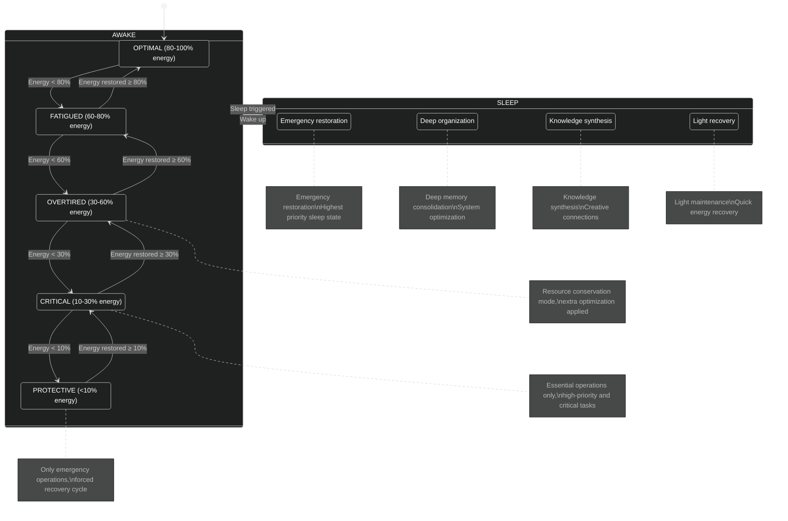
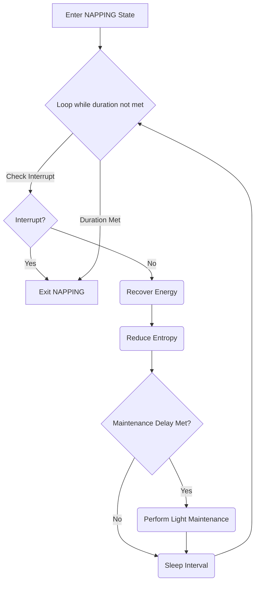
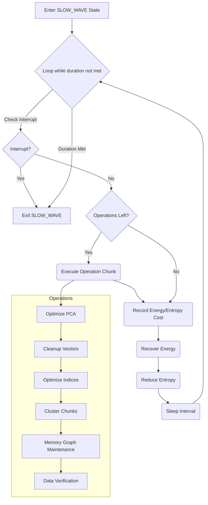
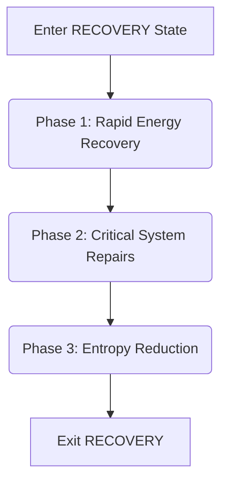
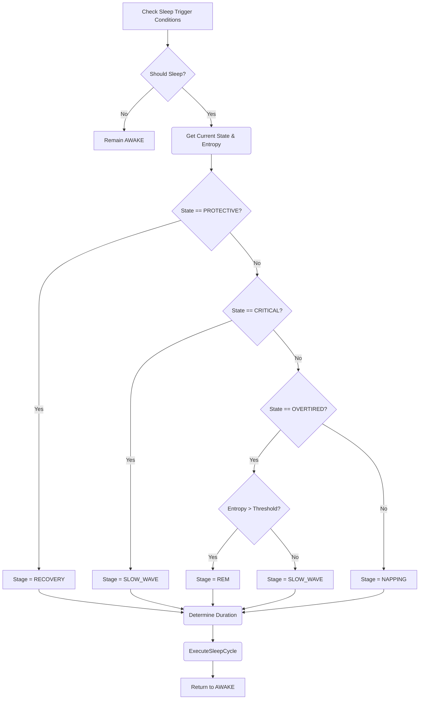
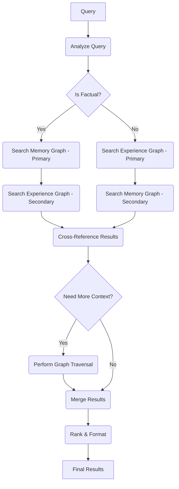
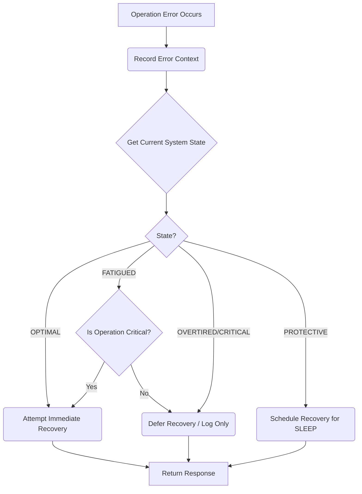
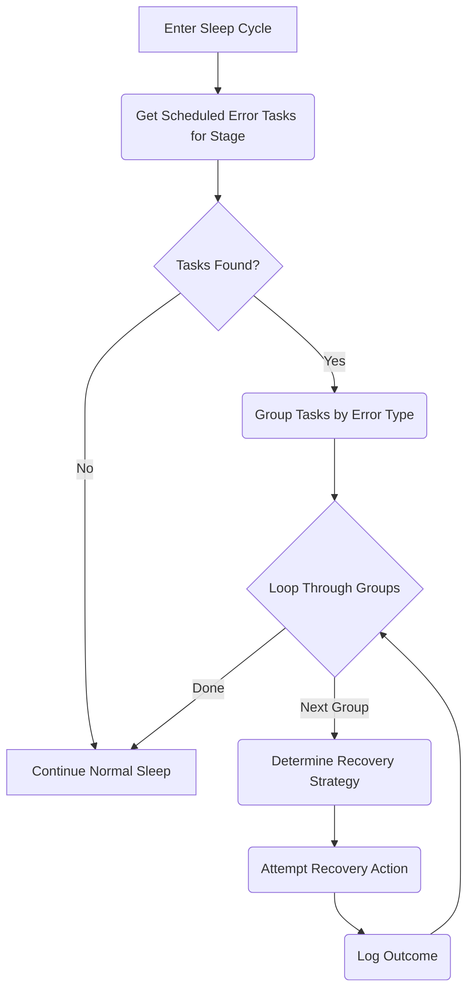
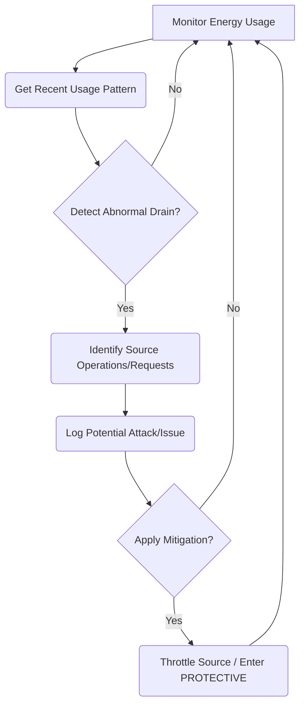

# Cognitive RAG (CRAG) System Technical Specification

## Table of Contents

- [1. Introduction](#1-introduction)
- [2. Core Concepts](#2-core-concepts)
  - [2.1 Cognitive Energy Model](#21-cognitive-energy-model)
  - [2.2 System States and Phase Transitions](#22-system-states-and-phase-transitions)
- [3. AWAKE Phase](#3-awake-phase)
  - [3.1 Alert State (OPTIMAL)](#31-alert-state-optimal)
  - [3.2 Focused State (FATIGUED)](#32-focused-state-fatigued)
  - [3.3 Conservation State (OVERTIRED, CRITICAL)](#33-conservation-state-overtired-critical)
  - [3.4 Emergency State (PROTECTIVE)](#34-emergency-state-protective)
- [4. SLEEP Phase](#4-sleep-phase)
  - [4.1 NAPPING State](#41-napping-state)
  - [4.2 SLOW_WAVE State](#42-slow_wave-state)
  - [4.3 REM State](#43-rem-state)
  - [4.4 RECOVERY State](#44-recovery-state)
  - [4.5 Sleep Scheduling and Transition](#45-sleep-scheduling-and-transition)
- [5. Dual-Graph Memory Architecture](#5-dual-graph-memory-architecture)
  - [5.1 Experience Graph](#51-experience-graph)
    - [5.1.1 Experience Graph Architecture](#511-experience-graph-architecture)
    - [5.1.2 Experience Graph Operations](#512-experience-graph-operations)
  - [5.2 Memory Graph](#52-memory-graph)
    - [5.2.1 Memory Graph Architecture](#521-memory-graph-architecture)
    - [5.2.2 Memory Graph Operations](#522-memory-graph-operations)
    - [5.2.3 Memory Graph Population and Maintenance](#523-memory-graph-population-and-maintenance)
  - [5.3 Dual-Graph Integration](#53-dual-graph-integration)
    - [5.3.1 Cross-Graph Retrieval](#531-cross-graph-retrieval)
    - [5.3.2 Knowledge Bridge Mechanism](#532-knowledge-bridge-mechanism)
  - [5.4 Memory Graph vs Experience Graph Comparison](#54-memory-graph-vs-experience-graph-comparison)
- [6. Server-Specific Adaptations](#6-server-specific-adaptations)
- [7. Integration with OARC-RAG Architecture](#7-integration-with-oarc-rag-architecture)
  - [7.1 Vector Database Enhancement](#71-vector-database-enhancement)
  - [7.2 RAG Engine Integration](#72-rag-engine-integration)
  - [7.3 API Layer Adaptation](#73-api-layer-adaptation)
  - [7.4 System Interconnection Architecture](#74-system-interconnection-architecture)
  - [7.5 Implementation Strategy](#75-implementation-strategy)
- [8. CRAG System Benefits for OARC-RAG](#8-crag-system-benefits-for-oarc-rag)
- [9. Error Handling in CRAG](#9-error-handling-in-crag)
  - [9.1 Energy-Aware Error Recovery](#91-energy-aware-error-recovery)
  - [9.2 Sleep Cycle Integration for Error Recovery](#92-sleep-cycle-integration-for-error-recovery)
  - [9.3 Experience Graph Error Learning](#93-experience-graph-error-learning)
- [10. Security in CRAG](#10-security-in-crag)
  - [10.1 Energy-Based Protection Mechanisms](#101-energy-based-protection-mechanisms)
  - [10.2 Memory Graph Security](#102-memory-graph-security)
- [11. System Limitations and Future Work](#11-system-limitations-and-future-work)
  - [11.1 Current Limitations](#111-current-limitations)
  - [11.2 Future Research Directions](#112-future-research-directions)
- [12. Conclusion](#12-conclusion)

## 1. Introduction

This document outlines the technical design and implementation of the Cognitive RAG (CRAG) system for the OARC-RAG framework. **It provides a detailed elaboration of the cognitive components introduced in Section 2.13 of the main `Specification.md` document.** The system implements computational analogs of biological cognitive processes, particularly the sleep-wake cycle and memory consolidation mechanisms, to create an efficient, self-regulating RAG system capable of continuous operation in server environments.

The CRAG system extends the core architecture defined in `Specification.md` by implementing:
- Energy and entropy tracking for operational state management (configurable rates)
- Multi-stage sleep cycles for system optimization (configurable triggers and durations)
- Dual-graph memory architecture for knowledge representation
- Protection mechanisms for continuous operation

**(Note: Specific values for rates, thresholds, and durations mentioned in algorithms are examples and should be defined in configuration files, potentially within the `configs/` directory outlined in `Specification.md` Section 7.2.)**

## 2. Core Concepts

### 2.1 Cognitive Energy Model

The Cognitive Energy Model tracks the system's operational capacity through two primary metrics:

1. **Energy**: Represents the system's available computational resources, which are depleted through operations and recovered during sleep cycles.
2. **Entropy**: Represents system disorder that increases through operations and is reduced during sleep cycles.

The following algorithm demonstrates how the Cognitive Energy Model manages system resources and state transitions. This model serves as the foundation for the system's self-regulation capabilities, allowing it to adapt its behavior based on available computational resources. By tracking energy depletion from various operations and the accumulation of entropy (system disorder), the model enables graceful degradation under load and proactive resource management, similar to how biological systems manage their energy budgets.

```
CognitiveEnergyModel

Initialize(config): // Load parameters from config
  max_energy ← config.max_energy
  max_entropy ← config.max_entropy
  depletion_rates ← config.depletion_rates // Dict mapping operation_type to energy cost
  entropy_rate ← config.entropy_rate // Factor applied to energy cost for entropy increase
  state_thresholds ← config.state_thresholds // Energy percentages for state transitions
  entropy_degradation_threshold ← config.entropy_degradation_threshold // e.g., 90%

  current_energy ← max_energy
  current_entropy ← 0
  system_state ← OPTIMAL // Initial state
  current_sleep_stage ← AWAKE

RecordOperation(operation_type, count=1):
  if operation_type not in depletion_rates:
    Log warning("Unknown operation type for energy tracking:", operation_type)
    return GetCurrentStatus()

  energy_cost ← depletion_rates[operation_type] × count
  current_energy ← max(0, current_energy - energy_cost)
  current_entropy ← min(max_entropy, current_entropy + energy_cost * entropy_rate)
  UpdateSystemState()
  return GetCurrentStatus()

UpdateSystemState():
  energy_percent ← (current_energy / max_energy) * 100 if max_energy > 0 else 0
  entropy_percent ← (current_entropy / max_entropy) * 100 if max_entropy > 0 else 0

  // Determine state based on energy
  if energy_percent >= state_thresholds.OPTIMAL: new_state ← OPTIMAL
  else if energy_percent >= state_thresholds.FATIGUED: new_state ← FATIGUED
  else if energy_percent >= state_thresholds.OVERTIRED: new_state ← OVERTIRED
  else if energy_percent >= state_thresholds.CRITICAL: new_state ← CRITICAL
  else: new_state ← PROTECTIVE

  // Degrade state if entropy is critically high (unless already PROTECTIVE)
  if entropy_percent > entropy_degradation_threshold and new_state != PROTECTIVE:
    # Example: Degrade OPTIMAL -> FATIGUED, FATIGUED -> OVERTIRED, etc.
    new_state = DegradeState(new_state)

  if new_state != system_state:
      Log info("System state changed:", system_state, "->", new_state)
      system_state ← new_state

  return new_state

GetCurrentStatus():
    return {
        energy: current_energy,
        entropy: current_entropy,
        state: system_state,
        sleep_stage: current_sleep_stage
    }

ShouldInitiateSleep(config): // Load parameters from config
  # Check based on state, entropy, inactivity time, etc. defined in config
  if system_state ∈ {PROTECTIVE, CRITICAL}: return true
  if system_state == OVERTIRED and (current_entropy / max_entropy) > config.sleep_trigger_entropy_overtired: return true
  # Add other conditions like inactivity timeout from config
  return false

DegradeState(current_state):
    # Logic to move to the next lower energy state
    if current_state == OPTIMAL: return FATIGUED
    if current_state == FATIGUED: return OVERTIRED
    if current_state == OVERTIRED: return CRITICAL
    if current_state == CRITICAL: return PROTECTIVE # Should ideally already be PROTECTIVE by energy
    return current_state # No change for PROTECTIVE
```

```mermaid
graph TD
    A[Operation Occurs] --> B(RecordOperation);
    B --> C{Update Energy & Entropy};
    C -- Energy Cost --> D[Decrease Current Energy];
    C -- Entropy Rate --> E[Increase Current Entropy];
    D --> F(UpdateSystemState);
    E --> F;
    F --> G[New System State];
    G --> H(GetOptimizationLevel);
    H --> I[Optimization Level (0-4)];
```

### 2.2 System States and Phase Transitions

The CRAG system operates in two fundamental phases: AWAKE and SLEEP. Within each phase, the system transitions between various states based on energy and entropy levels:



The system employs a state-based optimization mechanism that adjusts resource usage based on current energy levels. This function maps system states to optimization levels, allowing components to adapt their behavior accordingly. Higher optimization levels correspond to more aggressive resource conservation strategies, ensuring the system can maintain essential functionality even when energy is low, as specified in the main architecture document's energy management guidelines.

```
GetOptimizationLevel():
  Match system_state:
    OPTIMAL:    return 0
    FATIGUED:   return 1
    OVERTIRED:  return 2
    CRITICAL:   return 3
    PROTECTIVE: return 4
```

## 3. AWAKE Phase

The AWAKE phase represents the period when the CRAG system actively processes user queries, acquires new information, and builds experiences within the Experience Graph. During this phase, the system's behavior adapts based on its current energy and entropy levels, transitioning between different states to optimize performance and resource usage.

When the system enters a new AWAKE phase after sleeping, the Experience Graph begins relatively empty for the current session, gathering new experiences as users interact with the system through queries and other operations.

### 3.1 Alert State (OPTIMAL)

The Alert state represents the optimal operational mode when energy levels are high (80-100% energy), characterized by peak performance and responsiveness. This algorithm configures the system for maximum accuracy and proactive processing, prioritizing result quality over computational efficiency. It aligns with the main specification's baseline state where systems operate at full capacity.

```
OperateInAlertPhase():
  # Active only in OPTIMAL state
  if system_state ≠ OPTIMAL: return false

  # Configure for peak performance
  SetOptimizationLevel(0)          # No resource conservation
  EnableProactiveOperations(true)  # Allow speculative processing
  SetRetrievalPriority("accuracy") # Prioritize quality over speed/cost
  StartAlertPhaseMonitoring()      # Initiate specific monitoring for this phase

  return true
```

### 3.2 Focused State (FATIGUED)

The Focused state operates when energy levels are moderately reduced (60-80% energy). This algorithm configures the system for balanced operation, typically active during the `FATIGUED` state (though the logic allows it in `OPTIMAL` under specific configurations or transitions). The Focused State represents a slight shift from peak performance towards resource conservation. It implements light optimizations (Level 1) by prioritizing active tasks and potentially reducing the scope or aggressiveness of background processes compared to the Alert state. This state aligns with the multi-level optimization approach described in the main specification, enabling dynamic adjustment of resource consumption based on operational conditions, maintaining high responsiveness for current requests while initiating energy-saving measures.

```
OperateInFocusedPhase():
  # Applicable in OPTIMAL or FATIGUED states, representing high or slightly reduced energy
  if system_state ∉ {OPTIMAL, FATIGUED}: return false

  SetOptimizationLevel(1) # Apply light optimization
  PrioritizeCurrentTasks() # Ensure active requests have resource priority
  SetRetrievalPriority("balanced") # Balance accuracy and speed/cost

  return true
```

### 3.3 Conservation State (OVERTIRED, CRITICAL)

The Conservation state activates when energy is limited (30-60% energy for OVERTIRED, 10-30% energy for CRITICAL), allowing the system to maintain essential functions while reducing resource usage. The Conservation Phase algorithm implements significant energy-saving measures during periods of limited resources. This mode increases caching effectiveness, disables non-essential background tasks, and shifts retrieval strategies toward efficiency over comprehensiveness. It proactively schedules sleep cycles when possible to recover energy. This phase directly implements the graceful degradation principles described in the main specification, allowing the system to continue functioning effectively even with significantly reduced resources by focusing only on high-priority operations.

```
OperateInConservationPhase():
  if system_state ∉ {OVERTIRED, CRITICAL}: return false
  
  SetOptimizationLevel(3)
  DisableNonEssentialTasks()
  IncreaseEffectiveCacheTTL(3.0)
  SetRetrievalPriority("efficiency")
  
  if CanScheduleProactiveSleep():
    ScheduleProactiveSleep()
  
  return true
```

### 3.4 Emergency State (PROTECTIVE)

The Emergency state activates when energy levels are critically low (<10% energy). This emergency protocol maximizes resource conservation by enforcing the most aggressive optimization settings, rejecting all non-critical requests, and providing minimal responses to essential operations. It triggers immediate recovery cycles if not already in a sleep state. This phase implements the system protection mechanisms described in the main specification, preventing complete system failure by radically reducing functionality to preserve core operations until energy can be restored.

```
OperateInEmergencyPhase():
  if system_state ≠ PROTECTIVE: return false
  
  SetOptimizationLevel(4)
  RejectNonCriticalRequests()
  SetMinimalResponseMode()
  
  if current_sleep_stage = AWAKE:
    ForceRecoveryCycle()
  
  return true
```

## 4. SLEEP Phase

The SLEEP phase is crucial for knowledge organization, enrichment, and system maintenance. Unlike the AWAKE phase which focuses on user interactions and experience gathering, the SLEEP phase transforms these experiences into structured long-term memory and performs various optimization tasks. During sleep, the system processes the experiences collected during the AWAKE phase, establishing connections in the Memory Graph and enriching the knowledge base.

The CRAG system implements multiple sleep states, analogous to biological sleep, each serving a distinct purpose triggered by the system's energy and entropy levels, as managed by the Cognitive Energy Model (Section 2.1). This mechanism aligns with the maintenance strategies outlined in `Specification.md` (Section 2.13.2), providing scheduled periods for tasks that would otherwise impact performance.

### 4.1 NAPPING State

The NAPPING state provides light recovery with minimal system impact, suitable for brief periods of inactivity or slight energy dips (`FATIGUED` state):

- **Purpose:** Light, quick recovery with minimal system impact. 
- **Activities:** Primarily energy recovery and minor entropy reduction. May include very light maintenance like cache refreshing or validating recent additions.
- **Characteristics:** Can be easily interrupted by high-priority requests. Short duration.

The NAPPING algorithm implements a light recovery mode designed for quick energy restoration with minimal interruption to system availability. It begins energy recovery immediately while gradually performing light maintenance tasks after the first minute. This phase regularly checks if it should be interrupted by urgent system needs. As described in the main specification's maintenance strategies, NAPPING represents the lowest-intensity maintenance cycle suitable for regular use during normal operation. The light maintenance tasks align with the "routine maintenance" operations outlined in the specification, focusing on cache refreshing and data validation.

```
PerformNapping(duration, config):
  minutes_elapsed ← 0
  interval ← config.sleep_update_interval or 0.5 # minutes
  recovery_rate ← config.energy_recovery_rates.NAPPING
  entropy_reduction_rate ← config.entropy_reduction_rates.NAPPING

  while minutes_elapsed < duration:
    if CheckInterruptSleep(): # Check for high-priority external events
        Log info("NAPPING interrupted.")
        break

    # Recover energy and reduce entropy based on rates and interval
    energy_gain = recovery_rate * interval
    current_energy = min(max_energy, current_energy + energy_gain)
    entropy_loss = entropy_reduction_rate * interval
    current_entropy = max(0, current_entropy - entropy_loss)

    # Perform light maintenance after a short delay
    if minutes_elapsed >= config.napping_maintenance_delay or 1.0:
      PerformLightMaintenance(config.napping_maintenance_intensity or 0.1)

    Sleep(interval * 60) # Sleep for interval duration in seconds
    minutes_elapsed += interval
    UpdateSystemState() # Update state based on recovered energy

PerformLightMaintenance(intensity):
  # Perform low-impact maintenance tasks
  # Intensity could influence depth/scope, e.g., number of items validated
  RefreshCriticalCaches()
  RemoveExpiredCacheEntries()
  ValidateRecentAdditions(count = intensity * 100) # Example: intensity scales validation count
  UpdateSystemStatistics()
```



### 4.2 SLOW_WAVE State

The SLOW_WAVE state focuses on deep memory consolidation and system optimization:

- **Purpose:** Deeper recovery, significant system optimization, and memory organization. Typically triggered by lower energy states (`CRITICAL`, `OVERTIRED`) or high entropy.
- **Activities:** Significant energy recovery and entropy reduction. Performs resource-intensive optimizations like PCA tuning, index rebuilding, vector cleanup, and Memory Graph maintenance. Crucially, this phase is also dedicated to **data verification and deeper analysis** tasks requiring external lookups or cross-referencing.
- **Characteristics:** Less easily interrupted than NAPPING. Longer duration.

The SLOW_WAVE sleep algorithm implements deeper optimization and maintenance operations that parallel the slow-wave sleep phase in human cognition. It sequentially executes resource-intensive optimization tasks like PCA dimensionality reduction, vector cleanup, index optimization, and chunk clustering. It also performs Memory Graph maintenance, including consistency checks and pruning. Crucially, this phase is also dedicated to **data verification and deeper analysis tasks**, as detailed in the enrichment specification. These tasks leverage the relatively quiescent state of the system to perform potentially costly external lookups or cross-referencing needed to validate information acquired during the AWAKE state.

**(See `docs/Enrichment.md`, Section 4.3, for detailed examples of verification tasks performed during SLOW_WAVE.)**

```
PerformSlowWaveSleep(duration, config):
  start_time ← current_time()
  target_end_time ← start_time + duration * 60
  recovery_rate ← config.energy_recovery_rates.SLOW_WAVE
  entropy_reduction_rate ← config.entropy_reduction_rates.SLOW_WAVE
  update_interval_seconds ← (config.sleep_update_interval or 0.5) * 60 # Convert interval to seconds

  # Define operations (these functions encapsulate the actual logic)
  operations = [
    (OptimizePCA, "PCA Optimization"), # Dimensionality reduction tuning
    (CleanupVectors, "Vector Cleanup"), # Remove orphaned/low-quality vectors
    (OptimizeIndices, "Index Optimization"), # Rebuild/optimize HNSW/ANN indices
    (ClusterChunks, "Chunk Clustering"), # Re-evaluate semantic clusters
    (MemoryGraphMaintenance, "Memory Graph Maintenance"), # Run consistency checks, etc. (See 5.2.3)
    (PerformDataVerificationTasks, "Data Verification/Deep Analysis") # Enrichment task (See Enrichment.md 4.3)
  ]

  operation_index ← 0
  last_update_time ← start_time

  while current_time() < target_end_time:
    if CheckInterruptSleep(): # Check for high-priority external events
        Log info("SLOW_WAVE sleep interrupted.")
        break

    # Perform a portion of the current operation or move to the next
    if operation_index < len(operations):
        operation_func, operation_name = operations[operation_index]
        Log debug("Performing SLOW_WAVE operation:", operation_name)
        # Execute a chunk of the operation, designed to be interruptible or run in segments
        completed = operation_func(config.slow_wave_operation_chunk_size or 100) # Pass chunk size/intensity
        if completed:
            operation_index += 1
            Log info("Completed SLOW_WAVE operation:", operation_name)
        # Note: Energy cost of maintenance operations might be handled internally by the functions
        # or recorded here if significant and predictable.

    # Check if it's time to update energy/entropy
    time_since_last_update = current_time() - last_update_time
    if time_since_last_update >= update_interval_seconds:
        RecoverEnergy(recovery_rate, time_since_last_update)
        ReduceEntropy(entropy_reduction_rate, time_since_last_update)
        last_update_time = current_time()
        UpdateSystemState() # Update state based on recovered energy/reduced entropy

    # Sleep for a short duration before next check/operation chunk
    Sleep(config.sleep_loop_interval_seconds or 1)

  # Final energy/entropy update for any remaining time
  final_elapsed = current_time() - last_update_time
  if final_elapsed > 0:
      RecoverEnergy(recovery_rate, final_elapsed)
      ReduceEntropy(entropy_reduction_rate, final_elapsed)
      UpdateSystemState()

# Helper functions for energy/entropy changes during sleep
RecoverEnergy(rate, elapsed_seconds):
  # Calculate energy to recover based on rate and elapsed time
  # Rate is typically energy units per second
  energy_to_recover = rate * elapsed_seconds
  
  # Update current_energy, ensuring it doesn't exceed max_energy
  current_energy = min(max_energy, current_energy + energy_gain)
  
  Log debug(f"Recovered {energy_to_recover:.2f} energy. Current: {current_energy:.2f}/{max_energy}")
  return current_energy

ReduceEntropy(rate, elapsed_seconds):
  # Calculate entropy to reduce based on rate and elapsed time
  # Rate is typically entropy units per second
  entropy_to_reduce = rate * elapsed_seconds
  
  # Update current_entropy, ensuring it doesn't go below zero
  current_entropy = max(0, current_entropy - entropy_loss)
  
  Log debug(f"Reduced entropy by {entropy_to_reduce:.2f}. Current: {current_entropy:.2f}/{max_entropy}")
  return current_entropy
```



### 4.3 REM State

The REM (Rapid Eye Movement) state focuses on creative connections and knowledge synthesis:

- **Purpose:** Knowledge synthesis, creative connection forming, and associative memory consolidation. Often triggered in the `OVERTIRED` state when entropy is high, suggesting a need for reorganization rather than just raw energy recovery.
- **Activities:** Focuses on analyzing patterns in the Experience Graph, generating abstractions, creating links between related but disconnected information, and performing **enrichment tasks involving synthesis and external exploration** (e.g., web searches, knowledge base lookups). Facilitates the Knowledge Bridge mechanism by transferring patterns from the Experience Graph to structured knowledge in the Memory Graph.
- **Characteristics:** Focuses on graph operations and potentially LLM-driven synthesis. Duration varies based on configuration and identified tasks.

The REM sleep algorithm implements sophisticated knowledge synthesis operations inspired by how human REM sleep facilitates creative connections and memory consolidation. During this phase, the system identifies concept clusters, discovers semantically similar but disconnected chunks, creates new connections between related content, and generates higher-level abstractions. This is a primary phase for **data enrichment activities focused on synthesis and exploration**, such as performing external lookups (web searches, Wikipedia) to find related concepts, cross-referencing internal data to build new links, and bridging knowledge between the Experience and Memory graphs using mechanisms detailed in the enrichment specification.

**(See `docs/Enrichment.md`, Section 4.3, for detailed examples of synthesis and cross-referencing tasks during REM sleep.)**

```
PerformREMSleep(duration, config):
  start_time ← current_time()
  target_end_time ← start_time + duration * 60
  recovery_rate ← config.energy_recovery_rates.REM
  entropy_reduction_rate ← config.entropy_reduction_rates.REM
  update_interval_seconds ← (config.sleep_update_interval or 0.5) * 60

  # Define REM-specific operations (complex functions performing knowledge synthesis and enrichment)
  operations = [
      (IdentifyConceptClusters, "Identify Concept Clusters"), # Group related nodes in Experience Graph
      (FindAndCreateDistantConnections, "Find/Create Distant Connections"), # Link semantically related but disconnected concepts
      (GenerateAbstractions, "Generate Abstractions"), # Create higher-level nodes in Experience Graph
      (PerformExternalEnrichmentLookups, "External Enrichment Lookups"), # e.g., Web search, Wikipedia lookup (See Enrichment.md 4.3)
      (PerformInternalCrossReferencing, "Internal Cross-Referencing"), # Link related internal documents/chunks (See Enrichment.md 4.3)
      (UpdateMemoryFromExperience, "Update Memory Graph from Experience"), # Bridge knowledge (See 5.3.2)
      (ProcessScheduledREMTasks, "Process Scheduled REM Tasks") # Handle tasks like error pattern abstraction (See 9.3)
  ]

  operation_index ← 0
  last_update_time ← start_time

  while current_time() < target_end_time:
      if CheckInterruptSleep():
          Log info("REM sleep interrupted.")
          break

      # Perform a portion of the current operation or move to the next
      if operation_index < len(operations):
          operation_func, operation_name = operations[operation_index]
          Log debug("Performing REM operation:", operation_name)
          # Execute a chunk of the operation
          completed = operation_func(config.rem_operation_chunk_size or 50) # Pass chunk size/intensity
          if completed:
              operation_index += 1
              Log info("Completed REM operation:", operation_name)
          # Record energy cost if applicable (some REM tasks might consume energy)
          # cognitive_system.RecordOperation(operation_name + "_cost", 1)

      # Check if it's time to update energy/entropy
      time_since_last_update = current_time() - last_update_time
      if time_since_last_update >= update_interval_seconds:
          RecoverEnergy(recovery_rate, time_since_last_update) # Use the same helper function
          ReduceEntropy(entropy_reduction_rate, time_since_last_update) # Use the same helper function
          last_update_time = current_time()
          UpdateSystemState()

      Sleep(config.sleep_loop_interval_seconds or 1)

  # Final energy/entropy update
  final_elapsed = current_time() - last_update_time
  if final_elapsed > 0:
      RecoverEnergy(recovery_rate, final_elapsed)
      ReduceEntropy(entropy_reduction_rate, final_elapsed)
      UpdateSystemState()
```

```mermaid
graph TD
    A[Enter REM State] --> B{Loop while duration not met};
    B -- Check Interrupt --> C{Interrupt?};
    C -- Yes --> D[Exit REM];
    C -- No --> E{Operations Left?};
    E -- Yes --> F(Execute Operation Chunk);
    F --> G(Record Energy/Entropy Cost);
    E -- No --> G;
    G --> H(Recover Energy);
    H --> I(Reduce Entropy);
    I --> J(Sleep Interval);
    J --> B;
    B -- Duration Met --> D;

    subgraph Operations
        Op1[Identify Clusters]
        Op2[Find/Create Connections]
        Op3[Generate Abstractions]
        Op4[External Enrichment]
        Op5[Internal Cross-Ref]
        Op6[Update Memory Graph (Bridge)]
        Op7[Process Scheduled Tasks]
    end
    F --> Op1 --> Op2 --> Op3 --> Op4 --> Op5 --> Op6 --> Op7
```

### 4.4 RECOVERY State

The RECOVERY state is an emergency restorative sleep mode:

- **Purpose:** Emergency restorative sleep triggered only when the system enters the `PROTECTIVE` state due to critically low energy.
- **Activities:** Prioritizes rapid energy restoration, followed by critical system repairs and entropy reduction. All non-essential operations are halted.
- **Characteristics:** Highest priority sleep state, cannot be easily interrupted. Focused solely on bringing the system back to a functional state.

The RECOVERY sleep algorithm implements an emergency restoration protocol when the system reaches critically low energy levels. It executes in three distinct phases: rapid energy recovery (focusing on restoring computational resources), critical system repairs (fixing any identified issues or inconsistencies), and entropy reduction (restoring system order). This emergency protocol directly implements the system resilience strategies outlined in the main specification, providing a mechanism for the system to recover from periods of extreme load or resource depletion without manual intervention. This capability is essential for continuous operation in production environments.

```
PerformRecoverySleep(duration):
  initial_energy ← current_energy
  initial_entropy ← current_entropy
  
  PerformRapidEnergyRecovery(duration × 0.4)
  PerformCriticalRepairs(duration × 0.3)
  PerformEntropyReduction(duration × 0.3)
```



### 4.5 Sleep Scheduling and Transition

The decision of *which* sleep state to enter and for *how long* is determined by the `ScheduleSleep` algorithm, based primarily on the current system state and entropy levels. The `ExecuteSleepCycle` function then dispatches control to the specific function responsible for managing the activities of the chosen sleep state.

When a SLEEP phase completes, the system transitions back to the AWAKE phase. During this transition, the Experience Graph for the new AWAKE phase begins relatively empty (though the Memory Graph retains the structured knowledge consolidated during previous SLEEP phases). This allows the system to build fresh experiences based on new user interactions and queries, while leveraging the long-term structured knowledge stored in the Memory Graph.

```
Algorithm: ScheduleSleep (Decision Logic)

ScheduleSleep(config): // Load parameters from config
  current_status = GetCurrentStatus()
  system_state = current_status.state
  current_entropy = current_status.entropy
  max_entropy = config.max_entropy

  # Determine stage and duration based on state, entropy, config values
  if system_state == PROTECTIVE:
    stage ← RECOVERY
    duration ← config.sleep_durations.RECOVERY
  else if system_state == CRITICAL:
    stage ← SLOW_WAVE
    duration ← config.sleep_durations.SLOW_WAVE # Use standard SLOW_WAVE duration
  else if system_state == OVERTIRED:
    # Check if entropy suggests REM is needed for reorganization
    if (current_entropy / max_entropy) > (config.rem_trigger_entropy_overtired or 0.7):
      stage ← REM
      duration ← config.sleep_durations.REM
    else: # Otherwise, prioritize deeper energy recovery and optimization
      stage ← SLOW_WAVE
      # Allow potentially different duration for SLOW_WAVE triggered by OVERTIRED vs CRITICAL
      duration ← config.sleep_durations.get("SLOW_WAVE_OVERTIRED", config.sleep_durations.SLOW_WAVE)
  else: # FATIGUED or OPTIMAL (proactive nap triggered by inactivity or low load)
    stage ← NAPPING
    duration ← config.sleep_durations.NAPPING

  Log info("Scheduling sleep:", stage, "for", duration, "minutes. Current State:", system_state, "Entropy:", current_entropy)
  # Return the decision for the execution function
  return {stage: stage, duration: duration}
```

```
Algorithm: ExecuteSleepCycle (Dispatcher)

ExecuteSleepCycle(stage, duration, config):
  if current_sleep_stage != AWAKE:
      Log warning("Attempted to start sleep cycle while already sleeping:", current_sleep_stage)
      return # Avoid nested sleep

  current_sleep_stage ← stage
  start_time ← current_time()
  Log info("Entering sleep stage:", stage, "for duration:", duration, "minutes")

  # Dispatch to the specific function for the stage
  # Pass config for stage-specific parameters (rates, thresholds, etc.)
  try:
      if stage == NAPPING: PerformNapping(duration, config)
      else if stage == SLOW_WAVE: PerformSlowWaveSleep(duration, config)
      else if stage == REM: PerformREMSleep(duration, config)
      else if stage == RECOVERY: PerformRecoverySleep(duration, config)
      else: Log error("Unknown sleep stage requested:", stage)
  catch Exception as e:
      Log critical("Exception during sleep cycle execution:", stage, e)
      # Ensure state is reset even on error
  finally:
      current_sleep_stage ← AWAKE
      UpdateSystemState() # Re-evaluate state after sleep attempt
      ResetExperienceGraphForNewAwakePhase() # Prepare for new experiences
      Log info("Waking up from sleep stage:", stage, "Final State:", system_state)
```



## 5. Dual-Graph Memory Architecture

The Cognitive RAG system implements a dual-graph memory architecture inspired by human memory models. This approach combines:

1. **Experience Graph**: An associative memory structure for episodic, pattern-based knowledge
2. **Memory Graph**: A structured semantic network for factual knowledge with explicit relationships

Together, these complementary structures enable both fuzzy pattern matching and precise factual recall, enhancing both retrieval accuracy and knowledge representation.

### 5.1 Experience Graph

The Experience Graph (EG) is a flexible, associative memory structure that captures experiences, patterns, and episodic information. Unlike traditional vector databases that store embeddings in isolation, the Experience Graph maintains connections between related content, creating an evolving network of associated information.

#### 5.1.1 Experience Graph Architecture

The Experience Graph consists of:

- **Nodes**: Representing content chunks, queries, responses, or synthetic abstractions
- **Edges**: Representing semantic or usage-based relationships between nodes
- **Activation Patterns**: Metadata tracking node usage, recency, and importance
- **Clusters**: Groups of semantically related nodes, potentially with summary nodes

This structure enables advanced operations like pattern recognition, context-aware retrieval, and knowledge abstraction beyond what flat vector storage allows.

```
Node {
    id: UUID,                      // Unique identifier
    content: Text,                 // Actual text content or reference
    embedding: Vector,             // High-dimensional semantic embedding
    node_type: Enum,               // E.g., CHUNK, QUERY, RESPONSE, ABSTRACTION
    metadata: Map<String, Any>,    // Source, timestamp, etc.
    activation: Float,             // Current activation level (recency/importance)
    activation_history: List<Activation>  // History of activations with timestamps
}

Edge {
    id: UUID,                      // Unique identifier
    source_id: UUID,               // Source node ID
    target_id: UUID,               // Target node ID
    edge_type: Enum,               // E.g., SEMANTIC, SEQUENCE, QUERY_RESPONSE, ABSTRACTION
    weight: Float,                 // Relationship strength (0.0-1.0)
    metadata: Map<String, Any>     // Creation time, creator (agent/user), etc.
}

Cluster {
    id: UUID,                      // Unique identifier
    node_ids: List<UUID>,          // Member node IDs
    centroid: Vector,              // Average embedding of member nodes
    summary_node_id: Optional<UUID>, // ID of node containing cluster summary
    metadata: Map<String, Any>     // Creation time, updates, etc.
}
```

```mermaid
graph LR
    subgraph Experience Graph Example
        N1(Node 1<br/>Type: CHUNK<br/>Content: "Paris is...") --- E1 --- N2(Node 2<br/>Type: CHUNK<br/>Content: "Eiffel Tower...");
        N2 --- E2 --- N3(Node 3<br/>Type: QUERY<br/>Content: "Where is Eiffel Tower?");
        N3 --- E3 --- N4(Node 4<br/>Type: RESPONSE<br/>Content: "In Paris...");
        N1 --- E4 --- N4;
        N2 --- E5 --- N4;
        N5(Node 5<br/>Type: ABSTRACTION<br/>Content: "Paris Landmarks") --- E6 --- N1;
        N5 --- E7 --- N2;
    end
    E1((Edge<br/>Type: SEMANTIC<br/>Weight: 0.8));
    E2((Edge<br/>Type: SEMANTIC<br/>Weight: 0.9));
    E3((Edge<br/>Type: QUERY_RESPONSE));
    E4((Edge<br/>Type: SEMANTIC<br/>Weight: 0.7));
    E5((Edge<br/>Type: SEMANTIC<br/>Weight: 0.95));
    E6((Edge<br/>Type: ABSTRACTION));
    E7((Edge<br/>Type: ABSTRACTION));
```

#### 5.1.2 Experience Graph Operations

The Experience Graph supports a range of operations for knowledge management and retrieval:

```
Algorithm: ExperienceGraphOperations

AddNode(content, embedding, node_type, metadata):
  node ← CreateNode(content, embedding, node_type, metadata)
  StoreNode(node)
  UpdateIndex(node)  // Update similarity search index
  
  // Optional: Create initial semantic connections
  if config.auto_connect_new_nodes:
    similar_nodes ← FindSimilarNodes(node.embedding, limit=config.initial_connections_count)
    for each similar in similar_nodes:
      similarity ← CosineSimilarity(node.embedding, similar.embedding)
      if similarity > config.min_connection_similarity:
        AddEdge(node.id, similar.id, SEMANTIC, weight=similarity)
  
  return node.id

AddEdge(source_id, target_id, edge_type, weight, metadata={}):
  edge ← CreateEdge(source_id, target_id, edge_type, weight, metadata)
  StoreEdge(edge)
  return edge.id

SearchByEmbedding(query_embedding, limit=10):
  // Find nearest neighbors in vector space
  candidate_nodes ← VectorSearch(query_embedding, limit)
  
  // Activate found nodes (increases importance)
  for each node in candidate_nodes:
    ActivateNode(node.id)
  
  return candidate_nodes

SearchByTraversal(start_node_id, max_depth=3, min_weight=0.5):
  // Find related nodes by graph traversal
  visited ← Set()
  queue ← [(start_node_id, 0)]  // (node_id, depth)
  results ← []
  
  while queue not empty and len(results) < limit:
    current_id, depth ← queue.pop()
    
    if current_id in visited or depth > max_depth:
      continue
      
    visited.add(current_id)
    current_node ← GetNode(current_id)
    results.append(current_node)
    ActivateNode(current_id)
    
    // Add unvisited neighbors with sufficient weight
    neighbors ← GetNeighbors(current_id)
    for each neighbor in neighbors:
      if neighbor.id not in visited and neighbor.weight >= min_weight:
        queue.push((neighbor.id, depth + 1))
  
  return results

ActivateNode(node_id, activation_value=1.0):
  node ← GetNode(node_id)
  
  // Update activation level (recency + importance)
  current_time ← GetCurrentTime()
  new_activation ← CalculateActivation(node.activation, activation_value, node.activation_history)
  
  // Record activation
  UpdateNodeActivation(node_id, new_activation)
  AppendActivationHistory(node_id, {time: current_time, value: activation_value})
  
  // Optional: Propagate reduced activation to connected nodes
  if config.activation_propagation_enabled and activation_value >= config.min_propagation_threshold:
    propagated_value ← activation_value * config.propagation_factor
    neighbors ← GetNeighbors(node_id)
    for each neighbor in neighbors where neighbor.weight >= config.min_propagation_edge_weight:
      ActivateNode(neighbor.id, propagated_value)

CreateAbstraction(node_ids, summary_content, summary_embedding):
  // Create a new node representing an abstraction of multiple nodes
  // This is typically called during REM sleep or by an abstraction agent
  
  abstraction_node ← AddNode(summary_content, summary_embedding, ABSTRACTION, {
    abstracted_from: node_ids,
    created_at: GetCurrentTime()
  })
  
  // Connect abstraction to source nodes
  for each id in node_ids:
    AddEdge(abstraction_node.id, id, ABSTRACTION, weight=1.0)
  
  // Optional: Create a cluster
  if config.create_clusters_for_abstractions:
    CreateCluster(node_ids, summary_node_id=abstraction_node.id)
  
  return abstraction_node.id

CreateCluster(node_ids, centroid=None, summary_node_id=None):
  if centroid is None:
    // Calculate centroid from node embeddings
    embeddings ← [GetNode(id).embedding for id in node_ids]
    centroid ← CalculateCentroid(embeddings)
  
  cluster ← {
    id: GenerateUUID(),
    node_ids: node_ids,
    centroid: centroid,
    summary_node_id: summary_node_id,
    metadata: {
      created_at: GetCurrentTime(),
      node_count: len(node_ids)
    }
  }
  
  StoreCluster(cluster)
  return cluster.id

DecayActivations(decay_factor=0.5, time_threshold_hours=24):
  // Gradually reduces activation levels of nodes not accessed recently
  // Typically called periodically or during sleep cycles
  
  current_time ← GetCurrentTime()
  threshold_time ← current_time - time_threshold_hours * 3600
  
  nodes_to_decay ← GetNodesLastActivatedBefore(threshold_time)
  for each node in nodes_to_decay:
    new_activation ← node.activation * decay_factor
    UpdateNodeActivation(node.id, new_activation)
    LogActivationDecay(node.id, node.activation, new_activation)

UpdateNodeContent(node_id, new_content, new_embedding=None):
  node ← GetNode(node_id)
  old_content ← node.content
  old_embedding ← node.embedding
  
  // Update content
  node.content ← new_content
  if new_embedding is not None:
    node.embedding ← new_embedding
    // Update similarity index
    UpdateIndex(node)
  
  // Update metadata
  node.metadata.updated_at ← GetCurrentTime()
  node.metadata.prior_versions ← node.metadata.get("prior_versions", []) + [{
    content: old_content,
    embedding: old_embedding,
    updated_at: node.metadata.get("updated_at")
  }]
  
  StoreNode(node)
```

### 5.2 Memory Graph

The Memory Graph (MG) provides structured knowledge representation through a semantic network of entities and relationships. Unlike the Experience Graph's associative patterns, the Memory Graph explicitly models knowledge with defined relationship types.

#### 5.2.1 Memory Graph Architecture

The Memory Graph architecture consists of:

- **Entities**: Representing distinct concepts, objects, or semantic units
- **Relationships**: Typed connections between entities (subject-predicate-object triples)
- **Properties**: Attributes associated with entities
- **Types/Ontology**: Classification structure for entities and relationships

This architecture enables structured knowledge representation that complements the associative nature of the Experience Graph.

```
Entity {
    id: UUID,                      // Unique identifier
    name: String,                  // Canonical name
    type: List<String>,            // Entity types (e.g., "Person", "Organization")
    properties: Map<String, Any>,  // Key-value attributes
    metadata: Map<String, Any>,    // Source, confidence, timestamp, etc.
    embedding: Optional<Vector>    // Optional semantic embedding
}

Relationship {
    id: UUID,                      // Unique identifier
    source_id: UUID,               // Subject entity ID
    target_id: UUID,               // Object entity ID
    predicate: String,             // Relationship type (e.g., "founded", "located_in")
    properties: Map<String, Any>,  // Additional relationship attributes
    confidence: Float,             // Confidence score (0.0-1.0)
    metadata: Map<String, Any>     // Source, timestamp, etc.
}
```

```mermaid
graph LR
    subgraph Memory Graph Example
        E1(Entity 1<br/>Name: Eiffel Tower<br/>Type: Landmark) -- R1 -- E2(Entity 2<br/>Name: Paris<br/>Type: City);
        E1 -- R2 -- E3(Entity 3<br/>Name: Gustave Eiffel<br/>Type: Person);
        E2 -- R3 -- E4(Entity 4<br/>Name: France<br/>Type: Country);
    end
    R1((Relationship<br/>Predicate: located_in));
    R2((Relationship<br/>Predicate: designed_by));
    R3((Relationship<br/>Predicate: capital_of));
```

#### 5.2.2 Memory Graph Operations

The Memory Graph supports operations for structured knowledge management:

```
Algorithm: MemoryGraph

AddEntity(name, type, properties={}, metadata={}):
  // Check if entity with same name and type already exists
  existing ← FindEntity(name, type)
  if existing:
    return MergeEntity(existing.id, properties, metadata)
  
  // Create new entity
  embedding ← GenerateEmbedding(name) if config.embed_entities else None
  entity ← CreateEntity(name, type, properties, metadata, embedding)
  StoreEntity(entity)
  
  if config.auto_link_new_entities and embedding:
    // Find and link to semantically similar entities
    similar_entities ← FindSimilarEntities(embedding, limit=5, threshold=0.8)
    for each similar in similar_entities:
      // Choose appropriate relationship type
      predicate ← InferRelationship(entity, similar)
      if predicate:
        AddRelationship(entity.id, similar.id, predicate, confidence=0.7, 
                        metadata={source: "auto_linking"})
  
  return entity.id

MergeEntity(entity_id, new_properties, new_metadata):
  entity ← GetEntity(entity_id)
  
  // Merge properties (with conflict resolution)
  for each key, value in new_properties:
    if key not in entity.properties or ShouldReplace(entity.properties[key], value, entity.metadata, new_metadata):
      entity.properties[key] ← value
  
  // Update metadata
  entity.metadata.updated_at ← GetCurrentTime()
  entity.metadata.sources ← entity.metadata.get("sources", []) + [new_metadata.get("source")]
  entity.metadata.confidence ← UpdateConfidence(entity.metadata.get("confidence", 0.5), new_metadata.get("confidence", 0.5))
  
  StoreEntity(entity)
  return entity.id

AddRelationship(source_id, target_id, predicate, properties={}, confidence=1.0, metadata={}):
  // Check for existing relationship
  existing ← FindRelationship(source_id, target_id, predicate)
  if existing:
    return UpdateRelationship(existing.id, properties, confidence, metadata)
  
  // Create new relationship
  relationship ← CreateRelationship(source_id, target_id, predicate, properties, confidence, metadata)
  StoreRelationship(relationship)
  return relationship.id

UpdateRelationship(rel_id, new_properties, new_confidence, new_metadata):
  relationship ← GetRelationship(rel_id)
  
  // Merge properties
  for each key, value in new_properties:
    relationship.properties[key] ← value
  
  // Update confidence
  relationship.confidence ← CombineConfidence(relationship.confidence, new_confidence)
  
  // Update metadata
  relationship.metadata.updated_at ← GetCurrentTime()
  relationship.metadata.sources ← relationship.metadata.get("sources", []) + [new_metadata.get("source")]
  
  StoreRelationship(relationship)
  return relationship.id

FindEntities(query, type=None, properties={}):
  // Multi-mode search
  
  // 1. By exact name match
  exact_matches ← SearchEntitiesByName(query)
  
  // 2. By semantic similarity if query is textual
  semantic_matches ← []
  if IsTextual(query):
    query_embedding ← GenerateEmbedding(query)
    semantic_matches ← SearchEntitiesByEmbedding(query_embedding)
  
  // 3. By property values
  property_matches ← SearchEntitiesByProperties(properties)
  
  // Combine and filter by type if specified
  all_matches ← CombineAndDeduplicateResults(exact_matches, semantic_matches, property_matches)
  if type:
    all_matches ← FilterEntitiesByType(all_matches, type)
  
  return all_matches

QueryByPattern(subject=None, predicate=None, object=None):
  // Triple pattern matching, like SPARQL
  if subject and predicate and object:
    // S-P-O: Check if specific relationship exists
    return FindSpecificRelationship(subject, predicate, object)
  
  if subject and predicate:
    // S-P-?: Find objects for subject-predicate
    return FindRelationshipObjects(subject, predicate)
  
  if subject and object:
    // S-?-O: Find predicates between subject and object
    return FindRelationshipPredicates(subject, object)
  
  if predicate and object:
    // ?-P-O: Find subjects for predicate-object
    return FindRelationshipSubjects(predicate, object)
  
  if subject:
    // S-?-?: Find all relationships involving subject
    return FindEntityRelationships(subject)
  
  if predicate:
    // ?-P-?: Find all relationships of type predicate
    return FindRelationshipsByType(predicate)
  
  if object:
    // ?-?-O: Find all relationships targeting object
    return FindRelationshipsWithObject(object)
  
  // ?-?-?: No constraints, return error or sample
  return { error: "Query too broad, please provide at least one constraint" }

TraceRelationshipPath(start_entity_id, end_entity_id, max_depth=3):
  // Find paths between entities
  visited ← Set()
  queue ← [[start_entity_id]]  // List of paths
  valid_paths ← []
  
  while queue not empty and len(queue[0]) <= max_depth:
    current_path ← queue.pop(0)
    current_id ← current_path[-1]
    
    if current_id == end_entity_id:
      valid_paths.append(current_path)
      continue
    
    if current_id in visited:
      continue
      
    visited.add(current_id)
    
    // Find all connected entities
    relationships ← GetEntityRelationships(current_id)
    for each rel in relationships:
      next_id ← rel.target_id if rel.source_id == current_id else rel.source_id
      if next_id not in current_path:  // Avoid cycles
        new_path ← current_path + [next_id]
        queue.append(new_path)
  
  // Convert entity IDs to names and include relationship details
  readable_paths ← []
  for each path in valid_paths:
    readable_path ← []
    for i from 0 to len(path)-2:
      source_id ← path[i]
      target_id ← path[i+1]
      source ← GetEntity(source_id).name
      target ← GetEntity(target_id).name
      relationship ← FindRelationship(source_id, target_id)
      if relationship:
        readable_path.append((source, relationship.predicate, target))
      else:
        // Might be in reverse direction
        relationship ← FindRelationship(target_id, source_id)
        if relationship:
          readable_path.append((target, "is " + relationship.predicate + " of", source))
    readable_paths.append(readable_path)
  
  return readable_paths
```

#### 5.2.3 Memory Graph Population and Maintenance

The Memory Graph is populated and maintained through multiple processes:
- **Entity Extraction**: Named Entity Recognition (NER) on text chunks
- **Relationship Inference**: Using language models to extract subject-predicate-object triplets
- **Knowledge Bridge**: Transfer of structured knowledge from the Experience Graph
- **Graph Maintenance**: Consistency checking, redundancy removal, and conflict resolution

Below is a sample algorithm for Memory Graph maintenance, typically executed during SLOW_WAVE sleep:

```
Algorithm: MemoryGraphMaintenance

PerformMemoryGraphMaintenanceInternal(batch_size, config):
  total_conflicts_resolved ← 0
  total_redundancies_removed ← 0
  total_consistencies_fixed ← 0
  
  // 1. Find and resolve conflicting relationships
  conflicts ← FindConflictingRelationships(batch_size)
  for each conflict in conflicts:
    resolution ← ResolveConflict(conflict, config.conflict_resolution_strategy)
    if ApplyResolution(resolution):
      total_conflicts_resolved += 1
  
  // 2. Identify and remove redundant relationships
  redundancies ← FindRedundantRelationships(batch_size)
  for each redundancy in redundancies:
    if MergeOrRemoveRedundancy(redundancy):
      total_redundancies_removed += 1
  
  // 3. Check for logical consistency issues (e.g., cycles in hierarchical rels)
  consistency_issues ← CheckGraphConsistency(batch_size)
  for each issue in consistency_issues:
    if FixConsistencyIssue(issue, config.consistency_fix_strategy):
      total_consistencies_fixed += 1
  
  // 4. Update entity embeddings if necessary
  if config.update_entity_embeddings:
    entities_to_update ← GetEntitiesNeedingEmbeddingUpdate(batch_size)
    for each entity in entities_to_update:
      UpdateEntityEmbedding(entity.id)
  
  // 5. Prune low-confidence or deprecated relationships
  if config.enable_relationship_pruning:
    PruneRelationships(config.min_confidence_threshold, 
                      config.min_support_evidence,
                      max_relationships=batch_size)
  
  // Return summary of maintenance performed
  return {
    conflicts_resolved: total_conflicts_resolved,
    redundancies_removed: total_redundancies_removed,
    consistencies_fixed: total_consistencies_fixed,
    total_operations: total_conflicts_resolved + total_redundancies_removed + total_consistencies_fixed
  }

FindConflictingRelationships(limit):
  // Find relationships that contradict each other
  // A simple approach looks for different objects for unique subject-predicates
  // E.g., "Eiffel Tower-located_in-Paris" vs "Eiffel Tower-located_in-London"
  conflicts ← []
  
  // Get candidate predicates that should be functional (have unique objects)
  functional_predicates ← GetFunctionalPredicates()
  
  for each predicate in functional_predicates:
    // Find subjects with multiple objects for this predicate
    subjects_with_conflicts ← FindSubjectsWithMultipleObjects(predicate, limit)
    
    for each subject in subjects_with_conflicts:
      conflicting_relationships ← GetRelationshipsWithSubjectPredicate(subject, predicate)
      conflicts.append({
        subject: subject,
        predicate: predicate,
        relationships: conflicting_relationships
      })
      
      if len(conflicts) >= limit:
        break
  
  return conflicts

ResolveConflict(conflict, strategy):
  subject ← GetEntity(conflict.subject)
  predicate ← conflict.predicate
  relationships ← conflict.relationships
  
  if strategy == "HIGHEST_CONFIDENCE":
    // Keep only the relationship with highest confidence
    best_relationship ← FindHighestConfidenceRelationship(relationships)
    return {
      keep: [best_relationship.id],
      remove: [r.id for r in relationships if r.id != best_relationship.id]
    }
  
  else if strategy == "MOST_RECENT":
    // Keep only the most recently added/updated relationship
    most_recent ← FindMostRecentRelationship(relationships)
    return {
      keep: [most_recent.id],
      remove: [r.id for r in relationships if r.id != most_recent.id]
    }
  
  else if strategy == "SOURCE_PRIORITY":
    // Keep based on source priority list
    prioritized ← PrioritizeRelationshipsBySource(relationships, config.source_priority_list)
    return {
      keep: [prioritized[0].id],
      remove: [r.id for r in prioritized[1:]]
    }
  
  else if strategy == "TEMPORAL_CONTEXT":
    // For temporal predicates, keep multiple with temporal context
    if IsTemporalPredicate(predicate):
      // Add temporal context if possible, otherwise use confidence
      temporal_relations ← AddTemporalContextToRelationships(relationships)
      if all(HasTemporalContext(r) for r in temporal_relations):
        return {
          keep: [r.id for r in temporal_relations],
          remove: []
        }
    
    // Fall back to confidence if not temporal or can't add context
    return ResolveConflict(conflict, "HIGHEST_CONFIDENCE")
  
  else:
    // Default to confidence-based resolution
    return ResolveConflict(conflict, "HIGHEST_CONFIDENCE")
```

### 5.3 Dual-Graph Integration

The Dual-Graph Integration combines the complementary strengths of the Experience and Memory Graphs to enhance information retrieval and knowledge representation.

#### 5.3.1 Cross-Graph Retrieval

Cross-Graph Retrieval enables comprehensive information gathering by querying both graphs simultaneously:

```
Algorithm: CrossGraphRetrieval

CrossGraphSearch(query, limit=10):
  // 1. Process query to extract entities and generate embedding
  query_embedding ← GenerateEmbedding(query)
  entities ← ExtractEntities(query)
  
  // 2. Search Experience Graph for relevant content
  eg_results ← ExperienceGraph.SearchByEmbedding(query_embedding, limit)
  
  // 3. Search Memory Graph for related entities and facts
  mg_results ← []
  for each entity in entities:
    entity_matches ← MemoryGraph.FindEntities(entity.text)
    if entity_matches:
      best_match ← entity_matches[0]  // Assuming sorted by relevance
      // Get relationships for this entity
      relationships ← MemoryGraph.GetEntityRelationships(best_match.id)
      mg_results.extend(relationships)
  
  // 4. Combine and rank results
  combined_results ← RankAndCombineResults(eg_results, mg_results, query)
  
  return combined_results

EnhancedDualGraphRetrieval(query, search_config):
  // Enhanced retrieval utilizing both graphs
  
  // 1. Initial analysis
  query_analysis ← AnalyzeQuery(query)
  query_embedding ← query_analysis.embedding
  extracted_entities ← query_analysis.entities
  query_intents ← query_analysis.intents
  
  // 2. Determine if query is more factual or experiential
  is_factual_query ← IsPrimarilyFactual(query_intents)
  
  // 3. Primary search in most relevant graph
  if is_factual_query:
    // Start with Memory Graph for factual queries
    primary_results ← SearchMemoryGraph(extracted_entities, search_config)
    secondary_results ← SearchExperienceGraph(query_embedding, search_config)
  else:
    // Start with Experience Graph for experiential queries
    primary_results ← SearchExperienceGraph(query_embedding, search_config)
    secondary_results ← SearchMemoryGraph(extracted_entities, search_config)
  
  // 4. Cross-reference between graphs
  enriched_results ← CrossReferenceResults(primary_results, secondary_results, query_analysis)
  
  // 5. Perform graph traversal to find additional context if needed
  if search_config.include_graph_traversal and len(enriched_results) < search_config.min_results:
    traversal_results ← PerformGraphTraversal(enriched_results, search_config.traversal_depth)
    enriched_results ← MergeResults(enriched_results, traversal_results)
  
  // 6. Apply final ranking and format results
  final_results ← RankAndFormatResults(enriched_results, query_analysis)
  
  return final_results

SearchExperienceGraph(query_embedding, config):
  // Search Experience Graph by embedding similarity and activate nodes
  similar_nodes ← ExperienceGraph.SearchByEmbedding(query_embedding, config.eg_limit)
  
  // If specified, also search by traversal from highest similarity nodes
  if config.use_traversal and similar_nodes:
    top_node ← similar_nodes[0]
    traversal_results ← ExperienceGraph.SearchByTraversal(
      top_node.id, 
      max_depth=config.traversal_depth,
      min_weight=config.min_edge_weight
    )
    similar_nodes ← MergeNodes(similar_nodes, traversal_results)
  
  return ConvertToUnifiedResultFormat(similar_nodes, "experience_graph")

SearchMemoryGraph(entities, config):
  results ← []
  
  // For each entity in query, find relevant facts
  for each entity in entities:
    entity_matches ← MemoryGraph.FindEntities(entity.text, entity.type)
    
    if entity_matches:
      entity_id ← entity_matches[0].id  // Take best match
      
      // Get facts about this entity
      relationships ← MemoryGraph.GetEntityRelationships(entity_id)
      
      // For important entities, also get second-degree relationships
      if entity.importance > config.important_entity_threshold:
        for each rel in relationships:
          other_id ← rel.target_id if rel.source_id == entity_id else rel.source_id
          secondary_rels ← MemoryGraph.GetEntityRelationships(other_id)
          // Filter and add secondary relationships
          filtered_secondary ← FilterSecondaryRelationships(secondary_rels, entity_id, config)
          relationships.extend(filtered_secondary)
      
      results.extend(relationships)
  
  // If query contains multiple entities, find paths between them
  if len(entities) >= 2 and config.find_entity_paths:
    top_entities ← [MemoryGraph.FindEntities(e.text)[0].id for e in entities[:2] 
                    if MemoryGraph.FindEntities(e.text)]
    if len(top_entities) >= 2:
      paths ← MemoryGraph.TraceRelationshipPath(
        top_entities[0], 
        top_entities[1],
        max_depth=config.max_path_depth
      )
      results.extend(ConvertPathsToResults(paths))
  
  return ConvertToUnifiedResultFormat(results, "memory_graph")

CrossReferenceResults(primary_results, secondary_results, query_analysis):
  enriched_results ← primary_results.copy()
  
  // Extract key entities and concepts from primary results
  primary_entities ← ExtractEntitiesFromResults(primary_results)
  primary_concepts ← ExtractConceptsFromResults(primary_results)
  
  // Find connections between primary and secondary results
  for each sec_result in secondary_results:
    sec_entities ← ExtractEntitiesFromResult(sec_result)
    sec_concepts ← ExtractConceptsFromResult(sec_result)
    
    // Calculate overlap score
    entity_overlap ← CalculateOverlap(primary_entities, sec_entities)
    concept_overlap ← CalculateConceptSimilarity(primary_concepts, sec_concepts)
    overall_score ← CombineOverlapScores(entity_overlap, concept_overlap)
    
    if overall_score > query_analysis.cross_reference_threshold:
      // Add cross-reference metadata
      sec_result.metadata.cross_reference_score ← overall_score
      sec_result.metadata.connection_type ← DetermineConnectionType(sec_result, primary_results)
      
      // Add to results if not redundant
      if not IsRedundantWithExisting(sec_result, enriched_results):
        enriched_results.append(sec_result)
  
  return enriched_results
```



#### 5.3.2 Knowledge Bridge Mechanism

The Knowledge Bridge Mechanism transfers information between the Experience and Memory Graphs, particularly during REM sleep. It extracts structured knowledge from experience patterns and helps form new associations based on structured facts.

```
Algorithm: KnowledgeBridge

BridgeKnowledge(experience_graph, memory_graph, config):
  // This function facilitates bidirectional knowledge transfer
  // between Experience Graph and Memory Graph
  
  // 1. Extract patterns from Experience Graph to add to Memory Graph
  eg_to_mg_results ← TransferExperienceToMemory(experience_graph, memory_graph, config)
  
  // 2. Use Memory Graph to enhance Experience Graph connections
  mg_to_eg_results ← EnhanceExperienceWithMemory(memory_graph, experience_graph, config)
  
  return {
    structured_knowledge_extracted: eg_to_mg_results.extracted_count,
    new_entities_created: eg_to_mg_results.new_entities,
    new_relationships_created: eg_to_mg_results.new_relationships,
    experience_connections_enhanced: mg_to_eg_results.enhanced_connections,
    abstractions_created: mg_to_eg_results.new_abstractions
  }

TransferExperienceToMemory(experience_graph, memory_graph, config):
  new_entities ← 0
  new_relationships ← 0
  extracted_count ← 0
  
  // Step 1: Identify clusters or frequently activated subgraphs in Experience Graph
  candidate_patterns ← FindSignificantPatterns(experience_graph, config.pattern_significance_threshold)
  
  // Step 2: For each pattern, extract structured knowledge
  for each pattern in candidate_patterns:
    // Use LLM or rule-based system to extract entities and relationships
    extracted_knowledge ← ExtractStructuredKnowledge(pattern, config.extraction_method)
    
    for each knowledge_item in extracted_knowledge:
      // Step 3: Add to Memory Graph if confidence is sufficient
      if knowledge_item.confidence >= config.min_extraction_confidence:
        if knowledge_item.type == "entity":
          entity_id ← memory_graph.AddEntity(
            knowledge_item.name,
            knowledge_item.entity_type,
            knowledge_item.properties,
            {
              source: "experience_graph",
              extracted_from: pattern.id,
              confidence: knowledge_item.confidence
            }
          )
          if IsNewEntity(entity_id):
            new_entities += 1
          
        elif knowledge_item.type == "relationship":
          // Find or create entities for subject and object
          subject_id ← memory_graph.AddEntity(knowledge_item.subject.name, knowledge_item.subject.type)
          object_id ← memory_graph.AddEntity(knowledge_item.object.name, knowledge_item.object.type)
          
          // Add relationship
          rel_id ← memory_graph.AddRelationship(
            subject_id,
            object_id,
            knowledge_item.predicate,
            knowledge_item.properties,
            knowledge_item.confidence,
            {
              source: "experience_graph",
              extracted_from: pattern.id
            }
          )
          if IsNewRelationship(rel_id):
            new_relationships += 1
        
        extracted_count += 1
  
  return {
    extracted_count: extracted_count,
    new_entities: new_entities,
    new_relationships: new_relationships
  }

EnhanceExperienceWithMemory(memory_graph, experience_graph, config):
  enhanced_connections ← 0
  new_abstractions ← 0
  
  // Step 1: Identify nodes in Experience Graph that mention entities in Memory Graph
  eg_nodes_with_entities ← FindNodesWithMemoryEntities(experience_graph, memory_graph)
  
  // Group by entity to process efficiently
  nodes_by_entity ← GroupNodesByEntity(eg_nodes_with_entities)
  
  for each entity_id, nodes in nodes_by_entity:
    if len(nodes) <= 1:
      continue  // Need multiple nodes to form meaningful connections
    
    // Step 2: For nodes mentioning same entity, create edges if not connected
    new_edges ← CreateEdgesBetweenRelatedNodes(nodes, "shares_entity", entity_id)
    enhanced_connections += len(new_edges)
    
    // Step 3: If sufficient nodes share an entity, consider creating an abstraction
    if len(nodes) >= config.min_nodes_for_abstraction:
      entity ← memory_graph.GetEntity(entity_id)
      
      // Get facts about this entity from Memory Graph to enrich abstraction
      entity_facts ← memory_graph.GetEntityRelationships(entity_id)
      
      // Create abstractive summary using facts and node contents
      abstraction_content ← GenerateAbstractiveSummary(nodes, entity, entity_facts)
      abstraction_embedding ← GenerateEmbedding(abstraction_content)
      
      // Create abstraction node
      abstraction_id ← experience_graph.CreateAbstraction(
        [node.id for node in nodes],
        abstraction_content,
        abstraction_embedding
      )
      
      if abstraction_id:
        new_abstractions += 1
        
        // Link abstraction to entity in Memory Graph
        experience_graph.AddEdge(
          abstraction_id,
          entity_id,
          "represents_entity",
          weight=1.0,
          metadata={bridge_type: "abstraction_to_entity"}
        )
  
  return {
    enhanced_connections: enhanced_connections,
    new_abstractions: new_abstractions
  }

FindSignificantPatterns(experience_graph, significance_threshold):
  patterns ← []
  
  // Method 1: Highly activated clusters
  active_clusters ← FindActiveClusters(experience_graph)
  for each cluster in active_clusters:
    if CalculateClusterSignificance(cluster) > significance_threshold:
      patterns.append({
        id: cluster.id,
        type: "cluster",
        nodes: experience_graph.GetNodesInCluster(cluster.id)
      })
  
  // Method 2: Frequently traversed paths
  frequent_paths ← FindFrequentPaths(experience_graph)
  for each path in frequent_paths:
    if path.traversal_count > significance_threshold:
      patterns.append({
        id: GeneratePatternId("path", path),
        type: "path",
        nodes: GetNodesInPath(path)
      })
  
  // Method 3: Densely connected subgraphs
  dense_subgraphs ← FindDenseSubgraphs(experience_graph)
  for each subgraph in dense_subgraphs:
    if subgraph.density > significance_threshold:
      patterns.append({
        id: GeneratePatternId("subgraph", subgraph),
        type: "subgraph",
        nodes: subgraph.nodes
      })
  
  return patterns

ExtractStructuredKnowledge(pattern, extraction_method):
  if extraction_method == "llm":
    // Use LLM to extract entities and relationships
    combined_text ← PrepareTextFromPattern(pattern)
    prompt ← CreateExtractionPrompt(combined_text)
    llm_response ← CallLLM(prompt)
    structured_knowledge ← ParseLLMResponse(llm_response)
    
  else if extraction_method == "rule_based":
    // Use rules and NLP techniques for extraction
    structured_knowledge ← []
    for each node in pattern.nodes:
      // Apply NER to find entities
      entities ← ExtractNamedEntities(node.content)
      for each entity in entities:
        structured_knowledge.append({
          type: "entity",
          name: entity.text,
          entity_type: entity.label,
          confidence: entity.score
        })
      
      // Apply relation extraction patterns
      relationships ← ExtractRelationships(node.content)
      structured_knowledge.extend(relationships)
  
  // Filter and deduplicate
  return FilterAndDeduplicate(structured_knowledge)
```

```mermaid
graph TD
    A[Trigger Knowledge Bridge (REM Sleep)] --> B{Direction?};
    B -- EG to MG --> C(Find Significant Patterns in EG);
    C --> D(Extract Structured Knowledge);
    D --> E(Add/Update Entities/Relationships in MG);
    B -- MG to EG --> F(Find EG Nodes with MG Entities);
    F --> G(Identify Related EG Nodes via MG Relationships);
    G --> H(Create/Strengthen Edges or Abstractions in EG);
    E --> I[Bridge Complete];
    H --> I;
```

### 5.4 Memory Graph vs Experience Graph Comparison

| Feature | Experience Graph (EG) | Memory Graph (MG) |
|---------|----------------------|-------------------|
| **Primary Purpose** | Episodic/associative memory for patterns | Semantic memory for structured facts |
| **Structure** | Flexible graph with various node/edge types | Structured entity-relationship graph |
| **Node Types** | Content chunks, queries, responses, abstractions | Entities with types and properties |
| **Edge Types** | Semantic similarity, usage patterns, temporal sequence | Typed predicates (e.g., "founded_by", "located_in") |
| **Relationship to Vector DB** | Enhanced layer above vector embeddings | Complementary structured knowledge |
| **Retrieval Mechanism** | Similarity search + graph traversal | Triple pattern matching + path finding |
| **Content Storage** | Stores actual content chunks | Primarily stores structured facts |
| **Update Frequency** | Continually during AWAKE phase | Primarily during REM sleep via Knowledge Bridge |
| **Primary Operations** | Pattern detection, activation spreading | Fact storage, logical inference |
| **Knowledge Source** | Direct experiences, queries, content | Extracted/distilled from Experience Graph |
| **State Over Time** | Short to medium-term, refreshes between AWAKE phases | Long-term, persistent across cycles |
| **Analysis Process** | Pattern recognition, clustering | Logical reasoning, entity resolution |

## 6. Server-Specific Adaptations

The CRAG system includes specialized adaptations to ensure efficient operation in server environments:

- **Resource Monitoring Integration**: The energy model interfaces with system resource monitoring (e.g., CPU, memory, I/O wait times) to detect resource constraints and adjust operations accordingly.
- **Graceful Request Throttling**: When energy levels are low, the system can automatically adjust request acceptance rates, ensuring priority tasks complete successfully.
- **Workload-Adaptive Sleep Scheduling**: Sleep cycles are scheduled during detected low-usage periods with a fallback for forced recovery during critical states.
- **Horizontal Scaling Architecture**: In multi-instance deployments, CRAG instances can coordinate sleep cycles to ensure service availability.

## 7. Integration with OARC-RAG Architecture

### 7.1 Vector Database Enhancement

The dual-graph memory system doesn't replace the vector database but enhances it by:

- **Adding Structural Metadata**: The Memory Graph provides typed relationships, entity links, and confidence metadata to vector embeddings.
- **Improving Retrieval Context**: Cross-graph search expands context by including structured facts during retrieval.
- **Optimizing Vector Operation**: Sleep cycles maintain vector indices, perform cleanup, and optimize embedding dimensionality.

### 7.2 RAG Engine Integration

The core RAG functions are enhanced through cognitive mechanisms:

```
Algorithm: EnhancedRetrieval

// Enhanced retrieval function integrated with CRAG components
RetrieveRelevantContent(query, top_k=5, cognitive_system):
  start_time ← current_time()
  
  // Get current system state
  system_state ← cognitive_system.GetSystemState()
  optimization_level ← cognitive_system.GetOptimizationLevel()
  
  // Record operation to reduce energy
  cognitive_system.RecordOperationStart("retrieval")
  
  // Prepare query
  query_embedding ← GenerateEmbedding(query)
  
  // Select retrieval strategy based on optimization level
  if optimization_level <= 1:  // OPTIMAL or light optimization (FATIGUED)
    // Use full dual-graph retrieval
    search_config ← GetSearchConfig(optimization_level)
    results ← cognitive_system.EnhancedDualGraphRetrieval(query, query_embedding, search_config)
  
  else if optimization_level == 2:  // Medium optimization (OVERTIRED)
    // Use faster search with more caching
    cached_results ← CheckCache(query)
    if cached_results:
      results ← cached_results
    else:
      // Simplified dual-graph search
      search_config ← GetOptimizedSearchConfig(optimization_level)
      results ← cognitive_system.SimplifiedDualGraphRetrieval(query, query_embedding, search_config)
  
  else:  // High optimization (CRITICAL, PROTECTIVE)
    // Use direct vector search only with minimal processing
    results ← SimpleVectorSearch(query_embedding, top_k)
  
  // Calculate operation duration for energy accounting
  end_time ← current_time()
  duration ← end_time - start_time
  
  // Record operation completion
  cognitive_system.RecordOperationComplete("retrieval", duration)
  
  // During AWAKE, record this search in Experience Graph for future learning
  if cognitive_system.IsAwake():
    cognitive_system.RecordSearchExperience(query, query_embedding, results)
  
  return results
```

### 7.3 API Layer Adaptation

The FastAPI layer integrates with CRAG for adaptive request handling:

```
Algorithm: EnergyAwareAPIHandler

// FastAPI route handler with energy awareness
@app.get("/search")
async def search_endpoint(query: str, top_k: int = 5):
  // Get cognitive system state
  cognitive_system ← get_cognitive_system()
  current_state ← cognitive_system.GetSystemState()
  
  // Check if we're in a critical state
  if current_state == PROTECTIVE:
    return {
      "error": "System in recovery mode, please try again later",
      "status_code": 503,
      "retry_after": 300  // 5 minutes
    }
  
  // Apply request throttling for CRITICAL state
  if current_state == CRITICAL:
    in_flight_requests ← get_in_flight_request_count()
    if in_flight_requests > max_critical_requests:
      return {
        "error": "System under heavy load, please try again later",
        "status_code": 429,
        "retry_after": 60
      }
  
  // For non-critical states, perform search with state-appropriate optimizations
  try:
    results ← RetrieveRelevantContent(query, top_k, cognitive_system)
    response ← FormatSearchResults(results)
    
    // Add system state info in response metadata
    response["system_info"] = {
      "state": current_state,
      "optimization_level": cognitive_system.GetOptimizationLevel(),
      "energy_level": cognitive_system.GetEnergyPercentage()
    }
    
    return response
    
  except Exception as e:
    // Record error and energy impact
    cognitive_system.RecordOperationError("search_endpoint", str(e))
    return {"error": "Search processing error", "status_code": 500}
```

### 7.4 System Interconnection Architecture

The overall integration with the OARC-RAG system creates a layered architecture:

```mermaid
graph TD
  A[API Layer (FastAPI)<br/>- Energy-aware request handling<br/>- State-based response format] --> B(CRAG Cognitive System<br/>- Energy/Entropy tracking<br/>- Sleep cycle management<br/>- Dual-graph memory system);
  B --> C{Experience Graph<br/>(Associative)};
  B --> D{Memory Graph<br/>(Structured)};
  C --> E[Vector Database & Search<br/>- Embeddings & ANN search<br/>- Document storage];
  D --> E;
  E --> F[Agent Framework<br/>- Refinement agents<br/>- Expansion agents<br/>- Energy-aware scheduling];
  F --> G[Resource Collection System<br/>- oarc-crawlers coordination<br/>- Document processing pipeline];
```

### 7.5 Implementation Strategy

The CRAG system will be implemented as a distinct module within the OARC-RAG package, with interfaces to key components:

- **Independent State Management**: The cognitive system maintains its own state, allowing other components to continue functioning during sleep cycles with adjusted parameters.
- **Dependency Injection**: Core RAG functions accept an optional cognitive system parameter, allowing gradual integration without breaking existing functionality.
- **Telemetry Bridge**: The energy model receives telemetry from other components (e.g., request counts, processing times) to inform state transitions.
- **Configuration Integration**: Sleep cycle parameters and energy model configuration integrate with the central configuration system.

## 8. CRAG System Benefits for OARC-RAG

The addition of the CRAG cognitive layer provides several key benefits:

1. **Automated Resource Management**: The energy model automatically adjusts computational resource usage based on system state, preventing overload and ensuring smooth degradation under pressure.
2. **Self-Improving Knowledge Base**: The dual-graph memory architecture enables the system to learn from interactions, consolidate knowledge, and form new connections during sleep cycles.
3. **Contextually Enhanced Retrieval**: Cross-graph retrieval provides more comprehensive and contextually relevant responses by combining associative patterns and structured facts.
4. **Scheduled Maintenance Automation**: Sleep cycles handle index optimization, vector cleanup, and knowledge consolidation without manual intervention.
5. **Long-Term Knowledge Retention**: The structured Memory Graph maintains persistent knowledge between sessions, enabling the system to learn and improve over time.

## 9. Error Handling in CRAG

The CRAG system incorporates specialized error handling mechanisms that leverage the cognitive model:

### 9.1 Energy-Aware Error Recovery

When errors occur, the error handling strategy adjusts based on the current energy level:

```
Algorithm: EnergyAwareErrorHandler

HandleOperationError(operation, error, cognitive_system):
  // Get current system state
  system_state ← cognitive_system.GetSystemState()
  error_context ← { 
    operation: operation, 
    error: error, 
    timestamp: current_time(),
    system_state: system_state 
  }
  
  // Record error for analysis
  cognitive_system.RecordError(error_context)
  
  // Determine recovery strategy based on state
  if system_state == OPTIMAL:
    // In optimal state, attempt immediate recovery
    recovery_successful ← AttemptImmediateRecovery(operation, error)
    if not recovery_successful:
      // Schedule for NAPPING if immediate recovery fails
      ScheduleErrorRecovery(error_context, NAPPING)
  
  else if system_state == FATIGUED:
    // In fatigued state, only attempt recovery for critical operations
    if IsCriticalOperation(operation):
      AttemptImmediateRecovery(operation, error)
    else:
      // Defer to next NAPPING cycle
      ScheduleErrorRecovery(error_context, NAPPING)
  
  else if system_state == OVERTIRED or system_state == CRITICAL:
    // In overtired/critical state, defer all recovery
    if IsCriticalOperation(operation):
      ScheduleErrorRecovery(error_context, REM, priority=HIGH)
    else:
      ScheduleErrorRecovery(error_context, SLOW_WAVE)
  
  else:  // PROTECTIVE state
    // In protective state, only log the error for future recovery
    ScheduleErrorRecovery(error_context, RECOVERY)
  
  // Return appropriate response
  return GetErrorResponse(operation, error, system_state)
```



### 9.2 Sleep Cycle Integration for Error Recovery

The error handling system integrates with sleep cycles for deferred recovery:

```
Algorithm: SleepCycleErrorRecovery

ProcessErrorRecoveryTasks(sleep_stage, cognitive_system):
  // Find error recovery tasks scheduled for this sleep stage
  recovery_tasks ← GetErrorRecoveryTasks(sleep_stage)
  
  // Group by error type and source for efficient handling
  grouped_tasks ← GroupErrorRecoveryTasks(recovery_tasks)
  
  // Process each group of related errors
  for each error_group in grouped_tasks:
    // Determine appropriate recovery strategy for this error group
    recovery_strategy ← DetermineRecoveryStrategy(error_group, sleep_stage)
    
    // Execute recovery operations
    recovery_results ← ExecuteRecoveryStrategy(recovery_strategy, error_group)
    
    // Record results
    for each task, result in zip(error_group, recovery_results):
      if result.success:
        MarkErrorAsResolved(task.id, result)
      else:
        // Retry in a deeper sleep stage if appropriate
        if CanEscalateRecovery(task, sleep_stage):
          ScheduleErrorRecovery(task, EscalateSleepStage(sleep_stage))
        else:
          MarkErrorAsUnresolvable(task.id, result)
  
  return {
    processed: len(recovery_tasks),
    resolved: CountResolvedTasks(recovery_tasks),
    escalated: CountEscalatedTasks(recovery_tasks),
    unresolvable: CountUnresolvableTasks(recovery_tasks)
  }
```



### 9.3 Experience Graph Error Learning

The CRAG system learns from errors through pattern analysis in the Experience Graph:

```
Algorithm: ErrorPatternLearning

AnalyzeErrorPatterns(cognitive_system):
  // Extract error experiences from Experience Graph
  error_nodes ← cognitive_system.experience_graph.FindNodesByType("error")
  
  // Group errors by similarity
  error_clusters ← ClusterErrorsByContent(error_nodes)
  
  for each cluster in error_clusters:
    if cluster.size >= config.min_error_pattern_threshold:
      // Create a pattern representation for this error type
      pattern ← {
        error_type: ExtractErrorType(cluster),
        common_context: ExtractCommonContext(cluster),
        frequency: cluster.size,
        impact: CalculateErrorImpact(cluster),
        potential_mitigations: IdentifyPotentialMitigations(cluster)
      }
      
      // Store the pattern in Memory Graph
      StoreErrorPatternInMemoryGraph(pattern, cognitive_system.memory_graph)
      
      // Create an abstraction in Experience Graph
      error_summary ← GenerateErrorPatternSummary(pattern)
      cognitive_system.experience_graph.CreateAbstraction(
        [node.id for node in cluster.nodes],
        error_summary,
        GenerateEmbedding(error_summary)
      )
      
      // Register preventive measures if available
      if pattern.potential_mitigations:
        RegisterPreventiveMeasures(pattern)
```

## 10. Security in CRAG

### 10.1 Energy-Based Protection Mechanisms

The CRAG system's energy model provides inherent protection against certain classes of attacks:

```
Algorithm: EnergyBasedProtection

// Monitors for suspicious energy drains that might indicate attacks
MonitorAbnormalEnergyUsage(cognitive_system):
  // Get recent energy usage patterns
  recent_usage ← cognitive_system.GetRecentEnergyUsage(window_minutes=15)
  
  // Check for abnormal patterns
  if DetectAbnormalUsagePattern(recent_usage):
    // Identify operations causing drains
    suspicious_operations ← IdentifySuspiciousOperations(recent_usage)
    
    for each operation in suspicious_operations:
      // Apply immediate protection
      if IsAttackPattern(operation.pattern):
        ApplyProtectionMeasure(operation.type, BLOCK)
        LogSecurityEvent("blocked_operation", operation)
      else:
        // Apply throttling
        ApplyProtectionMeasure(operation.type, THROTTLE)
        LogSecurityEvent("throttled_operation", operation)
    
    // If severe, trigger protective sleep
    if NeedsDefensiveMeasures(suspicious_operations):
      cognitive_system.ForceProtectiveMode("security_trigger")
```



### 10.2 Memory Graph Security

Security mechanisms specific to the Memory Graph prevent poisoning and unauthorized modifications:

```
Algorithm: MemoryGraphSecurityChecks

// Checks memory graph operations for potential attacks/abuse
ValidateMemoryGraphOperation(operation, cognitive_system):
  if operation.type == "add_entity" or operation.type == "add_relationship":
    // Check for poisoning attempts (e.g., malicious content, relationship manipulation)
    if ContainsPotentialPoisoning(operation.data):
      LogSecurityViolation("graph_poisoning_attempt", operation)
      return { allowed: false, reason: "potential_poisoning" }
  
  else if operation.type == "delete" or operation.type == "modify":
    // Validate authorization and change impact
    if not IsAuthorizedModification(operation):
      LogSecurityViolation("unauthorized_graph_modification", operation)
      return { allowed: false, reason: "unauthorized" }
    
    if IsHighImpactModification(operation) and not HasSufficientAuthorization(operation):
      LogSecurityViolation("high_impact_modification_without_auth", operation)
      return { allowed: false, reason: "insufficient_auth_for_impact" }
  
  // Rate limiting based on operation source
  if ExceedsRateLimit(operation.source, operation.type):
    LogSecurityViolation("rate_limit_exceeded", operation)
    return { allowed: false, reason: "rate_limited" }
  
  return { allowed: true }
```

## 11. System Limitations and Future Work

### 11.1 Current Limitations

The CRAG system has several known limitations in its current design:

- **Sleep Cycle Interruption**: Critical operations may still need to interrupt sleep cycles, potentially reducing their effectiveness.
- **Initial Knowledge Bootstrap**: The Memory Graph begins relatively empty and requires significant interaction to build structured knowledge.
- **Cross-Instance Coordination**: In distributed deployments, coordinating sleep cycles across instances remains challenging.
- **Memory Graph Scaling**: As the Memory Graph grows, efficient querying, particularly of complex relationship paths, may become computationally expensive.
- **Energy Parameter Tuning**: Optimal energy depletion and recovery rates need empirical tuning for different deployment scenarios.

### 11.2 Future Research Directions

Potential areas for future enhancement include:

- **Distributed CRAG Architecture**: Developing a fully distributed architecture where cognitive state is shared across instances.
- **Personalized Energy Models**: Creating per-user or per-workload energy profiles for more precise resource allocation.
- **Advanced Memory Consolidation**: Incorporating more sophisticated memory consolidation algorithms during sleep cycles.
- **Emotional State Modeling**: Adding a simulated emotional state that influences retrieval and interaction.
- **Proactive Knowledge Acquisition**: Implementing self-directed learning during periods of low usage.
- **Biorhythm-Inspired Cycles**: Incorporating longer-term rhythms (like circadian patterns) for extended maintenance operations.

## 12. Conclusion

The Cognitive RAG (CRAG) system represents a significant advancement in making RAG architectures more autonomous, self-regulating, and continuously improving. By implementing computational analogs to biological cognitive mechanisms—specifically energy management, sleep cycles, and dual-memory architecture—CRAG enables RAG systems to operate efficiently in production environments while continuously enhancing their knowledge representation and retrieval capabilities.

The system balances immediate operational needs with long-term knowledge organization, providing mechanisms for graceful degradation under load and automated recovery. The dual-graph memory architecture combines the strengths of associative and structured knowledge representation, enabling both pattern-based similarity and precise factual recall.

This approach positions CRAG as not just a retrieval system but a continuously evolving knowledge ecosystem that learns from its experiences and organizes its knowledge in increasingly sophisticated ways—all while intelligently managing its own computational resources.
