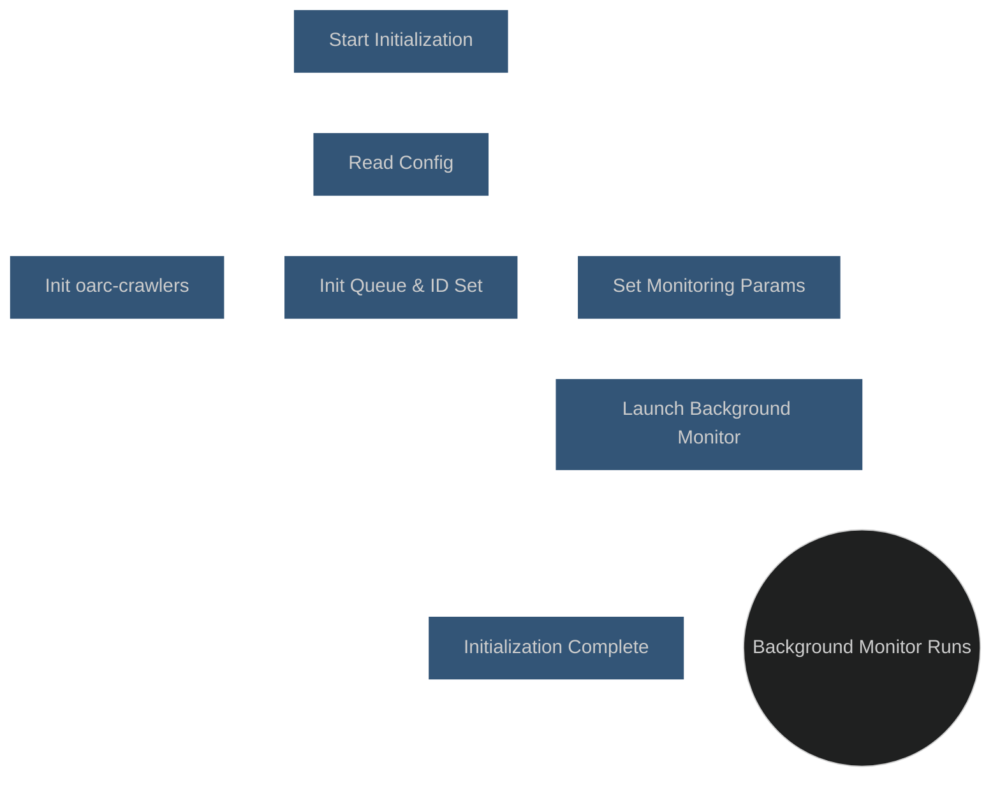
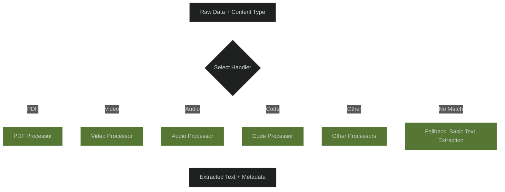
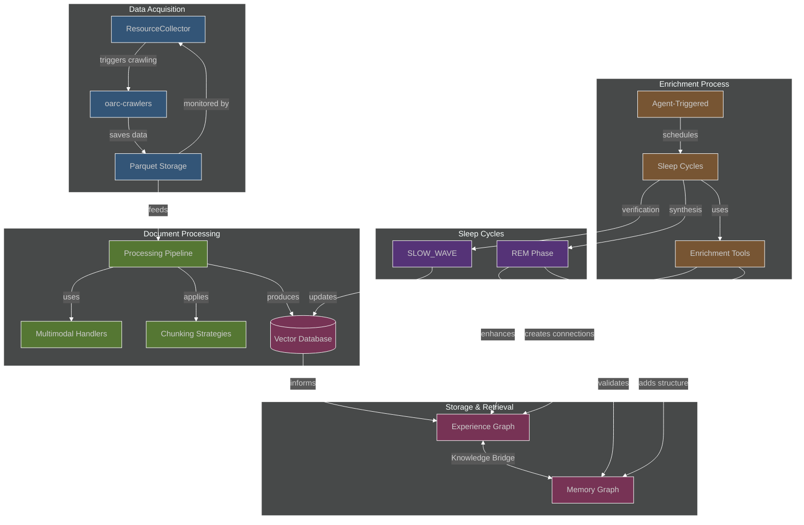
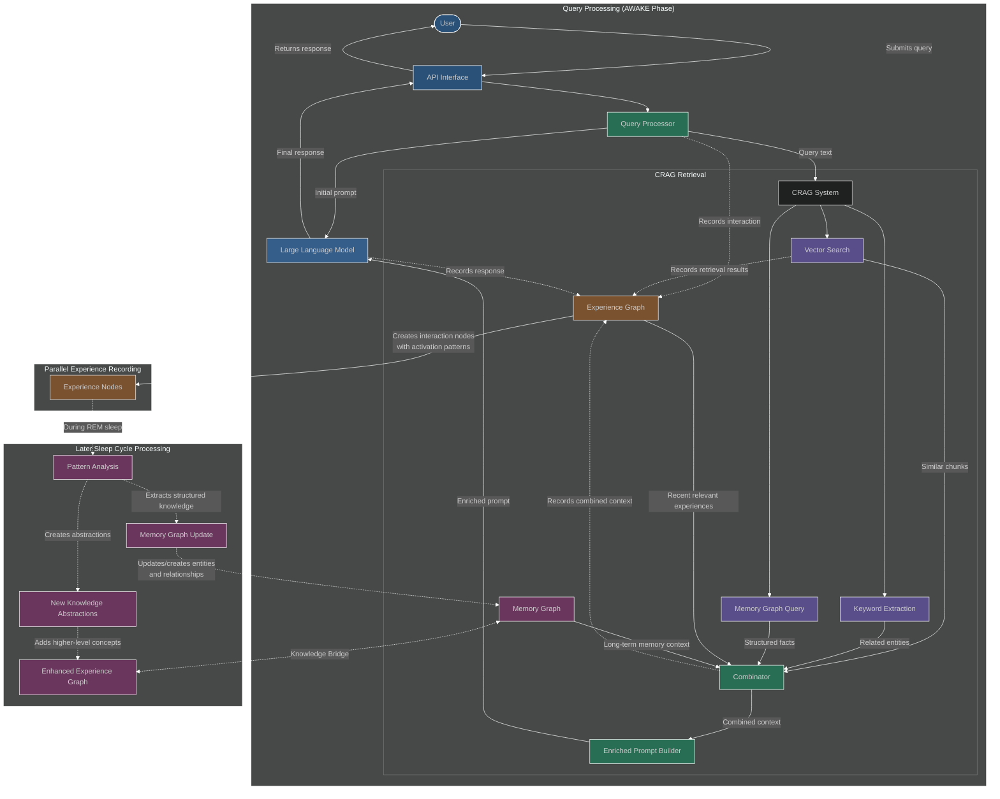
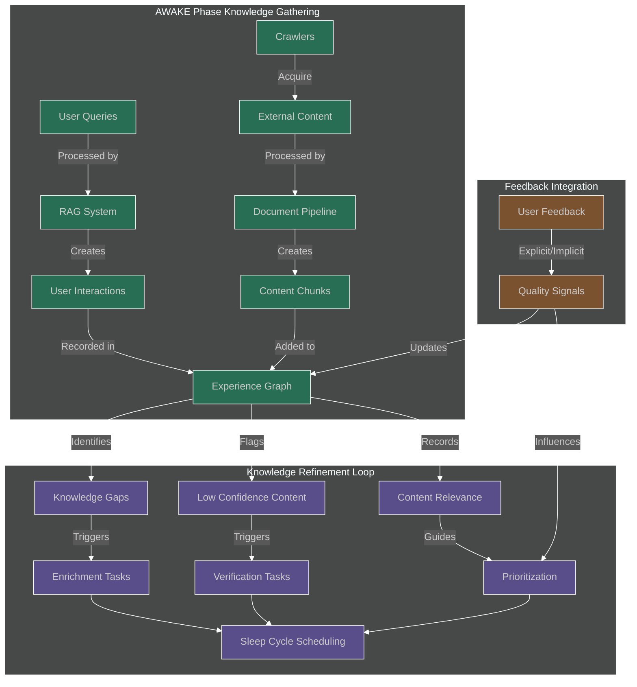
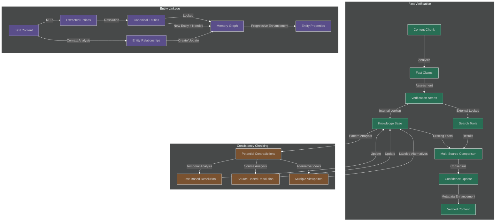
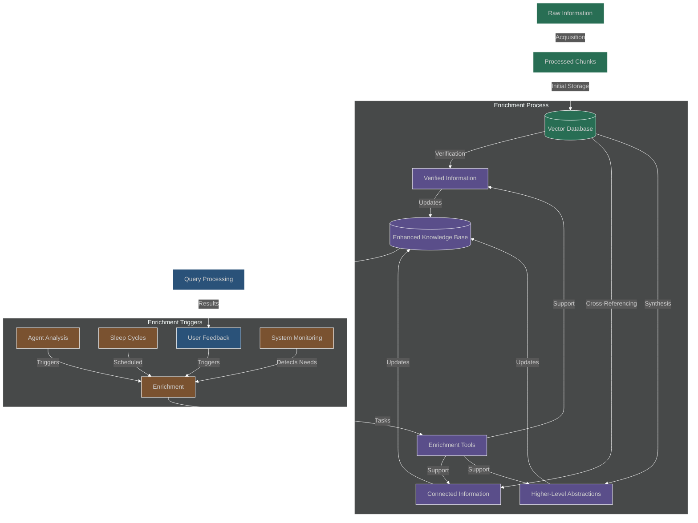
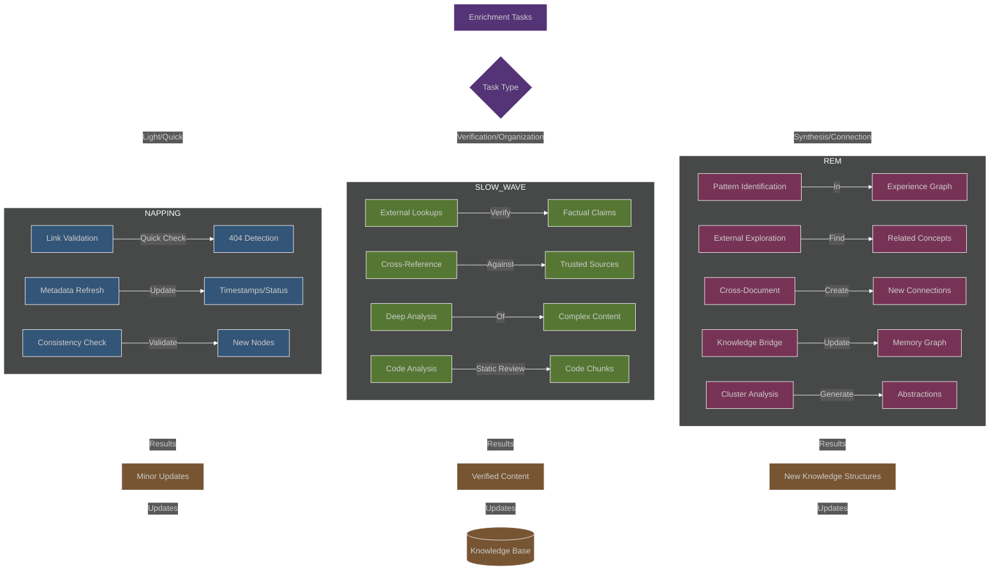

# Cognitive RAG (CRAG): Data Acquisition and Enrichment

This document details the Cognitive RAG (CRAG) system's mechanisms for acquiring external data and enriching its internal knowledge base. Data acquisition utilizes the `oarc-crawlers` package and a processing pipeline for initial ingestion and structuring. Following this, a distinct enrichment phase enhances the value, accuracy, and interconnectedness of stored information. Operating primarily during simulated cognitive sleep cycles and guided by agent analysis, this phase employs verification, cross-referencing, and synthesis techniques, deeply integrating with the dual-graph memory system to refine and store knowledge.

## Table of Contents

- [1. Introduction](#1-introduction)
- [2. Data Acquisition System](#2-data-acquisition-system)
    - [2.1 Resource Collection Coordination](#21-resource-collection-coordination)
    - [2.2 Core Crawling Functionality (`oarc-crawlers`)](#22-core-crawling-functionality-oarc-crawlers)
    - [2.3 Multimodal Content Acquisition](#23-multimodal-content-acquisition)
- [3. Document Processing Pipeline](#3-document-processing-pipeline)
    - [3.1 Pipeline Stages](#31-pipeline-stages)
    - [3.2 Multimodal Content Processing](#32-multimodal-content-processing)
- [4. Enrichment Workflows](#4-enrichment-workflows)
    - [4.1 End-to-End Data Flow](#41-end-to-end-data-flow)
    - [4.2 User Query Enrichment Flow](#42-user-query-enrichment-flow)
    - [4.3 Continuous Knowledge Enhancement](#43-continuous-knowledge-enhancement)
    - [4.4 Cross-Reference and Verification Tasks](#44-cross-reference-and-verification-tasks)
- [5. Data Enrichment Process](#5-data-enrichment-process)
    - [5.1 Overview](#51-overview)
    - [5.3 Enrichment During Sleep Cycles](#53-enrichment-during-sleep-cycles)
    - [5.5 Role of Dual-Graph Memory](#55-role-of-dual-graph-memory)
- [6. Appendix](#6-appendix)
    - [6.1 Glossary of Terms](#61-glossary-of-terms)

## 1. Introduction

Understanding the flow of information within the CRAG system requires differentiating between three fundamental stages:

1.  **Data Acquisition**: The initial gathering of raw, multimodal data from diverse external sources (web, YouTube, GitHub, ArXiv, etc.) orchestrated by the `ResourceCollector` using the `oarc-crawlers` package. This occurs during the AWAKE state, and acquired data is typically stored in Parquet format.
2.  **Document Processing**: The transformation of acquired raw data (loaded from Parquet) into structured, normalized, and chunked information suitable for embedding and storage. This is handled by a configurable pipeline with specialized processors for different content types (text, code, video, etc.).
3.  **Data Enrichment**: The subsequent enhancement of processed and stored information to increase its value, accuracy, and interconnectedness within the dual-graph memory system. This involves verification, cross-referencing, and synthesis, primarily executed during specialized SLEEP cycles (NAPPING, SLOW_WAVE, REM) and guided by agent analysis or system monitoring.

In essence, CRAG first **acquires** raw data using `oarc-crawlers`, then **processes** it into structured, usable chunks via a dedicated pipeline, and finally **enriches** this stored information through verification, cross-referencing, and synthesis, primarily during simulated sleep cycles, to enhance its overall value and connectivity within the dual-graph memory. The subsequent sections detail the technical mechanisms behind each of these stages.

## 2. Data Acquisition System

The Data Acquisition System, operating primarily during the system's AWAKE state, is responsible for gathering raw information from external sources. As defined in the main architecture (`Specification.md`, Section 2.12), the core fetching and extraction logic resides within the dedicated **`oarc-crawlers`** package. This package provides a suite of specialized crawlers (e.g., for web, YouTube, GitHub) and handles the complexities of interacting with diverse sources, including politeness protocols and rate limiting. Crucially, `oarc-crawlers` standardizes the output, typically saving acquired raw data and associated metadata into efficient Parquet files. The orchestration of these crawling tasks and the monitoring of the resulting Parquet files for ingestion into the processing pipeline are managed by the `ResourceCollector` component, which is detailed in the following section.

### 2.1 Resource Collection Coordination

The `ResourceCollector` component serves as the central coordinator for the Data Acquisition System, operating exclusively during the system's AWAKE state. It orchestrates the `oarc-crawlers` package by initiating specific crawling jobs based on system configuration, agent requests, or scheduled tasks. Concurrently, it monitors the output directory where `oarc-crawlers` saves the acquired raw data (typically as Parquet files). Upon detecting new files, the `ResourceCollector` extracts key metadata and enqueues the file information, making it available for the subsequent Document Processing Pipeline (detailed in Section 3). This mechanism ensures a controlled flow of external information into the RAG engine's processing stages. The algorithm below details this coordination and monitoring logic.

```mermaid
%%{init: {
    'theme': 'dark',
    'themeVariables': {
        'background': 'transparent',
        'primaryColor': '#ffffff',
        'primaryTextColor': '#ffffff',
        'primaryBorderColor': '#ffffff',
        'lineColor': '#ffffff',
        'fontSize': '16px',
        'fontFamily': 'arial'
    }
}}%%
flowchart TD
    subgraph ResourceCollector (AWAKE State)
        A[Trigger: Config/Agent/Schedule] --> B{Initiate Crawl?}
        B -- Yes --> C[Call oarc-crawlers.StartJob]

        subgraph Background Monitoring
            D[Monitor Output Directory] --> E{New Parquet File?}
            E -- Yes --> F[Read Metadata]
            F --> G[Enqueue File Info]
        end

        G --> H[(Document Processing Pipeline)]
    end

    C --> I[oarc-crawlers]
    I --> J[(Parquet Output Directory)]
    J --> D

    classDef collector fill:#335577,stroke:#fff;
    classDef external fill:#557733,stroke:#fff;
    classDef pipeline fill:#773355,stroke:#fff;

    class A,B,C,D,E,F,G collector
    class I,J external
    class H pipeline
```

#### 2.1.1 Initialization

The `ResourceCollector` begins by initializing necessary components based on the system configuration. This includes setting up instances of specific crawlers from the `oarc-crawlers` package as needed, establishing a thread-safe queue (`document_queue`) to hold information about newly acquired data files ready for the Document Processing Pipeline, and creating a set (`processed_ids`) to track files already handled. It also configures the directory where `oarc-crawlers` saves its output (Parquet files) and the interval for monitoring this directory. Finally, it launches a background process dedicated to monitoring the output directory.



```
Algorithm: ResourceCollector - Initialization

Initialize(config):
    // Initialize oarc-crawlers components (specific crawlers are part of the package)
    // Example: youtube_crawler = oarc_crawlers.YouTubeDownloader(...)
    // ... initialize other needed crawlers from oarc_crawlers based on config

    // Initialize processing queue (for documents ready for RAG pipeline ingestion)
    document_queue ← new ThreadSafeQueue()
    processed_ids ← new ConcurrentSet() // Tracks IDs processed by RAG pipeline
    monitoring_interval ← config.monitoring_interval or 60 # seconds
    oarc_crawlers_data_dir ← config.oarc_crawlers_data_dir

    // Start background monitoring process/thread
    StartBackgroundMonitor(oarc_crawlers_data_dir, monitoring_interval, document_queue, processed_ids)
```


#### 2.1.2 Crawling Job Triggering

When instructed to acquire data from a specific source (e.g., via configuration or agent request during the AWAKE state), the `ResourceCollector` uses the `TriggerCrawlingJob` function. This function identifies the appropriate crawler within the `oarc-crawlers` package based on the source type (like 'youtube', 'web', 'github'). It then initiates the crawling job using the selected `oarc-crawlers` instance. The `oarc-crawlers` package internally manages the complexities of the crawl, including asynchronous execution, rate limiting, and saving the raw output to Parquet files. The `ResourceCollector` simply triggers the job and receives confirmation or error status.

```mermaid
%%{init: {
    'theme': 'dark',
    'themeVariables': {
        'background': 'transparent',
        'primaryColor': '#ffffff',
        'primaryTextColor': '#ffffff',
        'primaryBorderColor': '#ffffff',
        'lineColor': '#ffffff',
        'fontSize': '16px',
        'fontFamily': 'arial'
    }
}}%%
flowchart TD
    A[Receive source_config] --> B{Determine crawler_type}
    B --> C[Get oarc-crawler instance]
    C --> D{Instance Found?}
    D -- Yes --> E[Call instance.StartJob]
    E --> F{Job Started?}
    F -- Yes --> G[Return {status: triggered}]
    F -- No --> H[Return {status: error}]
    D -- No --> I[Return {status: error, msg: "Unsupported type"}]

    classDef process fill:#335577,stroke:#fff;
    class A,B,C,D,E,F,G,H,I process;
```

```
Algorithm: ResourceCollector - Triggering Crawling Jobs

TriggerCrawlingJob(source_config):
    // Determine the appropriate crawler from oarc-crawlers based on source_config
    crawler_type ← source_config.type // e.g., "youtube", "github", "web", "arxiv", "ddg"
    crawler_instance ← GetOarcCrawlerInstance(crawler_type)

    if not crawler_instance:
        throw Exception("Unsupported source type for oarc-crawlers: " + crawler_type)

    // oarc-crawlers handles internal rate limiting, async execution, and Parquet saving.
    // This call likely returns quickly after initiating the crawl job within oarc-crawlers.
    try:
        job_id = crawler_instance.StartJob(source_config) # Example method name
        return { status: "triggered", source_type: crawler_type, job_id: job_id }
    catch Exception as e:
        return { status: "error", message: e.message }
```

#### 2.1.3 Output Monitoring and Enqueuing

A dedicated background process, `MonitorCrawlerOutput`, continuously watches the output directory specified during initialization. At regular intervals, it scans for new Parquet files generated by the `oarc-crawlers` jobs. For each new file found, it attempts to read basic metadata (like source type and a unique identifier) from the Parquet file itself. If the file hasn't been processed before (checked using `processed_ids`), it enqueues the file's path and associated metadata onto the `document_queue`. This makes the newly acquired data available for pickup and processing by the Document Processing Pipeline (Section 3). Error handling is included to log issues during file discovery or metadata reading.

```mermaid
%%{init: {
    'theme': 'dark',
    'themeVariables': {
        'background': 'transparent',
        'primaryColor': '#ffffff',
        'primaryTextColor': '#ffffff',
        'primaryBorderColor': '#ffffff',
        'lineColor': '#ffffff',
        'fontSize': '16px',
        'fontFamily': 'arial'
    }
}}%%
flowchart TD
    A[Start Monitor] --> B{Check for New Files}
    B -- No New Files --> C[Sleep(interval)]
    C --> B
    B -- New Files Found --> D{Loop Through Files}
    D -- Next File --> E[Read Metadata]
    E --> F{Get/Generate ID}
    F --> G{ID Processed?}
    G -- Yes --> D
    G -- No --> H[Enqueue File Info]
    H --> I[Add ID to Processed Set]
    I --> D
    D -- All Files Done --> C
    E -- Error --> J[Log Error]
    J --> D

    classDef monitor fill:#335577,stroke:#fff;
    class A,B,C,D,E,F,G,H,I,J monitor;
```

```
Algorithm: ResourceCollector - Monitoring Crawler Output

// Background process/thread monitors oarc-crawlers output directory
MonitorCrawlerOutput(data_dir, interval, queue, processed_ids):
    while True:
        new_files = CheckForNewParquetFiles(data_dir) # Scans directory for new/unprocessed files
        for file_path in new_files:
            try:
                metadata = ReadParquetMetadata(file_path) // Get source info, crawler type etc.
                doc_id = metadata.get("id") or GenerateIDFromFile(file_path)

                if doc_id not in processed_ids:
                     // Enqueue metadata or path for the RAG processing pipeline
                    queue.Enqueue({
                            "id": doc_id,
                            "source_path": file_path,
                            "source_type": metadata.get("crawler_type"),
                            "metadata": metadata
                            })
                    processed_ids.Add(doc_id)
            catch Exception as e:
                    LogError("Failed to process discovered file:", file_path, e)
                    # Optionally move file to an error directory

        Sleep(interval)
```

### 2.2 Core Crawling Functionality (`oarc-crawlers`)

The **`oarc-crawlers`** package provides the core web crawling and scraping functionalities. This includes:
- **General Web Crawling:** Using `BSWebCrawler` for fetching and parsing HTML content from websites, respecting `robots.txt` and politeness delays.
- **Specific Source Crawlers:** Dedicated modules for sources like YouTube (videos, metadata, captions), GitHub (repositories, code), DuckDuckGo (search results), and ArXiv (papers, LaTeX source).
- **Data Persistence:** Integrated saving of crawled data into Parquet files via `ParquetStorage`.
- **Extensibility:** The `oarc-crawlers` package can be extended with new crawlers or features as required, maintaining a unified interface and storage mechanism.

The RAG system coordinates these crawlers via the `ResourceCollector`, triggering crawls based on configuration or specific requests.

```
Algorithm: WebCrawler (Coordination via oarc-crawlers)

// Initialization and coordination are handled by ResourceCollector (Section 2.2)
// which uses instances of crawlers from the oarc_crawlers package.

// Example internal logic within an oarc_crawlers module (e.g., BSWebCrawler)
CrawlWebsite(start_url, max_depth, config):
  // Initialize internal queue, visited sets, respect robots.txt cache
  urls_queue ← new PriorityQueue()
  visited_urls ← new Set()
  // ... other internal state ...
  
  EnqueueURL(start_url, 0)

  while not urls_queue.IsEmpty():
    job ← urls_queue.Dequeue()
    url ← job.url
    
    if url in visited_urls or job.depth > max_depth: continue
    if not IsAllowedByRobots(url): continue // Handled internally
    
    visited_urls.Add(url)
    ApplyRateLimiting(url) // Handled internally
    
    fetch_result ← FetchURL(url) // Uses async HTTP client
    if not fetch_result.success: continue
    
    // Process content (e.g., extract text, links using BeautifulSoup)
    extracted_data = ExtractContentAndLinks(fetch_result.content, url)
    
    // Save extracted data using internal ParquetStorage
    SaveToParquet(url, extracted_data, config.data_dir) 
    
    // Enqueue newly found links
    for link in extracted_data.links:
      EnqueueURL(link, job.depth + 1)
      
  // Notify completion or make data available for pickup
```

### 2.3 Multimodal Content Acquisition

The **`oarc-crawlers`** package is specifically designed to handle the *acquisition* phase for diverse content types beyond standard web text. This involves invoking specialized crawlers within the package to fetch the raw data formats from their respective sources. For instance:
- The `YouTubeDownloader` fetches video files and associated metadata (like titles, descriptions).
- The `GitHubCrawler` clones repositories or downloads specific code files (e.g., `.py`, `.js`, `.md`).
- The `ArXivCrawler` retrieves PDF documents or LaTeX source files.
- The `BSWebCrawler` might download linked non-HTML files like images or documents if configured.

During this acquisition stage, `oarc-crawlers` focuses solely on retrieving the raw digital assets. The primary goal is collection and storage, typically saving the raw file content (or references to it) along with extracted source metadata into standardized Parquet files via its `ParquetStorage` component. No significant *interpretation* or *content extraction* (like video transcription or PDF text extraction) occurs at this point.

The subsequent *processing* and interpretation of these acquired multimodal formats—transforming raw video into text via transcription, extracting text from PDF structures, or analyzing code syntax—is explicitly deferred to specialized handlers within the Document Processing Pipeline, as detailed in Section 3.2. This separation ensures that the acquisition phase remains focused on efficient data gathering, while the processing phase handles the complexities of content interpretation.

```mermaid
%%{init: {
    'theme': 'dark',
    'themeVariables': {
        'background': 'transparent',
        'primaryColor': '#ffffff',
        'primaryTextColor': '#ffffff',
        'primaryBorderColor': '#ffffff',
        'lineColor': '#ffffff',
        'fontSize': '16px',
        'fontFamily': 'arial'
    }
}}%%
flowchart TD
    Source[External Source (e.g., YouTube, GitHub, ArXiv)] --> OC[oarc-crawlers (Specific Crawler)]
    OC --> Parquet[Raw Data Saved (Parquet File)]
    Parquet --> DPP[Document Processing Pipeline (Section 3.2)]
    DPP --> Processed[Processed Content (e.g., Text, Transcription)]

    classDef acquisition fill:#335577,stroke:#fff;
    classDef processing fill:#557733,stroke:#fff;
    class Source,OC,Parquet acquisition;
    class DPP,Processed processing;
```

## 3. Document Processing Pipeline

### 3.1 Pipeline Stages

Following acquisition by `oarc-crawlers` and storage (typically in Parquet format), the Document Processing Pipeline transforms the raw data. It applies a configurable sequence of stages to produce structured, normalized, and chunked information suitable for embedding and storage within the dual-graph memory system. Key stages often include:

-   **Normalization**: Cleaning and standardizing content (e.g., text case folding).
-   **Metadata Management**: Extracting or adding relevant metadata (source, timestamps).
-   **Content-Specific Processing**: Handling diverse formats like text, code, or multimodal data (detailed in Section 3.2).
-   **Chunking**: Dividing content into appropriately sized, semantically relevant units using various strategies.
-   **Feature Extraction**: Optional steps like language detection or named entity recognition (NER).

The diagram below illustrates the general processing flow through these configured stages.

```mermaid
%%{init: {
    'theme': 'dark',
    'themeVariables': {
        'background': 'transparent',
        'primaryColor': '#ffffff',
        'primaryTextColor': '#ffffff',
        'primaryBorderColor': '#ffffff',
        'lineColor': '#ffffff',
        'fontSize': '16px',
        'fontFamily': 'arial'
    }
}}%%
flowchart TD
    A[Raw Data (Parquet)] --> B(Normalization)
    B --> C(Metadata Management)
    C --> D(Content-Specific Processing)
    D --> E(Chunking)
    E --> F(Feature Extraction)
    F --> G[Processed Chunks (Ready for Embedding)]

    classDef stage fill:#557733,stroke:#fff;
    class B,C,D,E,F stage;
```

The algorithm below details the implementation of this pipeline.

```
Algorithm: ProcessingPipeline (Post-Acquisition)

Initialize(config):
  // Configure pipeline stages (Normalization, Chunking, Metadata, etc.)
  for each stage_config in config.stages:
    processor ← CreateProcessor(stage_config.type, stage_config.config)
    processors[stage_config.name] ← processor
    stages.append(stage_config.name)

  // Initialize Parquet reader from oarc-crawlers
  parquet_storage = oarc_crawlers.ParquetStorage(config.data_dir)

ProcessAcquiredData(source_info): // source_info contains path to Parquet file, metadata
  // Load data collected by oarc-crawlers
  try:
    raw_data_df = parquet_storage.load_data(source_info["source_path"])
    // Convert DataFrame rows to document objects for pipeline processing
    initial_documents = ConvertDataFrameToDocuments(raw_data_df, source_info["metadata"])
  catch Exception as e:
     metrics.RecordError("data_loading", e)
     return {success: false, error: "Failed to load data from Parquet"}

  processed_results = []
  for document in initial_documents:
      current_doc ← document
      stage_results ← {}

      // Process through each pipeline stage
      for each stage_name in stages:
        processor ← processors[stage_name]
        try:
          start_time ← current_time()
          result ← processor.Process(current_doc)
          current_doc ← result.document
          stage_results[stage_name] ← result.metadata
          elapsed ← current_time() - start_time
          metrics.RecordStageTime(stage_name, elapsed)
        catch Exception as e:
          metrics.RecordError(stage_name, e)
          processed_results.append({
            success: false,
            error: e.message,
            stage: stage_name,
            partial_results: stage_results,
            original_doc_id: document.id
          })
          break # Stop processing this document on error
      else: # No break occurred
          processed_results.append({
            success: true,
            document: current_doc, # Final processed document ready for embedding/storage
            stage_results: stage_results
          })

  return processed_results # List of results for each initial document
```

### 3.2 Multimodal Content Processing

This stage within the Document Processing Pipeline (introduced in Section 3.1) handles the interpretation of diverse raw data formats acquired by `oarc-crawlers` (detailed in Section 2.3). Its primary function is to apply specialized handlers to extract meaningful content, typically text, and relevant metadata from various media types. For instance, raw video files might be transcribed, PDF documents might have their text content extracted, and code files might be analyzed for structure and documentation. The specific logic for selecting and applying these handlers based on content type is detailed in the `MultimodalHandler` algorithm below.



```
Algorithm: MultimodalHandler (Processing Stage in Pipeline)

Initialize(config):
  // Register content processors for pipeline stages
  RegisterProcessor("application/pdf", PDFProcessor) // Extracts text from PDF
  RegisterProcessor("video/*", VideoProcessor)       // Extracts audio, potentially frames/metadata
  RegisterProcessor("audio/*", AudioProcessor)       // Transcribes audio
  RegisterProcessor("text/code", CodeProcessor)      // Analyzes code structure/docstrings
  // ... other processors ...

ProcessContent(document_data, content_type): // document_data loaded from Parquet
  // Find appropriate processor based on content_type (or file extension/metadata)
  processor ← FindMatchingProcessor(content_type)

  if not processor:
    Log warning("No specialized processor for content type: " + content_type)
    // Fallback to basic text extraction if possible
    return ExtractBasicText(document_data)

  // Process the content using the specialized processor
  result ← processor.Process(document_data, config) // e.g., PDFProcessor extracts text

  return {
    text: result.text, // Extracted/Transcribed text
    metadata: result.metadata, // Processor-specific metadata
    confidence: result.confidence
  }
```

## 4. Enrichment Workflows

This section details the primary workflows responsible for data enhancement and interconnection within the CRAG system.

### 4.1 End-to-End Data Flow

The enrichment process forms a continuous cycle of information improvement that spans from initial data acquisition to sophisticated knowledge synthesis. As illustrated in the diagram below, this process integrates multiple specialized subsystems working in concert:

1.  **Acquisition**: The `ResourceCollector` directs `oarc-crawlers` to gather multimodal data from external sources, saving raw content and metadata to Parquet files.
2.  **Processing**: Raw data from Parquet files is ingested by the Document Processing Pipeline, which uses specialized handlers (e.g., for text, video, code) and chunking strategies to create structured, normalized units suitable for embedding.
3.  **Storage**: Processed chunks are embedded and stored in the Vector Database, providing the basis for the Experience Graph and enabling links to the structured knowledge within the Memory Graph.
4.  **Enrichment Initiation**: Enrichment tasks (verification, cross-referencing, synthesis) are triggered by agents, scheduled during sleep cycles, or initiated by system monitoring, utilizing dedicated tools like search APIs and LLMs.
5.  **Sleep Cycle Execution**: Scheduled enrichment tasks are executed during specific sleep phases: SLOW_WAVE for deep verification and organization, and REM for pattern analysis, synthesis, and establishing new knowledge connections within the dual-graph memory.

This cyclical flow ensures that information continuously evolves from raw data into increasingly valuable, interconnected knowledge structures.



### 4.2 User Query Enrichment Flow

When a user submits a query, the CRAG system initiates a multi-stage workflow designed to provide contextually relevant answers while simultaneously capturing interaction data for ongoing knowledge refinement. This process integrates real-time retrieval with long-term learning mechanisms:

1.  **Dual-Path Query Handling**: Upon receiving a query via the API, the system processes it concurrently: one path involves immediate LLM interaction for rapid initial assessment, while the other engages the CRAG retrieval mechanisms for in-depth, knowledge-grounded context generation.
2.  **Comprehensive Context Retrieval**: The CRAG system gathers relevant information using a blend of techniques: vector search identifies semantically similar content, keyword extraction targets explicit terms, and Memory Graph queries retrieve structured facts. This is further enriched by incorporating recent interaction data from the Experience Graph and consolidated knowledge from the Memory Graph.
3.  **Intelligent Context Synthesis**: A `Combinator` component assesses, filters, and merges the retrieved information from diverse sources, prioritizing relevance and coherence. The `Enriched Prompt Builder` then formats this synthesized context into an optimized prompt for the Large Language Model (LLM).
4.  **Interaction Recording for Learning**: Each significant event within the query lifecycle—including the initial query, retrieval results, combined context, and final LLM response—is captured as an "experience" node in the Experience Graph. These nodes store activation patterns reflecting usage frequency and relationships, forming the basis for future learning.
5.  **Asynchronous Knowledge Consolidation and Enhancement**: During subsequent sleep cycles (particularly REM), the system analyzes the patterns and connections within the accumulated experience nodes. This analysis facilitates the extraction of structured knowledge, the generation of higher-level abstractions, and updates to the Memory Graph, thereby refining and expanding the system's knowledge base over time.


### 4.3 Continuous Knowledge Enhancement

The continuous knowledge enhancement workflow operates as a cyclical process of information refinement. During the AWAKE phase, the system gathers experiences through user interactions and active data acquisition. These experiences are recorded in the Experience Graph, creating an associative network of content nodes and their usage patterns.



This feedback-driven learning cycle comprises several interconnected components:

1.  **Active Knowledge Gathering**: The system accumulates knowledge through two primary channels:
    *   **User Interactions**: Every query, result, and subsequent user behavior creates valuable usage patterns.
    *   **External Acquisition**: The crawlers actively gather domain-relevant content, which is processed into semantic chunks.

2.  **Experience Recording**: All interactions and content are captured in the Experience Graph, which tracks not just the content itself but metadata about its usage, relevance, and relationships to other information.

3.  **Gap and Quality Analysis**: The system continuously analyzes its knowledge base to identify:
    *   **Knowledge Gaps**: Missing information revealed by user queries without confident answers
    *   **Low Confidence Content**: Information chunks with uncertain factual status
    *   **Relevance Patterns**: Frequently accessed or highly connected information that warrants further enrichment

4.  **Targeted Enrichment Strategy**: Based on this analysis, the system schedules appropriate enhancement tasks, selecting the optimal sleep cycle for each:
    *   **NAPPING**: Quick refreshes of frequently accessed but potentially outdated information
    *   **SLOW_WAVE**: Deep verification of factual claims against external sources
    *   **REM**: Creative connections between disparate knowledge areas and synthesis of higher-level concepts

5. **Feedback Integration Loop**: User feedback, both explicit (direct corrections) and implicit (follow-up queries), provides quality signals that further refine the enrichment priorities and directly update content confidence scores.

This continuous cycle allows the system to progressively improve its knowledge quality and connectivity without manual curation, focusing its resources on the most valuable or problematic areas of its knowledge base.


### 4.4 Cross-Reference and Verification Tasks

Cross-reference and verification workflows ensure the accuracy and interconnectedness of the knowledge base through systematic checks and linking operations. These processes are fundamental to maintaining knowledge quality and building a densely connected semantic network.

The system employs several specialized verification and linking processes:

1. **Fact Verification Pipeline**: 
   - Begins with identifying explicit or implicit factual claims within content chunks
   - Assesses each claim's verification needs based on importance, confidence, and existing support
   - Employs multiple verification strategies in parallel:
     - External lookup using search tools to find corroborating sources
     - Internal knowledge base consultation to check for consistency
   - Compares multiple sources to determine consensus or identify conflicting information
   - Updates content with verification metadata, confidence scores, and source citations

2. **Entity Linkage Process**:
   - Extracts named entities and concepts from text using NER and concept recognition
   - Resolves these mentions to canonical entities in the Memory Graph
   - Creates new entities when no match exists, avoiding entity duplication
   - Analyzes contextual relationships between entities to establish connection types
   - Progressively enhances entity properties through repeated encounters across documents

3. **Consistency Checking Framework**:
   - Proactively analyzes the knowledge base to detect potential contradictions
   - Employs specialized resolution strategies:
     - Temporal analysis to distinguish outdated information from current facts
     - Source credibility assessment to resolve conflicting claims
     - Multi-perspective representation to maintain alternative viewpoints when appropriate
   - Updates the knowledge base to resolve or properly represent contradictions

4. **Cross-Document Synthesis**:
   - Identifies complementary information fragments scattered across multiple documents
   - Constructs comprehensive views by combining partial information
   - Detects supporting evidence across sources to strengthen confidence in assertions
   - Generates abstracted summaries that integrate multiple perspectives into coherent knowledge

These processes work together during appropriate sleep cycles to ensure the knowledge base maintains high standards of accuracy, coherence, and interconnectedness, enabling more reliable and comprehensive responses to user queries.



## 5. Data Enrichment Process

### 5.1 Overview

The Data Enrichment process enhances the value, accuracy, and interconnectedness of information already acquired and processed by the system. It transforms stored information into validated, interconnected knowledge through a multi-stage workflow:

1. **Information Evolution Pathway**: Raw information progresses through a value-adding transformation sequence:
   - **Initial Acquisition**: External data is gathered through crawlers and processed into chunks
   - **Basic Storage**: These chunks are embedded and stored in the vector database
   - **Enrichment Processes**: Three primary enrichment operations transform this raw information:
     - **Verification**: Cross-checking facts against trusted sources for accuracy
     - **Cross-Referencing**: Discovering and establishing connections between related information
     - **Synthesis**: Generating higher-level abstractions from related knowledge fragments
   - **Enhanced Knowledge Structures**: The enriched information is integrated into the dual-graph memory system

2. **Enrichment Trigger Mechanisms**: Multiple pathways can initiate enrichment processes:
   - **Agent Analysis**: RAG agents identify content needing verification or expansion
   - **Sleep Cycle Scheduling**: Regular maintenance during system sleep phases
   - **User Feedback**: Direct or indirect signals about information quality
   - **System Monitoring**: Automated detection of outdated or low-confidence content

3. **Tools Framework**: Enrichment processes utilize specialized tools to enhance information:
   - **Crawlers and Search APIs**: For external verification and discovery
   - **LLMs**: For content analysis, synthesis, and abstraction
   - **Knowledge Base Consultation**: For internal consistency checking

4. **Continuous Improvement Loop**: The enriched knowledge feeds back into the query processing system, enabling more accurate and comprehensive responses, which in turn generate new interactions and opportunities for enrichment.

This continuous process ensures that the system's knowledge base grows not just in size but in quality, accuracy, and interconnectedness over time.



### 5.3 Enrichment During Sleep Cycles

Sleep cycles are crucial for data enrichment, mirroring cognitive consolidation in biological systems. These specialized maintenance periods provide dedicated time for resource-intensive enrichment operations that would be impractical during normal operation. Each sleep stage serves distinct enrichment functions:

1. **NAPPING Phase** - Light, Quick Maintenance:
   - **Link Validation**: Performs rapid checks on external links, detecting broken references (404s)
   - **Metadata Refreshing**: Updates timestamps, access counts, and other lightweight metadata
   - **Consistency Verification**: Performs basic validation checks on newly added nodes
   - **Characteristics**: Short duration, easily interruptible, minimal resource consumption

2. **SLOW_WAVE Phase** - Deep Verification and Optimization:
   - **External Lookups**: Conducts thorough fact verification against trusted sources
   - **Cross-Reference Analysis**: Compares information against internal trusted content
   - **Deep Content Analysis**: Performs detailed analysis of complex content types
   - **Code Analysis**: Conducts static code reviews and documentation checks
   - **Characteristics**: Longer duration, resource-intensive, focuses on accuracy and organization

3. **REM Phase** - Creative Connections and Synthesis:
   - **Pattern Identification**: Analyzes the Experience Graph for meaningful clusters and usage patterns
   - **External Exploration**: Conducts broad searches for related concepts and supporting information
   - **Connection Creation**: Establishes new relationships between previously unlinked content
   - **Knowledge Bridge Operation**: Updates the Memory Graph based on Experience Graph patterns
   - **Abstraction Generation**: Creates higher-level concepts and summaries from related content
   - **Characteristics**: Medium duration, balances creativity with analysis, focuses on knowledge expansion

This specialized division of enrichment responsibilities ensures that each type of task occurs during the most appropriate system state. Task routing intelligently assigns enrichment work to the optimal sleep phase based on the nature of the task, required resources, and expected outcomes.



### 5.5 Role of Dual-Graph Memory

The dual-graph memory system plays a central role in guiding and storing enrichment results. This complementary architecture combines the strengths of associative pattern learning with structured knowledge representation, creating a powerful foundation for sophisticated knowledge management:

1. **Experience Graph as Enrichment Guide**:
   - **Activation Patterns**: Highlight frequently used or recently relevant information, directing enrichment resources toward high-value content
   - **Cluster Analysis**: During REM sleep, identifies semantically related content that could benefit from synthesis or deeper connections
   - **Relationship Discovery**: Cross-referencing activities create new edges connecting previously isolated but related concepts
   - **Knowledge Synthesis**: Generates new abstraction nodes that represent higher-level concepts derived from patterns across multiple documents
   - **Error Detection**: Identifies contradictions or confusion patterns that trigger corrective enrichment activities

2. **Memory Graph as Structured Knowledge Repository**:
   - **External Knowledge Integration**: Enrichment lookups against external sources (Wikipedia, specialized databases) add structured entities and relationships
   - **Structured Extraction**: REM sleep processes synthesize unstructured content into formal entity-relationship triples
   - **Fact Verification**: SLOW_WAVE processes validate factual claims against trusted sources, updating confidence scores
   - **Context Provision**: Structured queries against the Memory Graph guide further enrichment by providing precise context for ambiguous terms or entities

3. **Knowledge Bridge Integration**:
   - **Verification Pathway**: Facts confirmed during SLOW_WAVE verification can update Memory Graph relationships with higher confidence scores
   - **Structure Extraction**: LLM analysis during REM sleep can convert patterns observed in the Experience Graph into formal Memory Graph structures
   - **Entity Recognition**: Mentions of entities in Experience Graph nodes can be linked to their canonical representations in the Memory Graph

The synergy between these complementary memory systems creates a self-improving knowledge ecosystem. The Experience Graph captures usage patterns and associative relationships that guide enrichment priorities, while the Memory Graph provides the structured foundation that ensures consistency and enables precise reasoning. Together, they enable a continuous cycle of information refinement that makes the entire knowledge base progressively more valuable over time.

```mermaid
%%{init: {
    'theme': 'dark',
    'themeVariables': {
        'background': 'transparent',
        'primaryColor': '#ffffff',
        'primaryTextColor': '#ffffff',
        'primaryBorderColor': '#ffffff',
        'lineColor': '#ffffff',
        'fontSize': '16px',
        'fontFamily': 'arial'
    }
}}%%

flowchart TD
    subgraph "Experience Graph Role"
        EGA[Activation Patterns] -->|"Highlight"| EGB[Important Information]
        EGC[Cluster Analysis] -->|"During REM"| EGD[Identifies Enrichment Candidates]
        EGE[New Relationships] -->|"From Cross-Referencing"| EGF[New Edges]
        EGG[Synthesized Knowledge] -->|"Summaries/Abstractions"| EGH[New Nodes]
        EGI[Error Patterns] -->|"Trigger"| EGJ[Corrective Enrichment]
    end
    
    subgraph "Memory Graph Role"
        MGA[External Lookups] -->|"Add"| MGB[Structured Knowledge]
        MGC[REM Synthesis] -->|"Extract"| MGD[Entity Relationships]
        MGE[SLOW_WAVE] -->|"Verification"| MGF[Fact Checking]
        MGG[Graph Queries] -->|"Guide"| MGH[Further Enrichment]
    end
    
    subgraph "Knowledge Bridge"
        KB1[Verified Facts] -->|"From SLOW_WAVE"| KB2[Memory Graph Updates]
        KB3[Extracted Structures] -->|"By LLM During REM"| KB4[From Experience Patterns]
        KB5[Entity Recognition] -->|"In Experience Nodes"| KB6[Memory Graph Linking]
    end
    
    Enrichment[Enrichment Process] -->|"Outputs"| EGA
    Enrichment -->|"Outputs"| MGA
    Enrichment -->|"Utilizes"| KB1
    
    EGB -->|"Informs"| NextEnrich[Next Enrichment Cycle]
    MGH -->|"Informs"| NextEnrich
    
    classDef experience fill:#335577,stroke:#fff
    classDef memory fill:#557733,stroke:#fff
    classDef bridge fill:#773355,stroke:#fff
    classDef process fill:#775533,stroke:#fff
    
    class EGA,EGB,EGC,EGD,EGE,EGF,EGG,EGH,EGI,EGJ experience
    class MGA,MGB,MGC,MGD,MGE,MGF,MGG,MGH memory
    class KB1,KB2,KB3,KB4,KB5,KB6 bridge
    class Enrichment,NextEnrich process
```



## 6. Appendix

### 6.1 Glossary of Terms
| Term                       | Definition                                                                                                                            |
| :------------------------- | :------------------------------------------------------------------------------------------------------------------------------------ |
| Abstraction Generation     | The process, typically during REM sleep, of creating higher-level concepts or summaries from related content fragments.              |
| Activation Patterns        | Data associated with Experience Nodes indicating usage frequency, relevance, or recency, used to guide enrichment priorities.         |
| Agent-Triggered Enrichment | Enrichment workflows initiated by `RAGAgent` subclasses upon detecting needs like low confidence or missing information.              |
| AWAKE State                | The primary operational state where the system interacts with users, acquires data, and performs immediate processing.                |
| Canonical Entities         | The standardized, unique representation of a named entity within the Memory Graph.                                                    |
| Chunking                   | Process of dividing documents into smaller, semantically cohesive pieces suitable for embedding and retrieval.                      |
| Code Analysis              | Enrichment task, often during SLOW_WAVE sleep, involving static analysis or documentation checks on code chunks.                    |
| Combinator                 | Component in the query workflow that assesses, filters, and merges retrieved information from diverse sources before LLM prompting. |
| Consistency Checking       | A framework and process for proactively identifying and resolving potential contradictions within the knowledge base.                |
| Connection Creation        | Enrichment task, often during REM sleep, focused on establishing new links or relationships between previously disconnected content. |
| Cross-Document Synthesis   | An enrichment process combining information fragments scattered across multiple documents to build comprehensive views or summaries.   |
| Cross-Reference Analysis   | Enrichment task comparing information across different internal documents or against trusted internal sources.                      |
| Cross-referencing          | Process of finding and establishing connections or links between different pieces of related information within the knowledge base.  |
| Data Acquisition           | The initial gathering of raw, multimodal data from diverse external sources, typically orchestrated by the `ResourceCollector`.       |
| Data Enrichment            | Post-acquisition enhancement of stored information through verification, cross-referencing, synthesis, and other refinement tasks.  |
| Deep Content Analysis      | Detailed analysis of complex content types performed during enrichment, often requiring significant resources (e.g., SLOW_WAVE).      |
| Document Processing        | The transformation of acquired raw data into structured, normalized, and chunked information suitable for embedding and storage.    |
| Dual-Graph Memory          | The combined memory system comprising the Experience Graph (associative, episodic) and the Memory Graph (structured, semantic).     |
| Enriched Prompt Builder    | Component that formats synthesized context retrieved by the Combinator into an optimized prompt for the Large Language Model (LLM).  |
| Enrichment Tools           | Collection of utilities (e.g., crawlers, search APIs, LLMs) used by various enrichment processes to enhance knowledge.              |
| Entity Linkage Process     | A specific workflow focused on identifying named entities in content and linking them to their canonical representations in the MG.  |
| Experience Graph           | Associative memory representation capturing content chunks, user interactions, usage patterns, and episodic information.            |
| Experience Node            | A node within the Experience Graph representing a specific interaction, query, content chunk, or synthesized concept.                |
| External Exploration       | Enrichment task, often during REM sleep, involving broad searches using external tools (like web search) for related concepts.      |
| External Lookups           | Using external resources (search engines, APIs, databases) during enrichment (esp. SLOW_WAVE) to verify facts or gather info.       |
| Fact Verification Pipeline | A specific workflow within enrichment focused on validating factual claims within content against internal and external sources.      |
| Feature Extraction         | Optional pipeline stage involving steps like language detection or named entity recognition (NER).                                  |
| Knowledge Bridge           | Mechanism facilitating the transfer and synchronization of information between the Memory Graph and the Experience Graph.           |
| Knowledge Gaps             | Areas where the system lacks sufficient information, often identified through failed queries or low-confidence responses.           |
| Link Validation            | Enrichment task, often during NAPPING, to check if external hyperlinks within content are still active or broken (e.g., 404s).      |
| LLM (Large Language Model) | Advanced AI models used for natural language understanding, generation, analysis, and synthesis tasks within the CRAG system.       |
| Low Confidence Content     | Information chunks flagged as potentially inaccurate or requiring verification.                                                       |
| Memory Graph               | Structured knowledge representation storing facts, entities, and their relationships in a formal graph structure.                   |
| Metadata Refreshing        | Light maintenance task, often during NAPPING, to update metadata like access timestamps or status flags.                            |
| Multimodal Content         | Diverse data formats beyond text (e.g., video, audio, code, images) that require specialized processing handlers.                   |
| NAPPING                    | A short, light sleep cycle focused on quick maintenance tasks like link validation, metadata refreshing, and basic consistency checks. |
| NER (Named Entity Recog.)  | Natural Language Processing technique to identify and categorize named entities (persons, organizations, locations) in text.        |
| oarc-crawlers              | A dedicated package providing specialized crawlers (web, YouTube, GitHub, etc.) and data persistence logic (e.g., Parquet).         |
| Parquet Storage            | Efficient columnar storage format used by `oarc-crawlers` to persist acquired raw data and metadata.                                |
| Pattern Identification     | Analysis, typically during REM sleep, of the Experience Graph to find meaningful clusters, usage trends, or connection opportunities. |
| Processing Pipeline        | A configurable sequence of stages (e.g., normalization, chunking, feature extraction) that transforms raw data for storage.        |
| REM                        | A sleep cycle focused on creative synthesis, pattern analysis, establishing new connections, knowledge abstraction, and exploration.  |
| REM Synthesis              | Creative connection finding, pattern analysis, knowledge synthesis, and abstraction performed during the REM sleep cycle.           |
| ResourceCollector          | Component that orchestrates the data acquisition process by initiating and monitoring `oarc-crawlers` jobs.                         |
| Relevance Patterns         | Analysis of usage data (e.g., access frequency, connections) to determine the importance or relevance of specific content.          |
| SLEEP Cycles               | Designated periods (NAPPING, SLOW_WAVE, REM) for offline processing, enrichment, memory consolidation, and system maintenance.      |
| SLOW_WAVE                  | A deep sleep cycle focused on resource-intensive verification, optimization, organization, and deep analysis tasks.                 |
| SLOW_WAVE Verification     | Deep verification, organization, and optimization tasks performed during the SLOW_WAVE sleep cycle using internal/external sources. |
| Synthesis                  | Process of combining distinct pieces of information or ideas to generate new insights, summaries, or higher-level abstractions.     |
| System Monitoring          | Automated processes that track system health and knowledge quality, potentially triggering enrichment tasks.                        |
| Task Routing               | The mechanism that intelligently assigns specific enrichment tasks to the most appropriate sleep cycle based on their nature.       |
| Verification               | Process of checking the accuracy and correctness of information, often against trusted internal or external sources.                |
