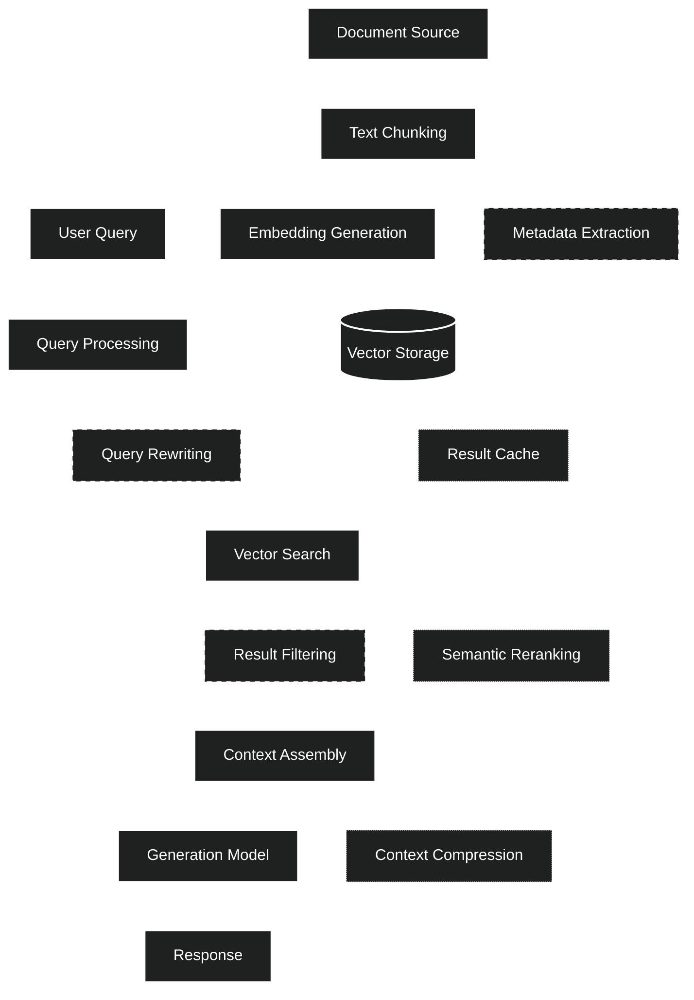

# Smol_Brain: Lightweight RAG Implementation Guide

## Introduction

This document provides practical guidance for implementing lightweight, efficient Retrieval-Augmented Generation (RAG) systems optimized for resource-constrained environments. While `Big_Brain.md` outlines theoretical foundations for recursive self-improving systems, Smol_Brain focuses on minimalist approaches that prioritize efficiency without sacrificing core functionality.

## Core Principles

1. **Minimal Viable RAG**: Implementing only essential components needed for effective retrieval and generation
2. **Resource Efficiency**: Optimizing for low memory footprint and computational requirements
3. **Progressive Enhancement**: Starting with basic functionality and adding capabilities as resources permit
4. **Smart Trade-offs**: Making informed decisions about which features to include based on use case requirements

## System Architecture



## Implementation Strategies

### 1. Data Pipeline Optimization

#### Chunking Strategy
- **Fixed-Size Chunks**: Use simple, consistent chunk sizes (e.g., 256 tokens) instead of variable semantic chunking
- **Minimal Overlap**: Reduce chunk overlap to 5-10% (vs. standard 15-20%) to minimize storage requirements
- **Selective Processing**: Only process essential document sections, skipping boilerplate content

#### Embedding Generation
- **Dimension Reduction**: Use smaller embedding dimensions (128-256 vs. standard 768-1536)
- **Quantization**: Apply 8-bit or 4-bit quantization to embeddings (75-87.5% space reduction)
- **Batch Processing**: Process documents in small batches to limit memory usage

### 2. Vector Database Simplification

#### Storage Options
- **In-Memory First**: For small datasets (<10k chunks), keep vectors entirely in memory using NumPy arrays
- **Memory Mapping**: For medium datasets, use memory-mapped files instead of full database solutions
- **Simple Persistence**: Use pickle/JSON + NumPy binary files instead of dedicated vector DBs

#### Vector Search
- **Approximate Search**: Implement basic approximation like product quantization
- **Top-K Limitation**: Restrict retrieval to smaller top-k values (3-5 vs. standard 10-20)
- **Early Stopping**: Implement simple early stopping based on similarity thresholds

### 3. Context Assembly

#### Context Window Management
- **Strict Budgeting**: Enforce hard token limits based on model context window
- **Truncation Strategy**: Prioritize higher-relevance chunks when truncating
- **Metadata Minimization**: Include only essential metadata in context

#### Response Generation
- **Template Simplification**: Use minimal prompt templates with essential instructions
- **Parameter Optimization**: Reduce temperature and max tokens for faster generation
- **Response Streaming**: Stream outputs to improve perceived latency

## Memory & Performance Optimizations

### Memory Reduction Techniques

1. **Shared Embeddings**: Use the same model for both embedding and generation when possible
2. **Progressive Loading**: Load components on-demand rather than all at startup
3. **Resource Scaling**: Dynamically adjust resource usage based on system load

### Performance Techniques

1. **Caching Strategy**: Cache frequent queries and their results
2. **Async Processing**: Use asynchronous operations for I/O-bound tasks
3. **Batching**: Group similar operations for better throughput

## Minimal Configuration Example

```python
# Sample minimal configuration for lightweight RAG
config = {
    # Core settings
    'embedding_model': 'llama3.1:latest',  # Use same model for embedding & generation
    'embedding_dimensions': 128,            # Reduced from standard 1024/4096
    'chunk_size': 256,                      # Smaller chunks than standard
    'chunk_overlap': 10,                    # Minimal overlap
    
    # Performance optimization
    'vector': {
        'use_pca': True,                    # Enable dimension reduction
        'pca_dimensions': 64,               # Further reduce dimensions 
        'enable_quantization': True,        # Use quantization for storage
        'target_precision': 'int8',         # 8-bit precision (vs float32)
    },
    
    # Retrieval settings
    'retrieval_top_k': 3,                   # Reduced from standard 5-10
    'similarity_threshold': 0.6,            # Lower threshold for faster filtering
    
    # Caching for performance
    'caching': {
        'query_cache_enabled': True,
        'query_cache_size': 100,            # Smaller cache size
        'embedding_cache_enabled': True,
        'embedding_cache_size': 500,        # Reduced from standard
        'eviction_policy': 'lru',           # Least Recently Used policy
    }
}
```

## Comparison with Full Implementation

| Feature | Smol_Brain | Full RAG Implementation |
|---------|------------|-------------------------|
| Vector Dimensions | 64-128 | 768-4096 |
| Chunk Size | 256 tokens | 512-1024 tokens |
| Chunk Overlap | 5-10% | 15-20% |
| Vector Storage | In-memory/Simple files | Full vector database |
| Query Processing | Basic | Advanced reformulation |
| Context Assembly | Simple concatenation | Sophisticated ranking & formatting |
| Reranking | None | Cross-encoder reranking |
| Caching | Basic LRU | Multi-level with TTL |

## Progressive Enhancement Path

Start with the minimal implementation and progressively add these features as resources permit:

1. **Basic RAG**: Simple query → vector search → context assembly → generation
2. **+Metadata**: Add basic metadata to improve filtering and presentation
3. **+Caching**: Implement query and embedding caches
4. **+Query Optimization**: Add query reformulation and expansion
5. **+Context Refinement**: Improve context assembly with better chunk selection and formatting
6. **+Reranking**: Add cross-encoder reranking for more relevant results
7. **+Recursive Processing**: Begin implementing recursive self-improvement cycles from Big_Brain.md

## Deployment Considerations

### Minimum System Requirements
- 512MB RAM for minimal implementation
- 1GB RAM for comfortable operation
- Single CPU core (multiple cores beneficial but not required)
- 100MB disk space for code and minimal vector storage

### Containerization
- Use Alpine Linux base for minimal Docker images
- Implement proper layer caching to minimize image size
- Consider CPU-only builds for broader compatibility

### Edge Computing
- Optimize for offline operation where applicable
- Implement progressive download of vector chunks
- Use quantized models specifically designed for edge devices

## Conclusion

The Smol_Brain approach demonstrates that effective RAG implementations don't require massive resources. By focusing on efficiency and making smart trade-offs, lightweight RAG systems can be deployed in resource-constrained environments while still providing valuable AI-augmented capabilities. This implementation philosophy complements the theoretical framework outlined in Big_Brain.md and the comprehensive system architecture detailed in Specification.md, providing a complete spectrum of RAG deployment options from minimal to advanced.
