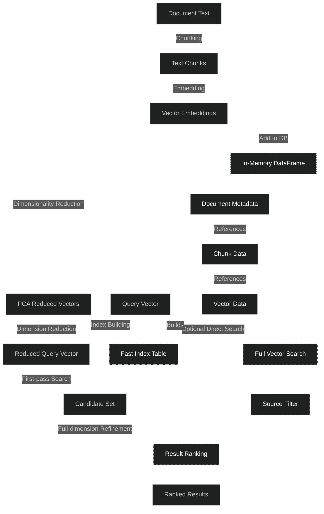
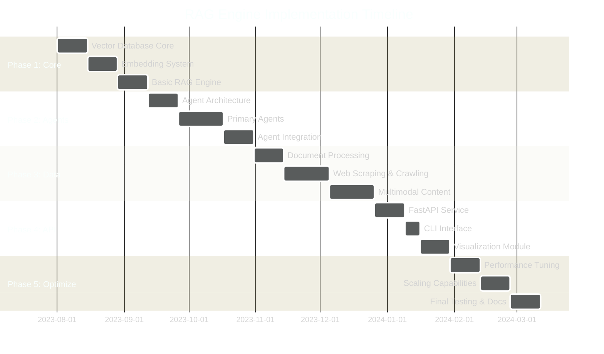
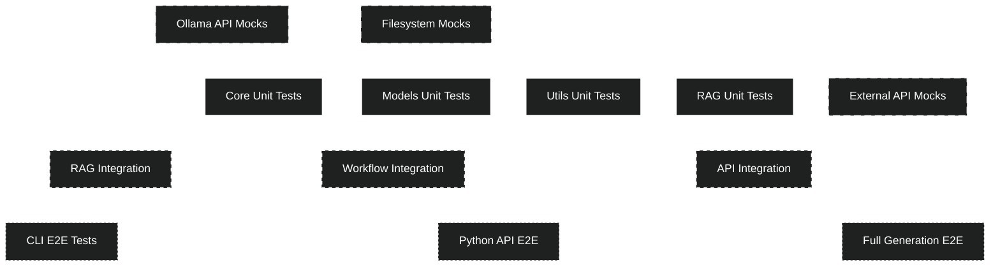
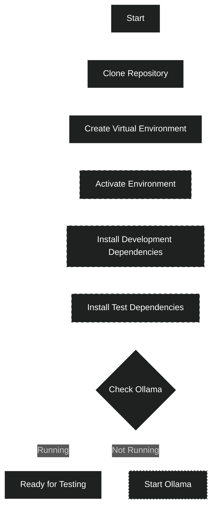
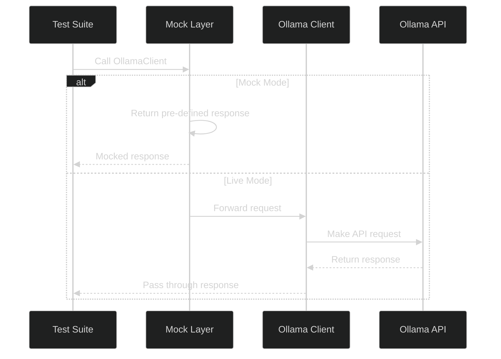
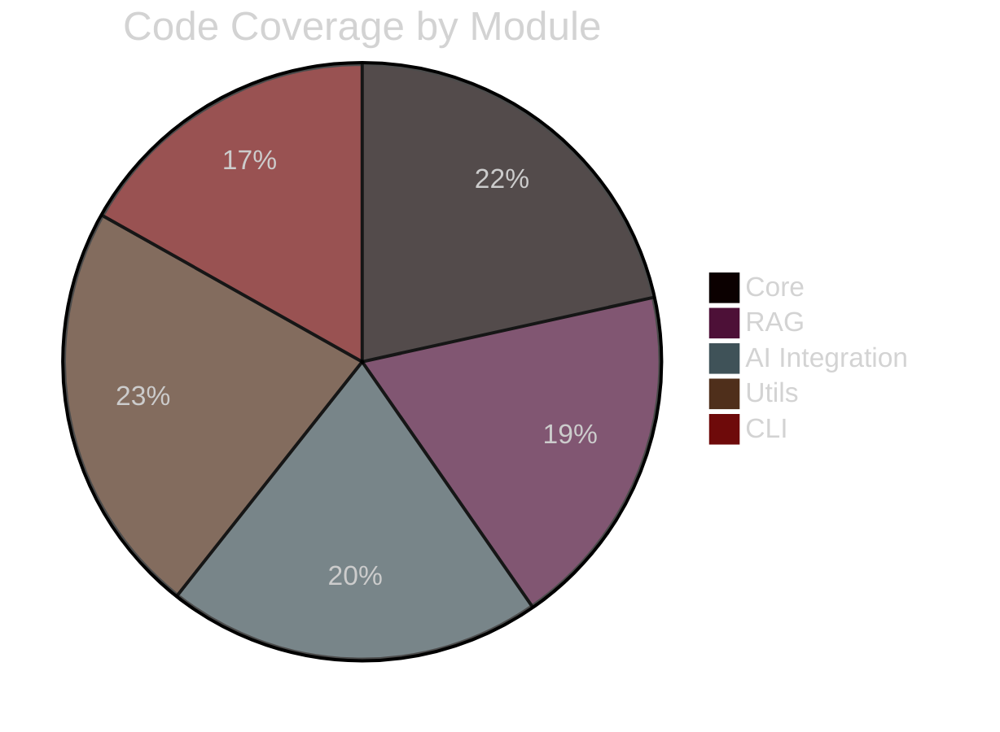
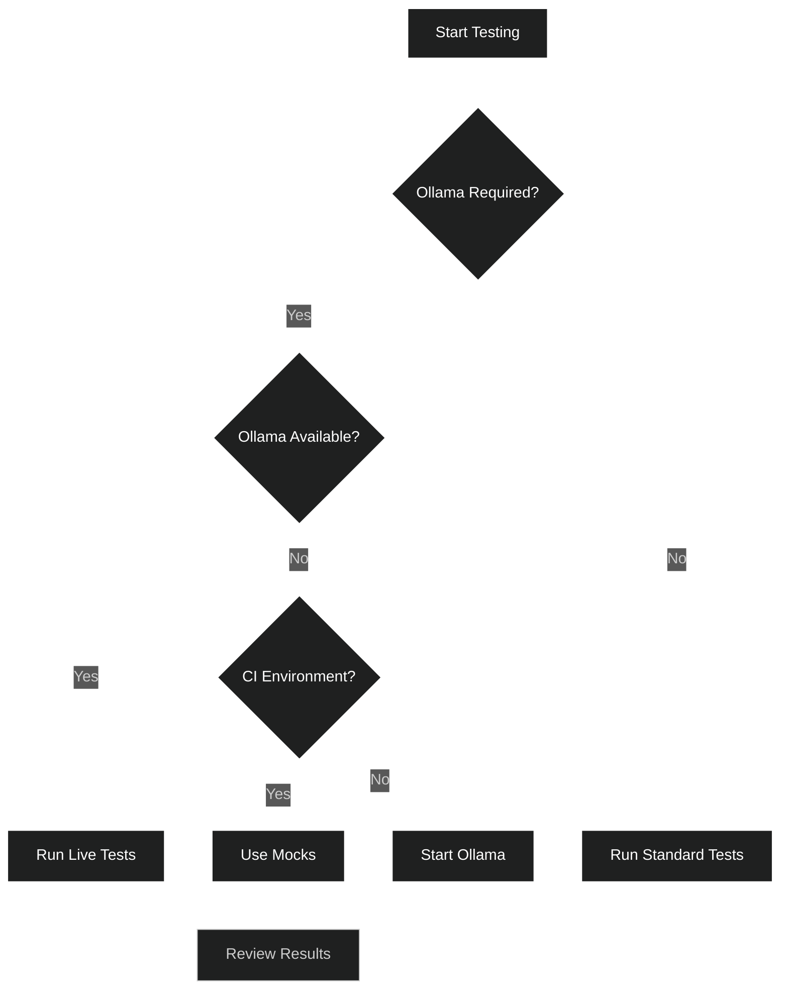

# Ultra-Fast, Lightweight RAG Engine: Detailed Specification & Implementation Plan

This document outlines the design, architecture, and implementation plan for an ultra-fast, lightweight Retrieval-Augmented Generation (RAG) engine that is highly concurrent, dynamically self-refining, and coupled with real-time visualization. The system leverages advanced embedding generation, approximate nearest neighbor (ANN) search (via HNSW), recursive agent operations on a pandas-based data backend, and a multi-threaded FastAPI service for concurrent HTTP interactions.

## Table of Contents

- [1. Overview](#1-overview)
- [2. System Architecture](#2-system-architecture)
  - [2.1 Embedding & Data Processing](#21-embedding--data-processing)
  - [2.2 Similarity Search via ANN/HNSW](#22-similarity-search-via-annhnsw)
    - [2.2.1 Vector Operations](#221-vector-operations)
    - [2.2.2 PCA-Based Indexing Optimization](#222-pca-based-indexing-optimization)
  - [2.3 Recursive Agent Operations](#23-recursive-agent-operations)
  - [2.4 Data Storage and Query Layer](#24-data-storage-and-query-layer)
    - [2.4.1 Vector Database System](#241-vector-database-system)
    - [2.4.2 Database Schema](#242-database-schema)
  - [2.5 API & Concurrency](#25-api--concurrency)
  - [2.6 Visualization Module](#26-visualization-module-pygame)
  - [2.7 Resource Collection System](#27-resource-collection-system)
  - [2.8 Performance Monitoring](#28-performance-monitoring)
  - [2.9 Multi-Level Caching System](#29-multi-level-caching-system)
  - [2.10 Design Patterns](#210-design-patterns)
    - [2.10.1 Singleton Pattern](#2101-singleton-pattern)
    - [2.10.2 Factory Pattern](#2102-factory-pattern)
    - [2.10.3 Combined Usage](#2103-combined-usage)
  - [2.11 Agentic Framework](#211-agentic-framework)
    - [2.11.1 Agent Architecture](#2111-agent-architecture)
    - [2.11.2 Agent Types](#2112-agent-types)
    - [2.11.3 Agent Collaboration Model](#2113-agent-collaboration-model)
  - [2.12 Data Acquisition System](#212-data-acquisition-system)
    - [2.12.1 Document Processing Pipeline](#2121-document-processing-pipeline)
    - [2.12.2 Web Crawling & Scraping](#2122-web-crawling--scraping)
    - [2.12.3 Multimodal Content Handling](#2123-multimodal-content-handling)
- [3. Implementation Plan](#3-implementation-plan)
  - [3.1 Phase 1: Core Infrastructure](#31-phase-1-core-infrastructure)
  - [3.2 Phase 2: Agent System Development](#32-phase-2-agent-system-development)
  - [3.3 Phase 3: Data Acquisition System](#33-phase-3-data-acquisition-system)
  - [3.4 Phase 4: API and Services](#34-phase-4-api-and-services)
  - [3.5 Phase 5: Optimization & Scaling](#35-phase-5-optimization--scaling)
  - [3.6 Development Timeline](#36-development-timeline)
- [4. Testing Strategy](#4-testing-strategy)
  - [4.1 Testing Architecture](#41-testing-architecture)
  - [4.2 Test Types](#42-test-types)
    - [4.2.1 Unit Tests](#421-unit-tests)
    - [4.2.2 Integration Tests](#422-integration-tests)
    - [4.2.3 End-to-End Tests](#423-end-to-end-tests)
  - [4.3 Testing Environment Setup](#43-testing-environment-setup)
  - [4.4 Ollama Integration Testing](#44-ollama-integration-testing)
  - [4.5 Continuous Integration](#45-continuous-integration)
  - [4.6 Code Coverage](#46-code-coverage)
- [4.7 Testing Challenges and Solutions](#47-testing-challenges-and-solutions)
  - [4.8 Test-Driven Development Approach](#48-test-driven-development-approach)
- [5. Future Considerations](#5-future-considerations)
- [6. Conclusion](#6-conclusion)
- [7. Best Practices](#7-best-practices)
  - [7.1 Document Preparation](#71-document-preparation)
  - [7.2 Query Optimization](#72-query-optimization)
  - [7.3 Context Assembly](#73-context-assembly)
  - [7.4 System Maintenance](#74-system-maintenance)
  - [7.5 Design Pattern Usage](#75-design-pattern-usage)
  - [7.6 Testing Best Practices](#76-testing-best-practices)
- [8. Usage Examples](#8-usage-examples)
  - [8.1 Basic RAG Workflow](#81-basic-rag-workflow)
  - [8.2 Advanced Query Strategies](#82-advanced-query-strategies)
  - [8.3 Performance Optimization](#83-performance-optimization)
- [9. System Dependencies](#9-system-dependencies)
  - [9.1 Required Dependencies](#91-required-dependencies)
  - [9.2 Optional Dependencies](#92-optional-dependencies)
  - [9.3 Vector Operations Utilities](#93-vector-operations-utilities)
- [10. Appendix](#10-appendix)
  - [10.1 Glossary](#101-glossary)
  - [10.2 Code Examples](#102-code-examples)
    - [10.2.1 Vector Database Examples](#1021-vector-database-examples)
    - [10.2.2 Agent Integration Examples](#1022-agent-integration-examples)
    - [10.2.3 Performance Optimization Examples](#1023-performance-optimization-examples)
    - [10.2.4 Testing Examples](#1024-testing-examples)
  - [10.3 Project Structure](#103-project-structure)
    - [10.3.1 Codebase Organization](#1031-codebase-organization)
    - [10.3.2 Key Modules](#1032-key-modules)
- [11. Implementation Risks and Mitigations](#11-implementation-risks-and-mitigations)
  - [11.1 Technical Risks](#111-technical-risks)
  - [11.2 Process Risks](#112-process-risks)
- [12. Success Metrics](#12-success-metrics)
- [13. Frequently Asked Questions](#13-frequently-asked-questions)

---

## 1. Overview

The RAG engine is designed to meet real-time requirements while retaining the flexibility to recursively refine and evolve its knowledge base. The system supports:
- **Dynamic Embedding Generation:** Utilizing preloaded Large Language Models (LLMs) with built-in embedding modes to transform text into high-dimensional (1024 features) vectors.
- **Efficient Similarity Search:** Powered by ANN techniques and HNSW for ultra-fast nearest neighbor retrieval.
- **Recursive Data Enhancement:** Through a suite of specialized agents that expand, refine, merge, split, and prune content blocks.
- **Pandas-based Query Engine:** For natural language query parsing and handling within lightweight, Pythonic data frames.
- **Multi-Threaded FastAPI Backend:** Enabling concurrent queries, agent operations, and real-time WebSocket updates.
- **Real-Time Visualization:** A standalone Pygame application for visually exploring the knowledge graph, with interactive node actions, zoom, pan, and real-time highlighting.

```mermaid
%%{init: {
    'theme': 'dark',
    'themeVariables': {
        'background': 'transparent',
        'primaryColor': '#ffffff',
        'primaryTextColor': '#ffffff',
        'primaryBorderColor': '#ffffff',
        'lineColor': '#ffffff',
        'fontSize': '16px',
        'fontFamily': 'arial'
    }
}}%%

flowchart TD
    %% Styling classes with monochrome patterns - white strokes for dark theme
    classDef core stroke:#fff,stroke-width:3px,color:#fff
    classDef supporting stroke:#fff,stroke-width:1px,stroke-dasharray:5 5,color:#fff
    classDef data stroke:#fff,stroke-width:1px,stroke-dasharray:3 3,color:#fff
    classDef client stroke:#fff,stroke-width:2px,color:#fff
    classDef agent stroke:#fff,stroke-width:1px,stroke-dasharray:10 5,color:#fff
    classDef viz stroke:#fff,stroke-width:1px,stroke-dasharray:1 1,color:#fff
    classDef pattern stroke:#fff,stroke-width:2px,stroke-dasharray:15 5,color:#fff
    classDef test stroke:#fff,stroke-width:1px,stroke-dasharray:5 2,color:#fff

    %% User, API and Core Engine
    User([User])
    API[FastAPI Service]:::client
    RAGEngine[RAG Engine]:::core

    %% Core Components without subgraphs
    %% Embedding System
    EmbGen[Embedding Generator]:::supporting
    BatchProc[Batch Processing]:::supporting
    EmbCache[(Embedding Cache)]:::data
    
    %% Vector Search
    HNSW[HNSW Graph]:::supporting
    Meta[Metadata Integration]:::supporting
    VecOps[Vector Operations]:::supporting
    
    %% Storage Layer
    PandasDF[Pandas DataFrame]:::data
    PyArrow[PyArrow]:::data
    Parquet[Parquet Files]:::data
    VecDB[Vector Database]:::data
    
    %% Query Components
    NLQuery[NL Query Parser]:::supporting
    QueryExec[Query Executor]:::supporting
    VecSearch[Vector Search]:::supporting
    
    %% Design Patterns
    SingletonPat[Singleton Pattern]:::pattern
    FactoryPat[Factory Pattern]:::pattern
    ServiceRegistry[(Service Registry)]:::data
    ObjectCreation[Object Creation]:::pattern
    
    %% Agent Components
    RecExp[Expansion Agent]:::agent
    Merge[Merge Agent]:::agent
    Split[Split Agent]:::agent
    Prune[Prune Agent]:::agent
    RAGEnhanced[RAG Enhanced Agent]:::agent
    
    %% Caching
    QueryCache[Query Cache]:::data
    DocCache[Document Cache]:::data
    EmbeddingCache[Embedding Cache]:::data
    TTLConfig[TTL Configuration]:::supporting
    LRUEviction[LRU Eviction]:::supporting
    
    %% Resource Collection
    ModCore[Modular Collection Core]:::supporting
    WebScraper[Web Scrapers]:::supporting
    APIConn[API Connectors]:::supporting
    FSProc[File System Processors]:::supporting
    
    %% Monitoring
    RAGMon[RAG Monitor]:::supporting
    PerfMetrics[(Performance Metrics)]:::data
    DashGen[Dashboard Generator]:::supporting
    
    %% Visualization
    Pygame[Pygame App]:::viz
    Graph[Knowledge Graph]:::viz
    NodeActions[Interactive Nodes]:::viz
    WebSocket[WebSocket Updates]:::viz
    
    %% Testing
    UnitTests[Unit Tests]:::test
    IntegrationTests[Integration Tests]:::test
    E2ETests[End-to-End Tests]:::test
    MockLayer[Mock Layer]:::test
    CIWorkflow[CI Workflow]:::test
    
    %% Codebase
    SrcDir["src/"]:::supporting
    TestsDir["tests/"]:::test
    DocsDir["docs/"]:::supporting
    RagModule["rag/"]:::core
    AIModule["ai/"]:::supporting
    UtilsModule["utils/"]:::supporting
    
    %% Core connections
    User --> API --> RAGEngine
    
    %% Embedding flow
    RAGEngine --> EmbGen --> BatchProc --> EmbCache
    
    %% Vector operations flow
    VecOps --> HNSW --> Meta
    RAGEngine --> VecOps
    
    %% Storage connections
    PandasDF --> PyArrow
    PandasDF --> Parquet
    PandasDF --- VecDB
    
    %% Query flow
    NLQuery --> QueryExec
    QueryExec --> PandasDF
    QueryExec --> VecSearch
    VecSearch --> VecDB
    RAGEngine --> NLQuery
    
    %% Patterns connections
    SingletonPat --- ServiceRegistry
    FactoryPat --- ObjectCreation
    SingletonPat --> RAGEngine
    FactoryPat --> API
    FactoryPat --> RecExp
    
    %% Agent connections
    RAGEngine --> RecExp
    RAGEngine --> Merge
    RAGEngine --> Split
    RAGEngine --> Prune
    RAGEngine --> RAGEnhanced
    RAGEnhanced --> VecOps
    
    %% Caching connections
    QueryCache & DocCache & EmbeddingCache --> TTLConfig
    QueryCache & DocCache & EmbeddingCache --> LRUEviction
    EmbCache --> EmbeddingCache
    RAGEngine --> QueryCache
    
    %% Resource collection
    ModCore --> WebScraper
    ModCore --> APIConn
    ModCore --> FSProc
    RAGEngine <--> ModCore
    
    %% Monitoring connections
    RAGEngine --> RAGMon --> PerfMetrics --> DashGen
    
    %% Visualization connections
    API <--> WebSocket --> Graph
    Pygame --> Graph --> NodeActions
    
    %% Testing connections
    MockLayer -.-> UnitTests --> IntegrationTests --> E2ETests
    UnitTests & IntegrationTests & E2ETests --> CIWorkflow
    UnitTests -.-> RAGEngine
    IntegrationTests -.-> API
    
    %% Code structure
    SrcDir --> RagModule & AIModule & UtilsModule
    TestsDir --> UnitTests
    RagModule --> RAGEngine
```



---

## 2. System Architecture

### 2.1 Embedding & Data Processing
- **Embedding Pipeline:**
  - **Input Processing:** Blocks of text up to 512 words are transformed by the LLM's embedding mode to produce dense 1024-dimensional vectors.
  - **Dimensionality Considerations:** Optionally apply PCA (or sparse PCA, if beneficial) to reduce dimensionality while preserving key semantic variance. PCA is favored because of the dense nature of the LLM embeddings.
  - **Batch & Cache Processing:** Leverage batch processing to generate embeddings and employ caching strategies for repeated or common queries.

### 2.2 Similarity Search via ANN/HNSW
- **Approximate Nearest Neighbors (ANN):**
  - Implement fast similarity retrieval using proprietary matrix math algorithms.
  - Leverage custom-built vector search optimizations without third-party dependencies.
  - Utilize scikit-learn and scipy for dimensionality reduction and efficient mathematical operations.
- **HNSW Indexing:**
  - Deploy a Hierarchical Navigable Small World Graph for scalable search.
  - Ensure metadata integration for fast lookups and to support recursive agent operations (e.g., backtrace of related blocks).

### 2.2.1 Vector Operations

The system incorporates a comprehensive suite of vector operations to support efficient similarity search and embedding manipulation:

- **Similarity Operations:**
  - **Cosine Similarity:** Optimized measurement of the cosine angle between vectors for semantic matching.
  - **Batch Similarity:** Efficient parallel computation of similarities between one query vector and multiple candidate vectors.

- **Vector Transformations:**
  - **Normalization:** Converting vectors to unit length while preserving direction.
  - **Dimension Reduction:** Using PCA to reduce embedding size while preserving semantic relationships.
  - **Vector Aggregation:** Methods for combining vectors including mean, weighted average, and concatenation.

- **Advanced Operations:**
  - **Diverse Vector Selection:** Algorithms to find maximally different vectors from a collection.
  - **Outlier Detection:** Statistical methods to identify anomalous vectors.
  - **Statistical Analysis:** Functions to compute vector distribution characteristics.

```python
# Example of advanced vector operations
def find_diverse_vectors(vectors, count=3, min_similarity_threshold=0.7):
    """Identify a subset of vectors that are maximally different from each other."""
    if len(vectors) <= count:
        return list(range(len(vectors)))
    
    # Start with first vector
    selected_indices = [0]
    
    while len(selected_indices) < count:
        max_min_distance = -1
        best_idx = -1
        
        # For each candidate vector
        for i in range(len(vectors)):
            if i in selected_indices:
                continue
            
            # Find minimum similarity to any already selected vector
            min_similarity = min(cosine_similarity(vectors[i], vectors[j]) 
                               for j in selected_indices)
            
            # Select vector with lowest maximum similarity (most diverse)
            if min_similarity < min_similarity_threshold and -min_similarity > max_min_distance:
                max_min_distance = -min_similarity
                best_idx = i
        
        if best_idx == -1:
            break  # No more sufficiently diverse vectors
            
        selected_indices.append(best_idx)
    
    return selected_indices
```

#### 2.2.2 PCA-Based Indexing Optimization

The RAG engine employs Principal Component Analysis (PCA) to create an optimized indexing structure for rapid vector lookups:

- **Dimensionality Reduction:** High-dimensional embeddings (e.g., 1024 dimensions) are projected to lower-dimensional spaces (typically 128-256 dimensions) while preserving semantic relationships.
- **Fast Index Table:** The reduced vectors are stored in a specialized fast index table that supports sub-linear time lookups.
- **Two-Tier Search Strategy:** 
  1. First-pass retrieval uses the reduced-dimension index for efficient candidate selection
  2. Second-pass refinement re-ranks candidates using the full-dimension vectors for maximum accuracy

```python
# Example of PCA-based index creation
def create_pca_index(vectors: np.ndarray, target_dimensions: int = 128) -> Tuple[np.ndarray, PCA]:
    """
    Create a PCA-based index for fast approximate lookup.
    
    Args:
        vectors: Original high-dimensional vectors
        target_dimensions: Target dimensionality after reduction
        
    Returns:
        Tuple of (reduced vectors, fitted PCA model)
    """
    # Initialize and fit PCA model
    pca = PCA(n_components=target_dimensions)
    reduced_vectors = pca.fit_transform(vectors)
    
    return reduced_vectors, pca
```

The PCA-based indexing provides significant performance advantages:
- **Memory Efficiency:** Reduced storage requirements (up to 87.5% reduction for 1024→128 dimensions)
- **Search Speed:** Logarithmic rather than linear time complexity for initial candidate retrieval
- **Scalability:** Better performance with growing vector collections
- **Cache Efficiency:** Improved CPU cache utilization with smaller vector footprints

### 2.4 Data Storage and Query Layer
- **Primary Storage:**
  - Utilize pandas DataFrames for lightweight, in-memory storage of embeddings, metadata (e.g., backlinks, usage frequency), and processed blocks.
- **Persistence Strategy:**
  - Implement hybrid persistence using both Parquet and Arrow formats:
    - **Parquet Files:** For long-term storage of large datasets with efficient compression.
    - **Arrow Files:** For high-performance data interchange and memory-mapping capabilities.
  - Automatically select optimal format based on data characteristics and usage patterns.
- **Pandas Query Engine:**
  - Interpret natural language queries, map them to DataFrame operations, and execute complex filtering/join queries to retrieve relevant blocks.

#### 2.4.1 Vector Database System

The Vector Database system provides efficient storage and retrieval of embeddings for RAG functionality:



**Core Features:**

- **Document Management:** Add, retrieve, and remove document chunks with automatic deduplication
- **Vector Search:** Efficient cosine similarity search with configurable threshold and ranking
- **PCA-Optimized Indexing:** Fast approximate search using dimensionality reduction and specialized index structures
- **Two-Tier Search:** Rapid candidate selection with reduced dimensions followed by precision ranking with full vectors
- **Source Filtering:** Filter results by document source or metadata attributes
- **Metadata Support:** Store and retrieve arbitrary metadata associated with documents
- **Statistics and Monitoring:** Track database metrics including document count, chunk statistics, and embedding dimension information

The VectorDatabase integrates with the broader RAG system:
- Coordinated by RAGEngine for document processing and retrieval
- Receives vectors from EmbeddingGenerator
- Works with TextChunker for document preparation
- Provides results to ContextAssembler for prompt enhancement

**Implementation Example:**
```python
# Using the VectorDatabase with PCA optimization
db = VectorDatabase(use_pca_optimization=True, pca_dimensions=128)

# Add document chunks with metadata
chunk_ids = db.add_document(
    text_chunks=["Content chunk 1", "Content chunk 2"],
    vectors=[[0.1, 0.2, ...], [0.3, 0.4, ...]],  # Original high-dim vectors
    metadata={"source": "documentation"},
    source="guide.md"
)

# Search with tiered approach (PCA first, then full vector refinement)
results = db.search(
    query_vector=[0.15, 0.25, ...],
    top_k=3,
    threshold=0.7,
    source_filter=["documentation"],
    use_fast_index=True  # Enables PCA-based fast indexing
)
```

#### 2.4.2 Database Schema

The in-memory database structure for vector storage includes:

| Field | Type | Description |
|-------|------|-------------| 
| `doc_id` | String | Unique document identifier |
| `chunk_id` | String | Unique chunk identifier |
| `text` | String | Original text content |
| `source` | String | Document source identifier |
| `metadata` | JSON | Encoded metadata for the chunk |
| `embedding` | Array | Full vector embedding as numpy array |
| `reduced_embedding` | Array | PCA-reduced vector for fast indexing |
| `timestamp` | DateTime | When the entry was created |

This structure ensures:
- Efficient storage and retrieval of vector embeddings
- Linkage between documents, chunks, and their embeddings
- Fast approximate search capabilities through dimensionality reduction
- Comprehensive metadata for filtering and context enrichment
- Performance optimization through in-memory operations


### 2.4 Data Storage and Query Layer
- **Primary Storage:**
  - Utilize pandas DataFrames for lightweight, in-memory storage of embeddings, metadata (e.g., backlinks, usage frequency), and processed blocks.
- **Persistence Strategy:**
  - Implement hybrid persistence using both Parquet and Arrow formats:
    - **Parquet Files:** For long-term storage of large datasets with efficient compression.
    - **Arrow Files:** For high-performance data interchange and memory-mapping capabilities.
  - Automatically select optimal format based on data characteristics and usage patterns.
- **Pandas Query Engine:**
  - Interpret natural language queries, map them to DataFrame operations, and execute complex filtering/join queries to retrieve relevant blocks.

#### 2.4.1 Vector Database System

The Vector Database system provides efficient storage and retrieval of embeddings for RAG functionality:


**Core Features:**

- **Document Management:** Add, retrieve, and remove document chunks with automatic deduplication
- **Vector Search:** Efficient cosine similarity search with configurable threshold and ranking
- **PCA-Optimized Indexing:** Fast approximate search using dimensionality reduction and specialized index structures
- **Two-Tier Search:** Rapid candidate selection with reduced dimensions followed by precision ranking with full vectors
- **Source Filtering:** Filter results by document source or metadata attributes
- **Metadata Support:** Store and retrieve arbitrary metadata associated with documents
- **Statistics and Monitoring:** Track database metrics including document count, chunk statistics, and embedding dimension information

The VectorDatabase integrates with the broader RAG system:
- Coordinated by RAGEngine for document processing and retrieval
- Receives vectors from EmbeddingGenerator
- Works with TextChunker for document preparation
- Provides results to ContextAssembler for prompt enhancement

**Implementation Example:**
```python
# Using the VectorDatabase with PCA optimization
db = VectorDatabase(use_pca_optimization=True, pca_dimensions=128)

# Add document chunks with metadata
chunk_ids = db.add_document(
    text_chunks=["Content chunk 1", "Content chunk 2"],
    vectors=[[0.1, 0.2, ...], [0.3, 0.4, ...]],  # Original high-dim vectors
    metadata={"source": "documentation"},
    source="guide.md"
)

# Search with tiered approach (PCA first, then full vector refinement)
results = db.search(
    query_vector=[0.15, 0.25, ...],
    top_k=3,
    threshold=0.7,
    source_filter=["documentation"],
    use_fast_index=True  # Enables PCA-based fast indexing
)
```

#### 2.4.2 Database Schema

The in-memory database structure for vector storage includes:

| Field | Type | Description |
|-------|------|-------------| 
| `doc_id` | String | Unique document identifier |
| `chunk_id` | String | Unique chunk identifier |
| `text` | String | Original text content |
| `source` | String | Document source identifier |
| `metadata` | JSON | Encoded metadata for the chunk |
| `embedding` | Array | Full vector embedding as numpy array |
| `reduced_embedding` | Array | PCA-reduced vector for fast indexing |
| `timestamp` | DateTime | When the entry was created |

This structure ensures:
- Efficient storage and retrieval of vector embeddings
- Linkage between documents, chunks, and their embeddings
- Fast approximate search capabilities through dimensionality reduction
- Comprehensive metadata for filtering and context enrichment
- Performance optimization through in-memory operations
--
### 2.4 Data Storage and Query Layer
- **Primary Storage:**
  - Utilize pandas DataFrames for lightweight, in-memory storage of embeddings, metadata (e.g., backlinks, usage frequency), and processed blocks.
- **Persistence Strategy:**
  - Implement hybrid persistence using both Parquet and Arrow formats:
    - **Parquet Files:** For long-term storage of large datasets with efficient compression.
    - **Arrow Files:** For high-performance data interchange and memory-mapping capabilities.
  - Automatically select optimal format based on data characteristics and usage patterns.
- **Pandas Query Engine:**
  - Interpret natural language queries, map them to DataFrame operations, and execute complex filtering/join queries to retrieve relevant blocks.

#### 2.4.1 Vector Database System

The Vector Database system provides efficient storage and retrieval of embeddings for RAG functionality:


**Core Features:**

- **Document Management:** Add, retrieve, and remove document chunks with automatic deduplication
- **Vector Search:** Efficient cosine similarity search with configurable threshold and ranking
- **PCA-Optimized Indexing:** Fast approximate search using dimensionality reduction and specialized index structures
- **Two-Tier Search:** Rapid candidate selection with reduced dimensions followed by precision ranking with full vectors
- **Source Filtering:** Filter results by document source or metadata attributes
- **Metadata Support:** Store and retrieve arbitrary metadata associated with documents
- **Statistics and Monitoring:** Track database metrics including document count, chunk statistics, and embedding dimension information

The VectorDatabase integrates with the broader RAG system:
- Coordinated by RAGEngine for document processing and retrieval
- Receives vectors from EmbeddingGenerator
- Works with TextChunker for document preparation
- Provides results to ContextAssembler for prompt enhancement

**Implementation Example:**
```python
# Using the VectorDatabase with PCA optimization
db = VectorDatabase(use_pca_optimization=True, pca_dimensions=128)

# Add document chunks with metadata
chunk_ids = db.add_document(
    text_chunks=["Content chunk 1", "Content chunk 2"],
    vectors=[[0.1, 0.2, ...], [0.3, 0.4, ...]],  # Original high-dim vectors
    metadata={"source": "documentation"},
    source="guide.md"
)

# Search with tiered approach (PCA first, then full vector refinement)
results = db.search(
    query_vector=[0.15, 0.25, ...],
    top_k=3,
    threshold=0.7,
    source_filter=["documentation"],
    use_fast_index=True  # Enables PCA-based fast indexing
)
```

#### 2.4.2 Database Schema

The in-memory database structure for vector storage includes:

| Field | Type | Description |
|-------|------|-------------| 
| `doc_id` | String | Unique document identifier |
| `chunk_id` | String | Unique chunk identifier |
| `text` | String | Original text content |
| `source` | String | Document source identifier |
| `metadata` | JSON | Encoded metadata for the chunk |
| `embedding` | Array | Full vector embedding as numpy array |
| `reduced_embedding` | Array | PCA-reduced vector for fast indexing |
| `timestamp` | DateTime | When the entry was created |

This structure ensures:
- Efficient storage and retrieval of vector embeddings
- Linkage between documents, chunks, and their embeddings
- Fast approximate search capabilities through dimensionality reduction
- Comprehensive metadata for filtering and context enrichment
- Performance optimization through in-memory operations
-

## 3. Implementation Plan

### 3.1 Phase 1: Core Infrastructure

The first implementation phase focuses on establishing the fundamental system components:

1. **Vector Database Core**
   - Develop the in-memory DataFrame-based vector storage
   - Implement basic similarity search functions
   - Create document chunking and processing components
   - Integrate persistence via Parquet/Arrow

2. **Embedding System**
   - Implement Ollama client for embedding generation
   - Create batch processing and caching mechanisms
   - Develop vector operations library
   - Add dimensionality reduction options

3. **Basic RAG Engine**
   - Develop core RAGEngine class with singleton pattern
   - Implement basic document addition and retrieval
   - Create configuration management
   - Add basic logging and monitoring

### 3.2 Phase 2: Agent System Development

The second phase focuses on creating the agentic framework:

1. **Agent Architecture**
   - Develop the base Agent abstract class
   - Implement core agent functionality
   - Create test harnesses for agent evaluation
   - Develop agent state tracking and history

2. **Primary Agents**
   - Implement RAGAgent for enhanced retrieval
   - Create ExpansionAgent for content enrichment
   - Build SplitAgent for content segmentation
   - Develop MergeAgent for content consolidation
   - Implement PruneAgent for content refinement

3. **Agent Integration**
   - Connect agents to the RAG engine
   - Implement agent collaboration mechanisms
   - Create agent orchestration logic
   - Add agent performance monitoring

### 3.3 Phase 3: Data Acquisition System

The third phase develops the data acquisition capabilities:

1. **Document Processing**
   - Integrate LlamaIndex document loaders
   - Implement format-specific processing
   - Create preprocessing transformations
   - Add metadata extraction and normalization

2. **Web Scraping & Crawling**
   - Implement web page scraping components
   - Create site crawling capabilities
   - Add API connectors for structured data sources
   - Develop feed processing for dynamic content

3. **Multimodal Content Handling**
   - Implement image processing and captioning
   - Create multimodal embedding strategies
   - Develop cross-modal retrieval techniques
   - Integrate OCR for text-in-image extraction

### 3.4 Phase 4: API and Services

The fourth phase focuses on exposing functionality through APIs:

1. **FastAPI Service** (Weeks 16-17)
   - Develop REST API endpoints for core functionality
   - Implement WebSocket support for real-time updates
   - Create background task processing
   - Add API authentication and rate limiting

2. **CLI Interface** (Week 18)
   - Implement command-line interface
   - Create interactive shell mode
   - Add batch processing commands
   - Develop configuration management

3. **Visualization Module** (Weeks 19-20)
   - Create Pygame knowledge graph visualization
   - Implement interactive node manipulation
   - Add real-time update capabilities
   - Create dashboard for system monitoring

### 3.5 Phase 5: Optimization & Scaling

The final phase optimizes performance and prepares for scaling:

1. **Performance Tuning** (Weeks 21-22)
   - Profile and optimize critical paths
   - Improve vector operations performance
   - Enhance caching strategies
   - Reduce memory footprint

2. **Scaling Capabilities** (Weeks 22-24)
   - Implement distributed processing options
   - Add sharding for large vector collections
   - Create load balancing mechanisms
   - Develop horizontal scaling capabilities

3. **Final Testing & Documentation** (Weeks 24-26)
   - Conduct comprehensive system testing
   - Finalize documentation and examples
   - Create benchmarks and performance reports
   - Prepare for production deployment

### 3.6 Development Timeline



This phased implementation plan ensures systematic development of the RAG engine, with regular milestones for testing and validation. Each phase builds upon the previous one, gradually adding capabilities while maintaining system stability and performance.

---

## 4. Testing Strategy

The testing strategy for the RAG engine ensures high-quality code, system reliability, and accurate functionality across all components. This comprehensive approach covers various test types and methodologies.

### 4.1 Testing Architecture

The testing system employs a multi-layered architecture to ensure thorough validation across all system components:



This approach enables systematic testing from isolated components to complete system workflows, ensuring comprehensive test coverage and early detection of issues.

### 4.2 Test Types

#### 4.2.1 Unit Tests

Unit tests validate individual components in isolation:

- **Core Components:** Tests for RAGEngine, VectorDatabase, and EmbeddingGenerator classes
- **Agent Tests:** Validation of agent behaviors and recursive operations
- **Utility Tests:** Verification of vector operations and helper functions

Example of a unit test for the RAGEngine:

```python
@patch('oarc_rag.rag.engine.VectorDatabase')
@patch('oarc_rag.rag.engine.EmbeddingGenerator')
@patch('oarc_rag.rag.engine.TextChunker')
@patch('oarc_rag.rag.engine.check_for_ollama')
def test_retrieve(self, mock_check_ollama, mock_chunker_class, 
                 mock_embedding_class, mock_db_class):
    """Test retrieving content from the RAG engine."""
    # Setup mocks
    mock_check_ollama.return_value = True
    
    mock_db = MagicMock()
    mock_db.search.return_value = [
        {"text": "Result 1", "similarity": 0.9},
        {"text": "Result 2", "similarity": 0.8}
    ]
    mock_db_class.return_value = mock_db
    
    mock_embedder = MagicMock()
    mock_embedder.embed_text.return_value = [0.1, 0.2, 0.3]
    mock_embedding_class.return_value = mock_embedder
    
    # Initialize engine
    engine = RAGEngine(run_id="test-run")
    
    # Perform retrieval
    results = engine.retrieve(
        "Test query", 
        top_k=2, 
        threshold=0.5, 
        source_filter="test_source"
    )
    
    # Verify calls
    mock_embedder.embed_text.assert_called_once_with("Test query")
    mock_db.search.assert_called_once_with(
        [0.1, 0.2, 0.3],
        top_k=2,
        threshold=0.5,
        source_filter="test_source"
    )
```

Running unit tests:

```bash
# Run all unit tests
pytest oarc_rag/tests/

# Run specific test file
pytest oarc_rag/tests/core/engine_test.py

# Run tests with verbose output
pytest -v oarc_rag/tests/
```

#### 4.2.2 Integration Tests

Integration tests validate interactions between system components:

- **RAG Integration:** Verify embedding generation, storage, and retrieval workflows
- **API Integration:** Ensure FastAPI endpoints correctly interact with the RAG engine
- **Component Interactions:** Test interactions between agents, the RAG engine, and the vector database

Example of running integration tests:

```bash
# Run all integration tests
pytest oarc_rag/tests/integration/

# Run specific integration test
pytest oarc_rag/tests/integration/test_workflow.py

# Generate report for integration tests
pytest oarc_rag/tests/integration/ --junitxml=reports/integration.xml
```

#### 4.2.3 End-to-End Tests

End-to-end tests validate complete system workflows:

- **CLI Workflow Tests:** Test command-line interface operations
- **Python API Workflow:** Validate API client functionality
- **Full Generation Workflow:** Test complete document processing, embedding, and retrieval cycle

Example of running E2E tests:

```bash
# Run E2E tests (requires Ollama)
pytest oarc_rag/tests/e2e/

# Run with extended timeout for API tests
pytest --timeout=300 oarc_rag/tests/e2e/
```

### 4.3 Testing Environment Setup

Setting up the testing environment requires the following steps:



Implementation steps:

1. Activate your virtual environment:
   ```bash
   # Windows
   .venv\Scripts\activate
   
   # Linux/macOS
   source .venv/bin/activate
   ```

2. Install development and test dependencies:
   ```bash
   pip install -e ".[dev]"
   pip install pytest pytest-cov mock
   ```

3. Verify Ollama is running for tests that require AI functionality:
   ```bash
   curl http://localhost:11434
   ```

### 4.4 Ollama Integration Testing

Testing the Ollama integration requires special considerations:



The system supports two testing modes for Ollama:

1. **Mock Tests:** Use mock responses for tests without calling actual Ollama API
   ```python
   @patch('oarc_rag.ai.client.requests.post')
   def test_generate_with_mocked_ollama(self, mock_post):
       mock_response = MagicMock()
       mock_response.json.return_value = {"message": {"content": "Mocked response"}
       mock_post.return_value = mock_response
       
       # Test with mocked response
       client = OllamaClient()
       result = client.generate("Test prompt")
       self.assertEqual("Mocked response", result)
   ```

2. **Live Tests:** For tests that interact with a running Ollama instance
   ```bash
   # Set environment variable to use real Ollama
   export OARC_RAG_TEST_USE_REAL_OLLAMA=1
   
   # Run the live tests
   pytest oarc_rag/tests/live/test_ollama_live.py
   ```

For live tests, ensure required models are available:
```bash
ollama pull llama3.1:latest
```

### 4.5 Continuous Integration

The project uses GitHub Actions for continuous integration:

```mermaid
%%{init: {
    'theme': 'dark',
    'themeVariables': {
        'background': 'transparent',
        'primaryColor': '#ffffff',
        'primaryTextColor': '#ffffff',
        'primaryBorderColor': '#ffffff',
        'lineColor': '#ffffff',
        'fontSize': '16px',
        'fontFamily': 'arial'
    }
}}%%

flowchart LR
    %% CI Workflow - optimized layout
    classDef pr stroke:#fff,stroke-width:3px,color:#fff
    classDef action stroke:#fff,stroke-width:1px,stroke-dasharray:5 5,color:#fff
    classDef outcome stroke:#fff,stroke-width:2px,color:#fff

    PR[Pull Request]:::pr --> Actions
    Push[Push to main]:::pr --> Actions
    
    %% Simplified workflow without subgraph
    Lint[Code Linting]:::action --> TypeCheck
    TypeCheck[Type Checking]:::action --> UnitTests
    UnitTests[Unit Tests]:::action --> IntTests
    IntTests[Integration Tests]:::action --> Results
    
    %% Results and outcomes
    Actions[GitHub Actions] --> Lint
    Results[CI Results]:::outcome --> |Success| Merge[Ready to Merge]:::outcome
    Results --> |Failure| Fix[Requires Fixes]:::outcome
```



The CI workflow automatically runs on pull requests and pushes to the main branch, performing:
- Code linting with flake8
- Type checking with mypy
- Unit tests with pytest
- Integration tests with mocked dependencies

### 4.6 Code Coverage

Code coverage is tracked to ensure comprehensive test coverage:

```bash
# Generate coverage report
pytest --cov=oarc_rag --cov-report=html oarc_rag/tests/
```

This generates an HTML report showing test coverage for each module:



The team maintains a target of at least 80% code coverage overall, with critical components like the RAG engine and vector database requiring at least 90% coverage.

---

## 5. Future Considerations

Future enhancements to the RAG engine could include:

- **Advanced Vector Database Integration:** Support for external vector databases like Milvus, Pinecone, or FAISS for handling extremely large datasets beyond in-memory capacity.
- **Self-Improving Agents:** Implementing reinforcement learning from human feedback (RLHF) to train agents to progressively improve their content generation and information retrieval.
- **Multi-LLM Integration:** Support for multiple LLM backends with automatic routing based on query complexity and content requirements.
- **Federated Vector Search:** Enabling distributed vector search across multiple independent RAG instances.
- **Automated Knowledge Graph Construction:** Dynamically building knowledge graphs from the ingested documents to enhance relationships between content blocks.
- **Stream Processing:** Real-time data ingestion and processing from continuous data sources.
- **Zero-Shot Information Extraction:** Advanced capabilities to extract structured information from unstructured text without explicit training.
- **Explainable Retrieval:** Providing transparency into why specific content blocks were retrieved and how they relate to the user query.

## 6. Conclusion

The Ultra-Fast, Lightweight RAG Engine provides a complete solution for retrieval-augmented generation with a focus on performance, modularity, and extensibility. By combining efficient vector operations, recursive agent-based enhancement, and a flexible storage architecture, the system delivers:

1. **High Performance:** Through optimized vector operations and efficient data structures
2. **Flexibility:** Via modular design and customizable components
3. **Extensibility:** With well-defined interfaces for adding new functionality
4. **Self-Improvement:** Through recursive agent operations on content
5. **Developer-Friendly:** With intuitive APIs and comprehensive documentation

This specification document serves as both a blueprint for implementation and a reference guide for developers integrating with the RAG engine. As the field of retrieval-augmented generation continues to evolve, this architecture provides a solid foundation for incorporating future advances while maintaining high performance and reliability.

## 7. Best Practices

### 7.1 Document Preparation

For optimal RAG performance, document preparation should follow these guidelines:

- **Chunking Strategy:** 
  - Choose chunk size appropriate for your content (typically 512-1024 tokens)
  - Use semantic chunking when possible (chunk at paragraph or section boundaries)
  - Maintain sufficient overlap between chunks (typically 10-20%)

- **Metadata Enrichment:**
  - Add rich metadata to each document to enable filtering
  - Include source information, dates, authors, and categories
  - Consider adding custom relevance scores for critical documents

- **Pre-processing:**
  - Remove boilerplate content and markup
  - Normalize text formatting and spacing
  - Handle special characters and entities consistently

### 7.2 Query Optimization

To improve retrieval quality:

- **Query Expansion:**
  - Generate multiple variations of the same query
  - Include synonyms and related terms
  - Consider temporal aspects if relevant

- **Query Parameters:**
  - Adjust search threshold based on query specificity
  - Tune top_k for precision vs. recall trade-offs
  - Use source filters to narrow search space

- **Hybrid Search:**
  - Combine keyword and vector search for better precision
  - Weight exact matches higher than semantic matches for technical terms
  - Use query classification to adjust search strategy

### 7.3 Context Assembly

For effective context assembly:

- **Ordering Strategy:**
  - Order retrieved chunks by relevance and coherence
  - Ensure logical flow between chunks when possible
  - Place most relevant information earlier in the context

- **Deduplication:**
  - Remove redundant information
  - Merge similar chunks when appropriate
  - Preserve unique details when combining related chunks

- **Context Compression:**
  - Summarize lengthy contexts to fit within token limits
  - Prioritize information directly relevant to the query
  - Use agents to extract and synthesize key points

### 7.4 System Maintenance

For ongoing system health:

- **Embedding Refresh:**
  - Re-generate embeddings when using new models
  - Periodically validate embedding quality
  - Track embedding model versions in metadata

- **Performance Monitoring:**
  - Log query latencies and throughput
  - Monitor memory usage, especially for vector operations
  - Set up alerts for degraded performance

- **Database Maintenance:**
  - Regularly validate vector database integrity
  - Implement backup and recovery procedures
  - Clean up orphaned vectors and metadata

### 7.5 Design Pattern Usage

Guidelines for using the singleton and factory patterns:

- **Singleton Pattern:**
  - Use for components that should exist only once (e.g., RAGEngine)
  - Ensure thread safety in concurrent environments
  - Provide a reset mechanism for testing
  - Example:
    ```python
    @singleton
    class RAGEngine:
        def __init__(self):
            # Initialize once
            pass
    ```

- **Factory Pattern:**
  - Use for creating related objects with varying configurations
  - Centralize creation logic to simplify client code
  - Support extension through new factory methods
  - Example:
    ```python
    class AgentFactory:
        @classmethod
        def create_agent(cls, agent_type, **kwargs):
            if agent_type == "expansion":
                return ExpansionAgent(**kwargs)
            elif agent_type == "merge":
                return MergeAgent(**kwargs)
            # other agent types
    ```

### 7.6 Testing Best Practices

#### Writing Effective Tests
- **Test Isolation**: Ensure tests can run independently and don't affect each other
- **Arrange-Act-Assert**: Structure tests with clear setup, action, and verification phases
- **Mock External Dependencies**: Use mocks for external services like Ollama
- **Parameterized Tests**: Use pytest's parameterize feature for testing multiple inputs
- **Test Edge Cases**: Include tests for boundary conditions and error scenarios

#### Test Organization
- Organize tests to mirror the source code structure
- Group related test cases in test classes
- Use descriptive test method names that explain what's being tested

#### Test Environment
- Use temporary directories for file operations
- Reset singleton instances between tests
- Use fixtures for common setup code
- Implement proper teardown for resource cleanup

#### Troubleshooting Test Issues
- Use the test decision flow chart to determine appropriate test strategy:



## 8. Usage Examples

### 8.1 Basic RAG Workflow

This example demonstrates a simple RAG workflow:

```python
from oarc_rag.rag import RAG

# Initialize RAG system
rag = RAG(embedding_model="llama3.1:latest")

# Add documents to the knowledge base
rag.add_file("documents/product_manual.pdf")
rag.add_document(
    text="Our new model XYZ-1000 features advanced cooling technology.",
    source="product_specs.txt"
)

# Query the system
results = rag.retrieve(query="How does the cooling system work?", top_k=3)
for result in results:
    print(f"Score: {result['similarity']:.2f} - {result['text']}")

# Generate an augmented response
response = rag.generate(query="Explain the cooling system in simple terms.")
print(f"Generated response: {response}")
```

### 8.2 Advanced Query Strategies

This example shows advanced querying techniques:

```python
from oarc_rag.rag import RAG
from oarc_rag.core.query import QueryFormulator

# Initialize components
rag = RAG(embedding_model="llama3.1:latest")
query_formulator = QueryFormulator()

# Add documents
rag.add_document(text="Technical documentation...", source="technical_docs.md")

# Create specialized queries
query = "How to configure the system?"
expanded_queries = query_formulator.expand_query(query)

# Search with multiple strategies
all_results = []
for expanded_query in expanded_queries:
    results = rag.retrieve(
        query=expanded_query,
        top_k=3,
        threshold=0.75
    )
    all_results.extend(results)

# Deduplicate and sort results
unique_results = query_formulator.deduplicate_results(all_results)
ranked_results = query_formulator.rank_by_relevance(unique_results, query)

# Generate response with enhanced context
response = rag.generate(
    query=query,
    context=query_formulator.assemble_context(ranked_results)
)
```

### 8.3 Performance Optimization

This example demonstrates performance optimization techniques:

```python
import time
from oarc_rag.rag import RAG
from oarc_rag.utils.profiler import measure_performance

# Initialize optimized RAG system
rag = RAG(
    embedding_model="llama3.1:latest",
    chunk_size=256,  # Smaller chunks for more precise retrieval
    chunk_overlap=25,  # 10% overlap
)

# Enable caching
rag.enable_caching(
    query_cache_size=1000,
    embedding_cache_size=5000,
    document_cache_size=200
)

# Measure ingestion performance
@measure_performance
def ingest_documents(rag_system, file_paths):
    for file_path in file_paths:
        rag_system.add_file(file_path)

file_list = ["doc1.pdf", "doc2.pdf", "doc3.pdf"]
ingest_documents(rag, file_list)

# Measure query performance
start = time.time()
for i in range(10):
    results = rag.retrieve(f"Query variation {i}", top_k=5)
query_time = (time.time() - start) / 10
print(f"Average query time: {query_time:.4f} seconds")

# Get performance metrics
metrics = rag.get_performance_metrics()
print(f"Cache hit rate: {metrics['cache_hit_rate']:.2%}")
print(f"Average vector search time: {metrics['avg_vector_search_time']:.4f}s")
```

## 9. System Dependencies

### 9.1 Required Dependencies

The RAG engine relies on the following core dependencies:

| Dependency | Version | Purpose |
|------------|---------|---------|
| `requests` | >=2.32.3 | Web requests and API calls |
| `ollama` | >=0.4.7 | Ollama API client library |
| `asyncio` | >=3.4.3 | Asynchronous operations |
| `numpy` | >=2.2.4 | Vector operations |
| `pandas` | >=2.2.3 | Data manipulation and analysis |
| `tenacity` | >=9.1.2 | Retrying operations with exponential backoff |
| `tqdm` | >=4.67.1 | Progress bar for long-running tasks |
| `scikit-learn` | >=1.6.1 | Vector operations and ML utilities |
| `scipy` | >=1.15.2 | Scientific computing |
| `llama-index` | >=0.12.28 | RAG framework |
| `llama-index-readers-json` | >=0.3.0 | JSON document processing |
| `llama-index-experimental` | >=0.5.4 | Experimental features |
| `langchain` | >=0.3.23 | Text chunking and RAG pipelines |
| `langchain-community` | >=0.3.21 | Community-contributed modules |
| `langchain-ollama` | >=0.3.0 | LangChain integration with Ollama |
| `tiktoken` | >=0.9.0 | Token counting |

### 9.2 Optional Dependencies

Additional optional dependencies enhance specific functionalities:

| Dependency | Version | Purpose |
|------------|---------|---------|
| `beautifulsoup4` | >=4.12.3 | Web scraping |
| `PyPDF2` | >=3.0.1 | PDF processing |
| `python-docx` | >=1.1.0 | DOCX processing |
| `pillow` | >=10.2.0 | Image processing |
| `fastapi` | >=0.110.0 | API framework |
| `uvicorn` | >=0.27.1 | ASGI server |
| `websockets` | >=12.0 | WebSocket support |
| `pygame` | >=2.5.2 | Visualization |

### 9.3 Vector Operations Utilities

The system includes specialized vector utilities that minimize external dependencies:

- **Normalization Functions:** Fast vector normalization with NumPy
- **Cosine Similarity:** Optimized similarity calculation using dot products
- **Batch Processing:** Efficient handling of multiple vectors simultaneously
- **Dimensionality Reduction:** PCA implementation for embedding size reduction
- **Vector Quantization:** Optional compression for memory optimization
- **In-Memory HNSW:** Custom implementation for approximate nearest neighbors search

Example vector operations utility:

```python
import numpy as np
from typing import List, Tuple

def batch_cosine_similarity(query_vector: np.ndarray, 
                           document_vectors: np.ndarray) -> np.ndarray:
    """
    Calculate cosine similarity between a query vector and multiple document vectors.
    
    Args:
        query_vector: Query embedding vector (1D array)
        document_vectors: Matrix of document embedding vectors (2D array)
    
    Returns:
        Array of similarity scores
    """
    # Normalize query vector
    query_norm = np.linalg.norm(query_vector)
    if query_norm > 0:
        query_vector = query_vector / query_norm
    
    # Normalize document vectors
    doc_norms = np.linalg.norm(document_vectors, axis=1, keepdims=True)
    non_zero_mask = doc_norms > 0
    normalized_docs = np.zeros_like(document_vectors)
    normalized_docs[non_zero_mask.flatten()] = (
        document_vectors[non_zero_mask.flatten()] / 
        doc_norms[non_zero_mask]
    )
    
    # Calculate similarities using dot product of normalized vectors
    similarities = np.dot(normalized_docs, query_vector)
    
    return similarities
```

## 10. Appendix

### 10.1 Glossary

| Term | Definition |
|------|------------|
| **ANN** | Approximate Nearest Neighbors - An algorithm for finding similar vectors without computing all exact distances |
| **Backlink** | Reference from one content block back to another source block |
| **Chunk** | A segment of text split from a larger document for embedding and retrieval |
| **Cosine Similarity** | A measure of similarity between two non-zero vectors calculated using the cosine of the angle between them |
| **Embedding** | A dense vector representation of text that captures semantic meaning |
| **HNSW** | Hierarchical Navigable Small World - An efficient graph structure for approximate nearest neighbor search |
| **LLM** | Large Language Model - AI models like GPT that generate and process human language |
| **Metadata** | Additional information about data, such as source, author, tags, etc. |
| **PCA** | Principal Component Analysis - A technique for dimensionality reduction |
| **RAG** | Retrieval-Augmented Generation - Enhancing LLM output with retrieved information |
| **TTL** | Time To Live - The lifespan of cached data before expiration |
| **Vector Database** | A specialized database optimized for storing and querying vector embeddings |

### 10.2 Code Examples

#### 10.2.1 Vector Database Examples

**Basic Document Addition and Search:**
```python
from oarc_rag.database import VectorDatabase

# Initialize database
db = VectorDatabase()

# Add document with chunks
db.add_document(
    text_chunks=["Python is a programming language.", "It supports multiple paradigms."],
    vectors=[[0.1, 0.2, 0.3], [0.4, 0.5, 0.6]],
    metadata={"category": "programming"},
    source="python_guide.md"
)

# Search for similar content
results = db.search(
    query_vector=[0.15, 0.25, 0.35],
    top_k=5,
    threshold=0.6
)

# Process results
for item in results:
    print(f"Text: {item['text']}")
    print(f"Similarity: {item['similarity']:.3f}")
    print(f"Source: {item['source']}")
    print(f"Metadata: {item['metadata']}")
    print("---")
```

**Advanced Filtering and Management:**
```python
# Search with source filtering
python_results = db.search(
    query_vector=[0.1, 0.2, 0.3],
    top_k=3,
    source_filter=["python_guide.md"]
)

# Get database statistics
stats = db.get_stats()
print(f"Total documents: {stats['document_count']}")
print(f"Total chunks: {stats['chunk_count']}")
print(f"Average chunks per document: {stats['avg_chunks_per_doc']:.2f}")

# Remove specific document
db.remove_document("outdated_guide.md")

# List all document sources
sources = db.get_document_sources()
print(f"Available sources: {sources}")
```

#### 10.2.2 Agent Integration Examples

**RAG-Enhanced Agent with Vector Database:**
```python
from oarc_rag.rag import RAGEngine, RAGAgent
from oarc_rag.database import VectorDatabase

# Initialize components
db = VectorDatabase()
rag_engine = RAGEngine(vector_db=db)

# Add knowledge to the database
rag_engine.add_document(
    text="Python is a high-level programming language known for its readability and simplicity.",
    metadata={"type": "definition"},
    source="programming_concepts.md"
)

# Create RAG-enhanced agent
agent = RAGAgent(name="ProgrammingTutor", rag_engine=rag_engine)

# Generate enhanced response
query = "Explain what Python is good for"
context = agent.retrieve_context(topic="Python", query_type="explanation")
enhanced_prompt = agent.create_enhanced_prompt(query, context_strategy="relevant_facts")
response = agent.generate(enhanced_prompt)

print(f"Enhanced response: {response}")
```

#### 10.2.3 Performance Optimization Examples

**Vector Database Optimization:**
```python
import time
from oarc_rag.database import VectorDatabase
from oarc_rag.utils.profiler import measure_performance

# Initialize optimized database
db = VectorDatabase(use_cache=True)

# Measure insertion performance
@measure_performance
def batch_insert(db, chunks, vectors):
    return db.add_document(
        text_chunks=chunks,
        vectors=vectors,
        source="performance_test.md"
    )

# Generate test data
chunks = ["Test chunk " + str(i) for i in range(1000)]
vectors = [[float(i)/1000] * 128 for i in range(1000)]

# Measure performance
start = time.time()
chunk_ids = batch_insert(db, chunks, vectors)
end = time.time()

print(f"Inserted {len(chunk_ids)} chunks in {end-start:.3f} seconds")
print(f"Average insertion time: {(end-start)/len(chunk_ids):.6f} seconds per chunk")

# Measure query performance
start = time.time()
for i in range(100):
    query_vector = [float(i)/100] * 128
    results = db.search(query_vector, top_k=5)
end = time.time()

print(f"Performed 100 queries in {end-start:.3f} seconds")
print(f"Average query time: {(end-start)/100:.6f} seconds per query")
```

#### 10.2.4 Testing Examples

**Basic Unit Test:**
```python
import unittest
from unittest.mock import patch, MagicMock
from oarc_rag.rag.engine import RAGEngine

class TestRAGEngine(unittest.TestCase):
    def setUp(self):
        """Set up test environment."""
        self.engine = RAGEngine(run_id="test-run", create_dirs=False)
    
    def tearDown(self):
        """Clean up after tests."""
        self.engine = None
        RAGEngine._reset_singleton()
    
    @patch('oarc_rag.rag.engine.VectorDatabase')
    def test_add_document(self, mock_db_class):
        """Test adding a document to the RAG engine."""
        mock_db = MagicMock()
        mock_db.add_document.return_value = [1, 2]
        mock_db_class.return_value = mock_db
        
        self.engine.vector_db = mock_db
        
        result = self.engine.add_document(
            text="Test document content",
            metadata={"source": "test"},
            source="test.md"
        )
        
        self.assertEqual(len(result), 2)
        mock_db.add_document.assert_called_once()
```

**Testing with Fixtures:**
```python
import pytest
from oarc_rag.rag.engine import RAGEngine

# Define fixtures in conftest.py
@pytest.fixture
def mock_vector_db():
    mock_db = MagicMock()
    mock_db.search.return_value = [
        {"id": 1, "text": "Result 1", "similarity": 0.9},
        {"id": 2, "text": "Result 2", "similarity": 0.8}
    ]
    return mock_db

# Use fixtures in tests
def test_retrieve_with_fixture(mock_vector_db):
    engine = RAGEngine(run_id="test-fixture")
    engine.vector_db = mock_vector_db
    
    results = engine.retrieve("Test query")
    
    assert len(results) == 2
    assert results[0]["text"] == "Result 1"
    mock_vector_db.search.assert_called_once()
```

**Integration Test with Mock:**
```python
def test_rag_agent_integration():
    """Integration test for RAG agent with mocked components."""
    # Setup mock engine and client
    mock_engine = MagicMock()
    mock_engine.retrieve.return_value = [
        {"text": "Python is a programming language.", "similarity": 0.95}
    ]
    
    with patch('oarc_rag.rag.rag_agent.OllamaClient') as mock_client_class:
        mock_client = MagicMock()
        mock_client.generate.return_value = "Python is widely used for data science."
        mock_client_class.return_value = mock_client
        
        # Create agent with mocked components
        agent = RAGAgent(
            name="test_agent",
            rag_engine=mock_engine
        )
        
        # Test the integration
        response = agent.process({
            "query": "Tell me about Python",
            "base_prompt": "Explain Python programming language"
        })
        
        # Verify the integration flow worked
        assert response == "Python is widely used for data science."
        mock_engine.retrieve.assert_called_once()
        mock_client.generate.assert_called_once()
```

### 10.3 Project Structure

#### 10.3.1 Codebase Organization

The RAG engine codebase follows a well-organized structure to ensure maintainability and clarity:

```
oarc-rag/
├── src/
│   └── oarc_rag/
│       ├── __init__.py          # Package initialization
│       ├── main.py              # Main entry point
│       ├── cli.py               # Command-line interface
│       ├── core/                # Core functionality
│       │   ├── __init__.py
│       │   ├── engine.py        # RAGEngine implementation
│       │   ├── database.py      # Vector database
│       │   ├── embedding.py     # Embedding generation
│       │   ├── chunking.py      # Text chunking utilities
│       │   ├── llama.py         # LlamaIndex integration
│       │   ├── rag.py           # Main RAG system interface
│       │   ├── rag_agent.py     # RAG-enhanced agents
│       │   ├── query.py         # Query formulation
│       │   └── monitor.py       # Performance monitoring
│       ├── ai/
│       │   ├── __init__.py
│       │   ├── client.py        # Ollama client integration
│       │   ├── prompts.py       # Prompt templates
│       │   └── agents/          # Agent implementations
│       │       ├── __init__.py
│       │       ├── agent.py     # Base agent class
│       │       ├── expansion.py # Content expansion agent
│       │       ├── merge.py     # Content merging agent
│       │       ├── split.py     # Content splitting agent
│       │       └── prune.py     # Content pruning agent
│       └── utils/
│           ├── __init__.py
│           ├── log.py           # Logging utilities
│           ├── config.py        # Configuration management
│           ├── utils.py         # General utilities
│           ├── vector/
│           │   ├── __init__.py
│           │   └── operations.py # Vector math operations
│           ├── decorators/
│           │   ├── __init__.py
│           │   ├── singleton.py  # Singleton pattern
│           │   └── factory.py    # Factory pattern
│           └── profiler.py       # Performance profiling tools
├── tests/
│   ├── __init__.py
│   ├── conftest.py               # Shared test fixtures
│   ├── core/
│   │   ├── __init__.py
│   │   ├── engine_test.py        # RAGEngine tests
│   │   ├── llama_test.py         # LlamaIndex integration tests
│   │   ├── rag_agent_test.py     # RAGAgent tests
│   │   └── monitor_test.py       # Monitoring tests
│   ├── ai/
│   │   ├── __init__.py
│   │   └── agents/
│   │       ├── __init__.py
│   │       └── agent_test.py     # Agent tests
│   ├── integration/
│   │   ├── __init__.py
│   │   └── test_workflow.py      # Integration tests
│   ├── e2e/
│   │   ├── __init__.py
│   │   └── test_cli.py           # End-to-end tests
│   └── live/
│       ├── __init__.py
│       └── test_ollama_live.py   # Live Ollama tests
├── docs/
│   ├── Specification.md          # This document
│   └── diagrams/                 # Architecture diagrams
│       └── system_overview.png
├── examples/
│   ├── basic_usage.py            # Basic usage examples
│   └── advanced_workflows.py     # Advanced usage examples
├── scripts/
│   └── setup_dev_env.sh          # Development environment setup
├── pyproject.toml                # Project metadata and dependencies
├── README.md                     # Project overview
└── LICENSE                       # License information
```

This structure separates concerns and promotes modularity, making it easier to navigate, maintain, and test the codebase.

#### 10.3.2 Key Modules

The RAG engine consists of several key modules:

1. **core**: Core RAG functionality including:
   - **engine.py**: Main RAGEngine implementation with singleton pattern
   - **database.py**: Vector database for efficient storage and retrieval
   - **embedding.py**: Embedding generation and processing
   - **rag.py**: High-level RAG system interface
   - **llama.py**: LlamaIndex integration components

2. **ai**: AI integration components including:
   - **client.py**: Ollama API client with retry capabilities
   - **agents/**: Agent framework and specialized agent implementations
   - **prompts.py**: Prompt templates and strategies

3. **utils**: Utility functions and helpers including:
   - **vector/**: Vector operations library with optimized implementations
   - **decorators/**: Design pattern implementations (singleton, factory)
   - **profiler.py**: Performance monitoring and profiling tools

4. **cli.py**: Command-line interface for direct system interaction

Each module maintains clear boundaries of responsibility while exposing interfaces for integration with other components. This modular design enables independent development and testing of components, while ensuring they work together seamlessly in the complete system.
